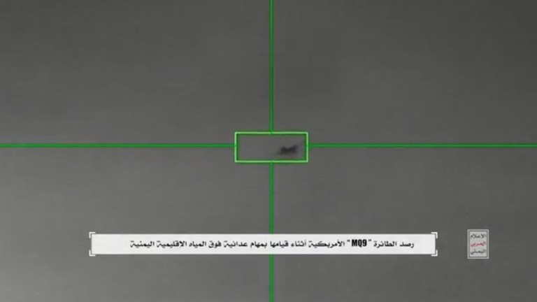
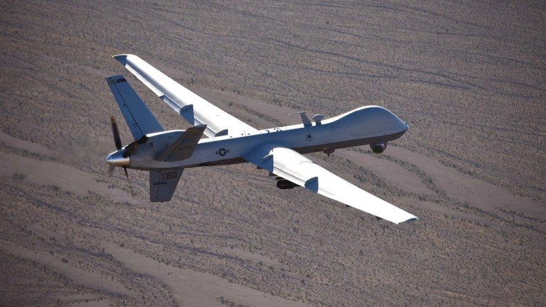

# 画面曝光！外媒：胡塞武装公开击落美军MQ-9“死神”无人机视频

【环球网报道 记者
黄泽佳】据“今日俄罗斯”（RT）9日报道，也门胡塞武装公开了8日当天击落一架美军MQ-9“死神”无人机的现场画面。胡塞武装发言人表示，这架无人机是在也门领海进行敌对性的监视和间谍活动时被击落的。

_视频截图_

胡塞武装发布的视频显示了一架无人机被持续跟踪的过程，从画面中可以看到，这架无人机被一枚地对空导弹击中，随后起火并坠落。

_美军MQ-9“死神”无人机 资料图 图源：外媒_

此外据美国广播公司当地时间11月8日报道，美国国防部官员证实，一架美军MQ-9“死神”无人机在也门附近的国际空域被胡塞武装击落。胡塞武装发言人还表示，“（美国的）敌对行为不会阻止也门武装部队继续对以色列采取军事行动，以声援巴勒斯坦人民。”

