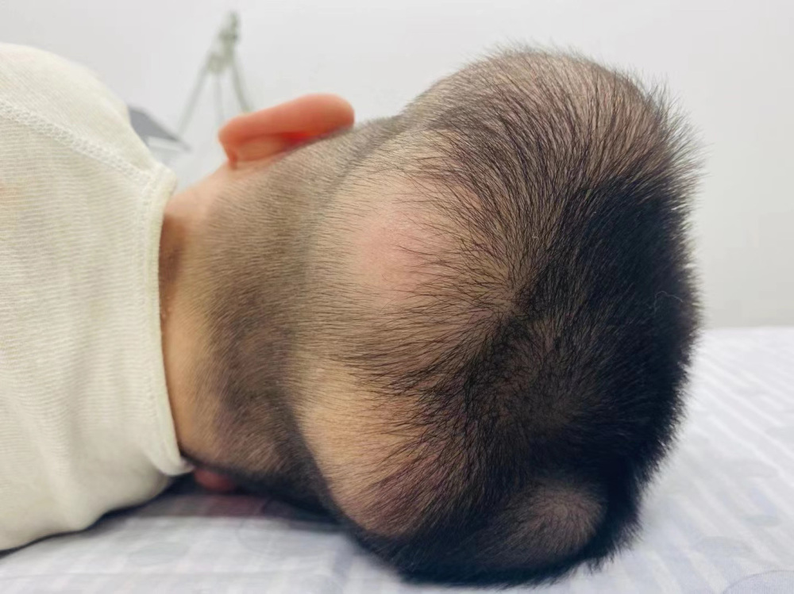
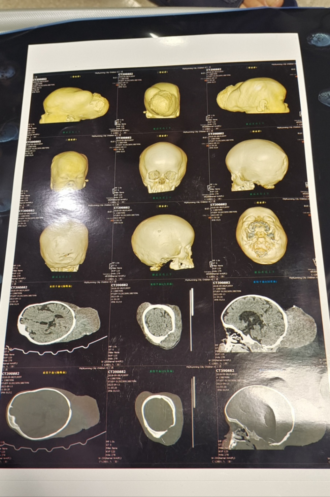
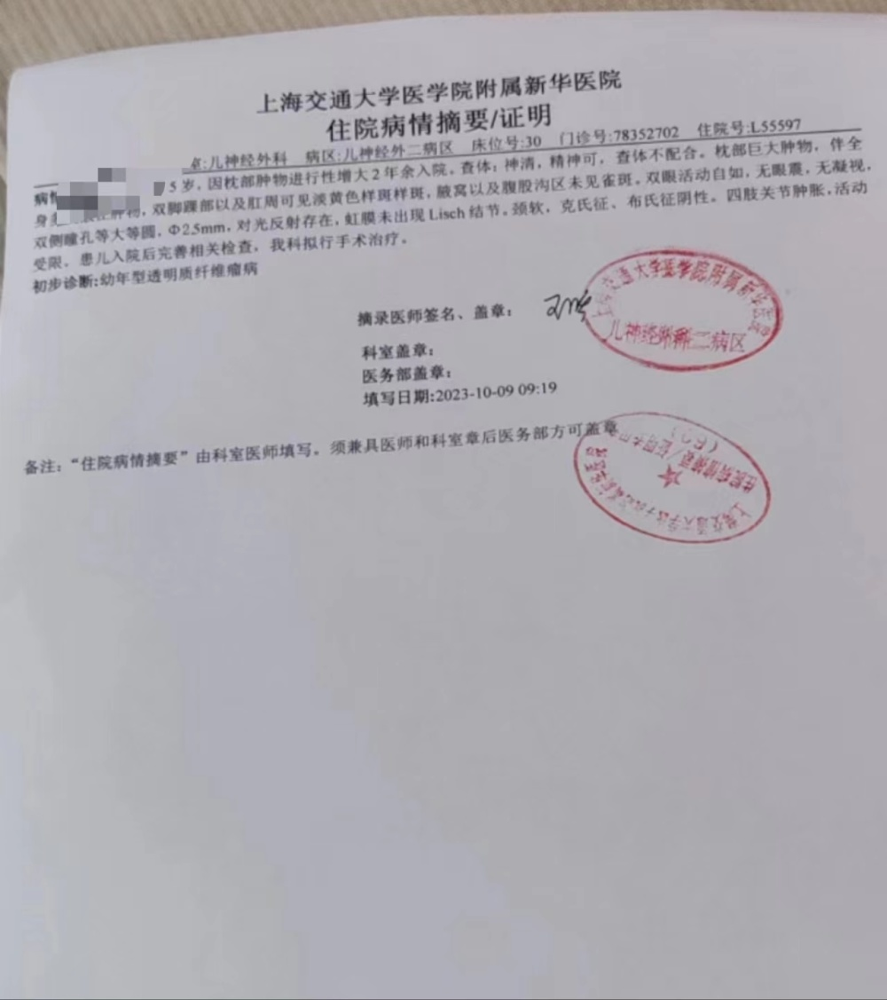

# 5岁男童患“超级罕见病”头部及身体多处长肿瘤，国内此前仅报道过1例

 _两三年前的桐桐，头部已经长满了鸡蛋大小的肿瘤。 本文图均为 受访者 供图_

今年已经5岁的桐桐（化名），在出生6个月时，就和其他孩子不太一样。

他少动，胳膊和腿都伸不直，不像别的孩子那么活跃。看着桐桐有些异常，母亲邢麦（化名）带着孩子去检查，但是在云南昆明跑遍了大小医院，也没查出病因。只是在医院里做了半年的康复训练，但怎么也不见好。

再长大一些，桐桐头上长了几个“大包”，膝关节和口腔里也开始长。受口腔里的“大包”影响，桐桐刚学会叫“妈妈”，就再也不怎么能说话了。

前些年，邢麦带着孩子又去了北京和上海的几家医院。直到2020年12月，在上海交通大学医学院附属新华医院的小儿神经外科，桐桐被确诊为幼年性透明蛋白纤维瘤病。

近日，长期从事儿童神经系统肿瘤及小儿神经系统先天性疾病领域研究的新华医院神经外科副主任王晓强告诉澎湃新闻（www.thepaper.cn），幼年性透明蛋白纤维瘤病是一种罕见的常染色体隐性遗传病，是ANTXR2基因突变所致，属于“超级罕见病”。在桐桐确诊之前，国内仅报道过1例病例，全球范围内报道的不过百例。目前，全球尚无药可治，只能对症治疗，治疗后会继续复发。

_今年桐桐的检查片子，可以看出他头部的肿瘤已经越长越大。_

**头部及身体多处长肿瘤**

半岁时，桐桐的腿和胳膊都不怎么动，腿伸不直，也无法伸手。那时，已经有过一个孩子的邢麦察觉到不太对，就带着孩子去了昆明的几家医院，但也查不出病因来。

桐桐在昆明儿童医院做了基因检测，但医生似乎仍无法确诊他患的到底是什么病；针对膝关节做了半年康复训练，也不见效果。

桐桐头部和身体上长起了“大包” 。更严重的，他的口腔里也开始长“包” 。受嘴里的“大包”影响，他刚会叫“妈妈”后，就几乎没怎么再说过话了。

桐桐头上的“包”还在长，快和鸡蛋一样大小了。两三年前，邢麦带着孩子踏上了赴上海治疗之路。

在新华医院的诊室里，王晓强见到了头上长了“大包”的桐桐。

近日，王晓强在接受澎湃新闻采访时回忆，当时桐桐的头部长了一圈纤维瘤，跟核桃一样大小，牙龈增生，身上多处关节都有挛缩现象。他还听到过病房里有人喊桐桐“外星人”。

起初，他也无法判断桐桐得的到底是什么病。在做了基因检测又查阅了国内外的文献后，他确诊桐桐为幼年性透明蛋白纤维瘤病。

基因检测报告显示，“发现与先证者（患儿）临床表型高度相关的ANTXR2基因变异”。

幼年性透明蛋白纤维瘤病（juvenile hyaline
fbromatosis，简称“JHF”）是一种罕见的常染色体隐性遗传病，无明显的性别及种族差异。病因为ANTXR2基因突变，以透明纤维组织异常生长为特征，典型表现为关节挛缩牙龈增生、皮肤增厚及溶骨性病变。

王晓强介绍，JHF在1873年被首次描述为纤维软疣，又名Murray-Puretic-Drescher
综合征。相关症状通常在患儿出生后2年内显现，因此多数患儿在5岁以内确诊。

他称，这种疾病属于极为罕见的一类。此前，国内有过报道的仅1例，为北京协和医院所报道。而国外文献显示，目前世界范围内报道的病例不足百例，在近亲通婚率更高的中东发病更为普遍。

王晓强称，桐桐的影像学显示，他的骨吸收涉及多个部位，且程度较重，其骨密度低于同龄人，骨痛与大量骨质吸收溶解导致关节变形有关。此外，透明纤维瘤的异常积累使张力增加，限制性病变影响关节活动，导致他在站立和行走时会出现“青蛙样”的姿势。

他告诉记者，因为幼年性透明蛋白纤维瘤病实在太罕见，全球范围内对幼年型透明质纤维瘤病的认识都非常有限，更没有特效药。目前的治疗方法只能是对症治疗。那时，王晓强及团队给桐桐做了头部肿瘤切除手术。

_桐桐今年在新华医院再次接受治疗_

**已经第二次切除肿瘤，但仍会复发**

然而，做了切除手术回家后的这两年多时间里，桐桐身上的肿瘤再次复发。今年，桐桐头上的肿瘤逐渐变大，破了皮。邢麦说，夏天天气热，农村的家里苍蝇多，苍蝇总是围着桐桐的头部。

桐桐关节处也都长满了肿瘤，无法自由伸展，无法翻身，更无法驱赶苍蝇，溃烂处很容易感染。“看着太可怜了。”邢麦看到儿子，心酸又心痛。

今年9月，邢麦再次带着儿子桐桐来到上海新华医院王晓强的诊室里。

邢麦称，上次手术时，头部未切除的肿瘤如今已经长得比梨子还大，之前切除过的也慢慢长得比较明显了。现在儿子身上，除了大关节处的大肿瘤，其他部位用手一摸，还有很多小肿瘤。

这导致桐桐几乎不能行走，无法说话，也无法正常进食。现在吃饭只能靠大人喂一些流食，“所有的事情都要靠大人”。

王晓强称，这次再见到桐桐，情况比两年前严重，肿瘤更大也更多，已经无法躺平，只能侧躺，头部肿瘤已经破皮溃烂，“（照片看起来）血淋淋的”，这已经严重影响了桐桐的生存质量。

10月5日，桐桐住进新华医院住院部，做了一系列检查后，再次进行肿瘤切除手术。

邢麦称，此前做手术借了一些钱，这两年靠种地已经还了一部分。这次来上海，是向亲戚朋友借了近10万块钱。此前，在医生王晓强的提醒下，他们曾发起过水滴筹的筹款，但筹到的四五万块钱，对于治疗费来说也是杯水车薪。

也有人劝她干脆放弃。但她不忍心，也做不到。“看着孩子真的很心疼，家里也没有钱，但是能给孩子改善一下就改善一下。”

10月下旬，王晓强及团队再次给桐桐做肿瘤切除手术，手术持续3个小时。术后恢复一段时间后，目前桐桐已经可以正常平躺。

为了提高桐桐的生活质量，邢麦还想带儿子去骨科做手术，切除掉关节处的肿瘤。

王晓强表示，目前桐桐身上腿关节、肘关节、腕关节都有肿瘤，很难完全切除，这些花费对这个家庭来说是笔不小的支出。而即使这次完全切除了，肿瘤还会持续复发。

看着桐桐的样子，王晓强也很心疼，给他捐了几千块钱，他的一些朋友得知桐桐的情况后也给予了一些捐助。

术后的桐桐已经出院。但王晓强也表达了另一个担忧——一旦身体上的肿瘤影响到心肺功能，这对患儿来说是致命的。

