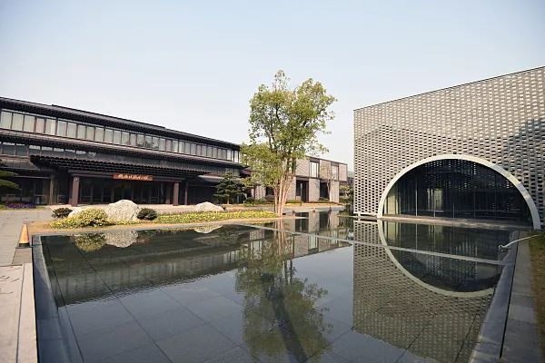

# “枫桥经验”的每一页都写着人民立场

北京东城区积极实践“梯次递进 一体调处”工作法，福建霞浦依托海上社区智慧平台开展“海上评理”，浙江枫桥派出所的“板凳警务”走得进“家门”、敲得开“心门”……

中央政法委日前在全国范围内评选出104个“枫桥式工作法”单位，并对先进典型进行表扬并授牌。

 _▲
9月20日下午,习近平总书记在浙江省绍兴市考察。他来到枫桥经验陈列馆,重温“枫桥经验”诞生演进历程,了解新时代“枫桥经验”创新发展情况。图源：新华网_

**（一）**

“小事不出村、大事不出镇、矛盾不上交”——说起“枫桥经验”，可以追溯到上世纪60年代。

1963年，中央在全国开展社会主义教育运动，作为浙江省的试点，诸暨县枫桥区按照“发动群众、依靠群众”的思路，依靠“说理”的方式开展工作，圆满完成任务。毛泽东同志对此批示“要各地仿效，经过试点，推广去做”，“发动和依靠群众，坚持矛盾不上交、就地解决”的“枫桥经验”由此走出枫桥。

几十年来，这一土生土长的中国智慧、东方经验，在火热实践中拔节生长、枝繁叶茂。特别是党的十八大以来，“枫桥经验”在新时代不断丰富发展，成为基层社会治理的一面旗帜和中国之治的闪耀名片。

**（二）**

从实践中来，到实践中去，是“枫桥经验”的显著特点。而坚持人民立场，则是其鲜明底色和价值内核。

在社会主义中国，人民是国家主人，也是国家发展最坚实的依托。我们党各项工作的开展，始终重视依靠人民群众解决问题，也相信人民群众能解决问题。

就拿“枫桥经验”来说，“依靠群众就地化解矛盾”，这一目标的实现、方法的践行，不只是自“上”而“下”的压茬推进，而且是自“下”而“上”的积极互动：通过群防群治、多元共治，最大限度把矛盾化解在基层、把问题解决在当地、把隐患消除在萌芽。

无论社会如何变迁，无论时代如何发展，无论调解的类型和方法如何千变万化，一切为了人民，都是“枫桥经验”不变的初心与精髓。

_▲枫桥经验陈列馆。图源：视觉中国_

**（三）**

“好措施、好办法哪里来？答案是从群众中来。”依靠群众、发动群众，本身就是解决问题的方案智慧。“解铃还需系铃人”，扎根基层、问需于民，才能精准找到关切所在，摸准解题之钥。

在枫桥，基层干部在长期联系、服务群众的实践中，形成了“走得进家门、坐得下板凳、拉得起家常、建得了感情”这一套进村入户的标准。

而随着时代发展，各地也与时俱进，开展着走好群众路线的新探索、新实践。比如，开通政务服务便民热线，一串号码牵系民生万事；探索党建引领的网格化治理模式，让街道干部在切得更小更细的治理单元中常态化走访……

走近群众、服务民生，架起一座座沟通党心民心的连心桥，就能更顺畅地把群众的智慧力量凝聚好、合理诉求解决好、合法权益维护好。

**（四）**

当前，中国社会正处于深度转型期，面对经济转轨、社会转型，一个有着14亿多人口的发展中大国，想要实现中国式现代化，就必须走出一条适合国情的社会治理之路。

“枫桥经验”中，依靠群众、发动群众的这一法宝，同样契合于现代治理体系的要求。在传统管理的概念中，习惯于管理主体唱“独角戏”，而现代治理的概念里，则强调各类治理主体协同。研究表明，从单一主体转向多元协同，充足专业的治理力量、共建共治共享的治理模式，能够显著提升基层治理效能。

这些年来，人民群众参与基层社会治理的意愿不断增强，北京的“朝阳群众”“西城大妈”，浙江的“武林大妈”“红枫义警”，都在社会治安方面屡立奇功。新时代“枫桥经验”调动人民群众“共同参与、群策群力”，打造“人人有责、人人尽责”的治理共同体，也将推动我国基层社会治理体系和治理能力的现代化。

 _▲ 绍兴诸暨枫桥古镇。图源：视觉中国_

**（五）**

治国安邦，重在基层。从古至今，平安稳定都是所有人在追求美好生活过程中不可或缺的基础保障。

具体到每个人的生活中，身边的矛盾能不能处理好，“天大的小事”有没有人管，直接关乎人民获得感、幸福感、安全感。在中国，乡镇、街道、社区或农村都是化解矛盾的小细胞、小单元，急难愁盼总能找到对应的“责任部门”，这也成为中国独特组织优势的体现。

而反观西方，社会相当“个体化”，政权体系很难达到最基层。基层治理这关键一环长久缺失，小矛盾容易越积越大、越拖越炸，直至造成尖锐的社会问题。

从这个角度来看，用好新时代“枫桥经验”，发挥群防群治的组织优势，也是一份中国提供给世界的基层治理方案。

**（六）**

矗立于枫溪江畔的枫桥经验陈列馆中，有一面写满了“群众心目中的新时代‘枫桥经验’”的墙，其中有一句意味深长的话，“人民满意是一条走不完的路，‘枫桥经验’是一本读不完的书。”

“为民服务”没有完成时，走过一甲子的“枫桥经验”，因植根人民而永葆生机，因与时俱进而历久弥新，也必将在新时代新征程创造出新的最美风景。

撰文：杜梨

