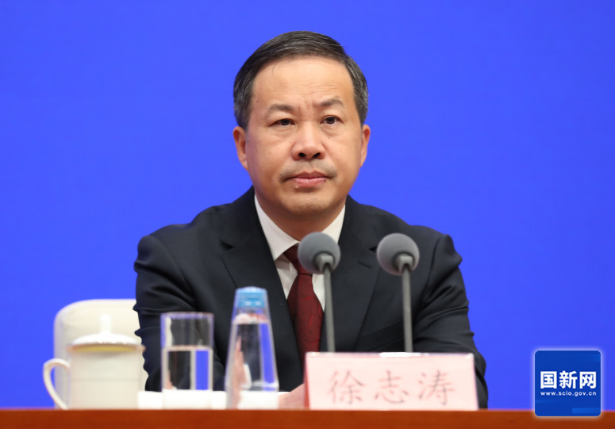

# 外媒称“藏族儿童被强迫在寄宿制学校上学”？西藏自治区副主席驳斥

11月10日，国新办举行《新时代党的治藏方略的实践及其历史性成就》白皮书新闻发布会。

会上，凤凰卫视记者提问：

有媒体说，西藏建设了大量的寄宿学校，有大量藏族儿童被强迫到这样的寄宿学校，远离家庭住所去上学。请问这一情况是否属实？

西藏自治区副主席徐志涛：

感谢这位记者对西藏教育情况的关注。《中华人民共和国义务教育法》规定，县级人民政府根据需要设置寄宿制学校，保障居住分散的适龄儿童、少年入学接受义务教育，这是确保公民平等享有受教育权而出台的一项政策，既解决了孩子们上学路途遥远、家长照顾困难的问题，也最大限度保障了教育机会均等和个人的公平发展，促进了国家教育事业的进步和人的全面发展。因此，不但在西藏，在中国的每个省份都建立了“寄宿+走读”的学校，面向所有适龄儿童，寄宿制办学正成为我国特别是广大农牧区的一种主要办学形式，这是长期以来各地办学实践中的一种自然选择，符合中国基本国情，也符合广大农牧区地理实际和人民群众受教育需求。我想，在座的一些中方的记者朋友、一些工作人员，也说不定有上过寄宿制学校并且受益于此的。

境外提到的所谓“藏族儿童被强迫在寄宿制学校上学”的这种情况，我觉得是别有用心的诬蔑抹黑。我们都知道，西藏一些地区由于
**海拔很高、自然条件艰苦、人口居住极为分散，特别是农牧区的孩子上下学都十分不方便，分散办学又难以保证教学质量，尤其需要设置这种“寄宿+走读”的学校**
，来保障孩子们受教育权并平等享受高质量教育资源。西藏自治区在寄宿制学校里面实行“包吃、包住、包学习费用”的“三包”政策，非常重视学生家庭参与学校的教育，通过家委会、开放日等邀请学生家长参加寄宿生活管理和规划等。无论是寄宿还是走读，完全是由学生和家长自己的意愿作出选择。

**中国的寄宿制教育与上世纪西方某些国家有针对性设置的“殖民式寄宿学校”有本质区别**
。中国的寄宿制教育多种多样、富有人性、充满活力，是发展教育事业、提高教育普及水平的一种好的办学方式，充分体现了教育的公益性属性，最大程度满足了人民群众对优质教育资源的渴求，为孩子们尤其是边远地区的孩子们提供了学习成长的优良环境，成为他们开启美好生活的金钥匙。

