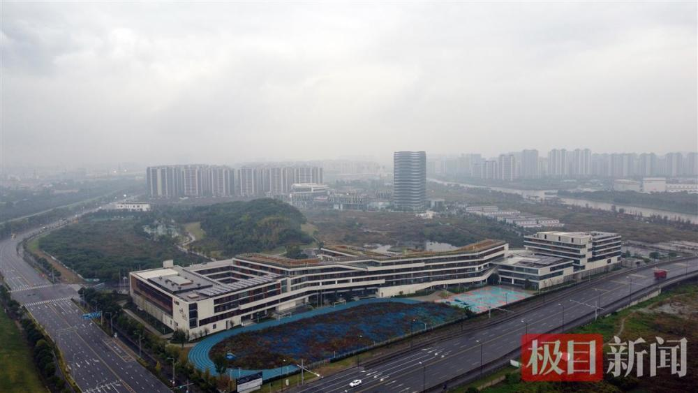
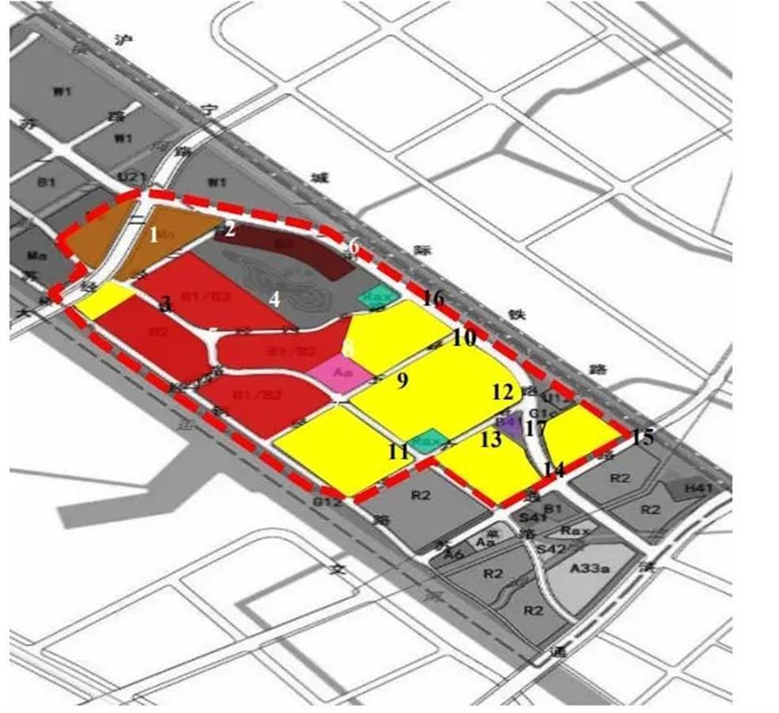
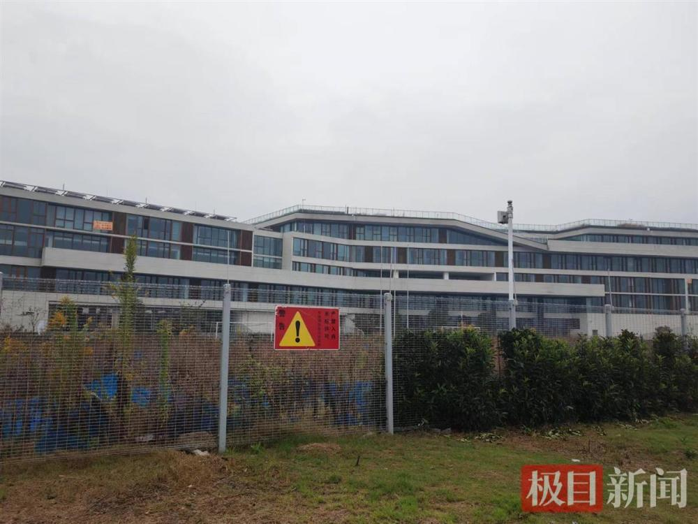
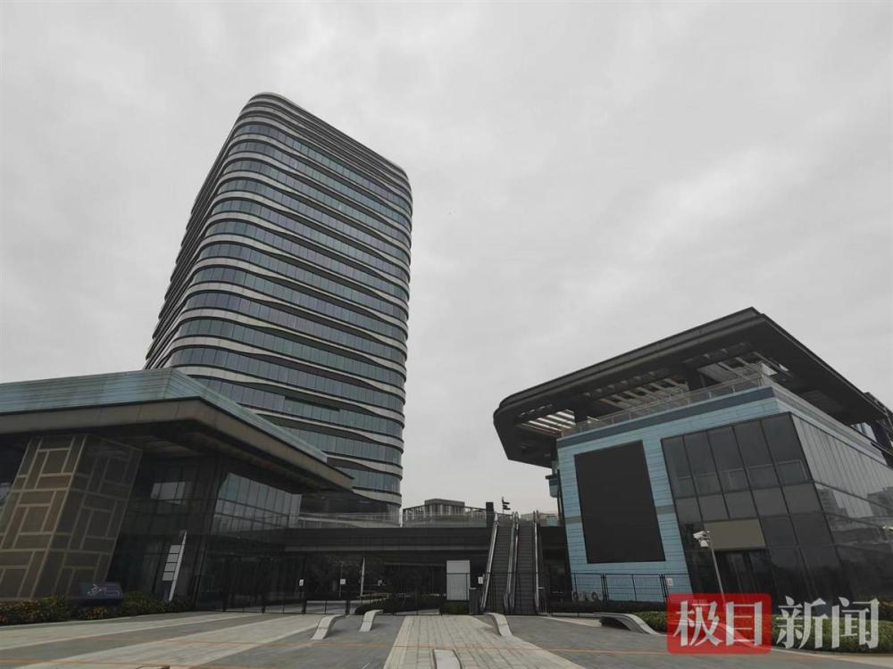
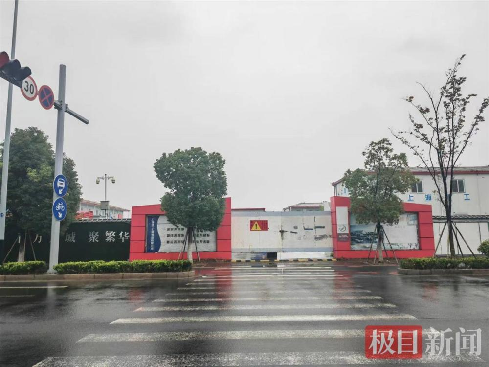
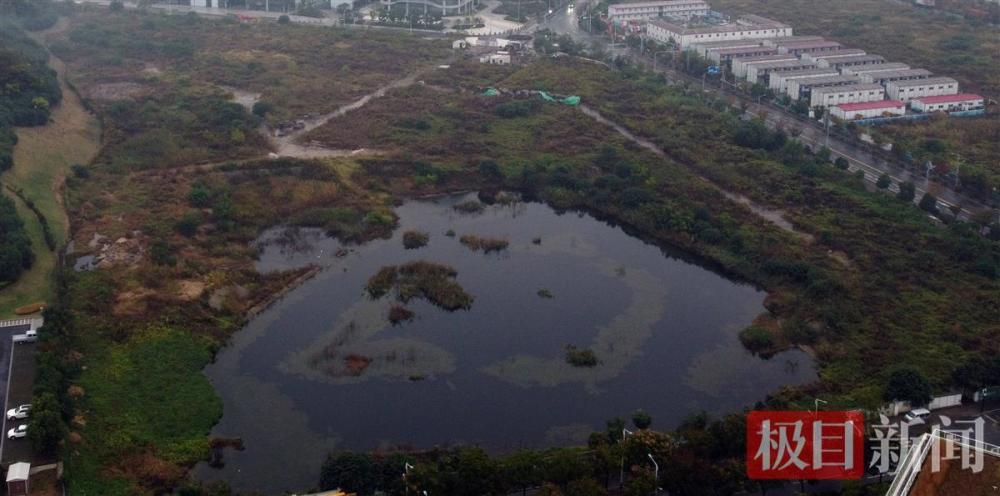
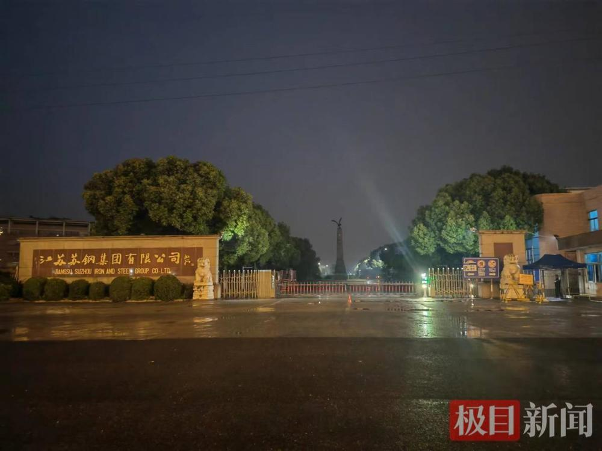
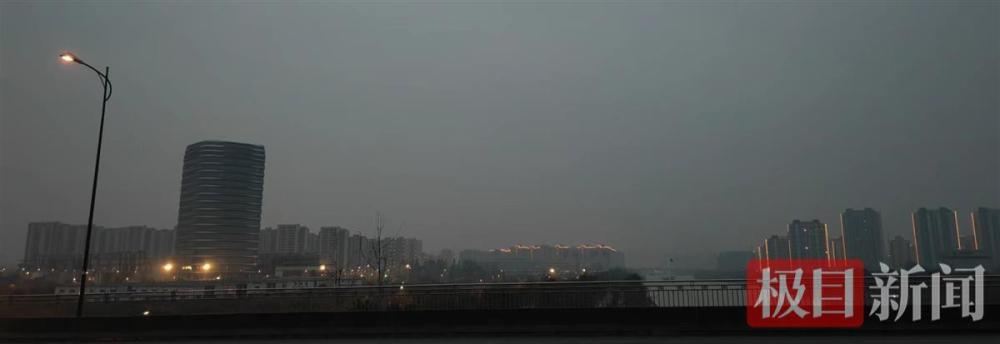

# 实探苏州“毒地”：地块上国际学校有污染警示牌，小区房价已大跌

极目新闻首席记者 丁鹏

11月9日，位于江苏苏州高新区浒墅关经济开发区（以下称“浒墅关镇”）苏钢路西侧的京杭大运河上，南来北往的货轮络绎不绝，一片繁忙景象，无不见证着这条南北经济动脉的活力。而在运河东侧仅几十米外的上海陆家嘴金融贸易区开发股份有限公司（以下简称陆家嘴集团）苏州绿岸公司项目，却是一片萧条景象，部分地块上杂草丛生，已经动工的项目也已停滞，建成的学校、商业功能区、住宅楼等也因“毒地块”阴云而停摆空置，陆家嘴集团“毒地块”百亿索赔的消息曝出，让这里再次成为焦点。

_此次事件中的苏州绿岸项目航拍_

此次舆论风波缘起于11月4日陆家嘴集团发布的一份公告，因其发现旗下苏州绿岸房地产开发有限公司（以下称苏州绿岸）2016年购入的17块土地中，有14宗存在土壤污染问题，遂将江苏苏钢集团有限公司（以下简称苏钢集团）、苏州市环境科学研究所、苏州市苏城环境科技有限责任公司等5家单位告上法庭，并向苏钢集团提出超100亿元人民币的赔偿诉求。

11月9日下午，极目新闻记者探访涉事项目地块发现，该项目住宅区已建起多个居民楼小区，但只有少数几幢居民楼有人居住，大部分处于闲置状态。已建成的雷丁学校操场上长满杂草，崭新的教学楼也处于闲置状态。住宅区多名居民称，他们入手时房子的价格高于周边其他楼盘，但现在房价因“毒地块”事件已出现大幅下跌，而更令他们担忧的是，至今没有人告诉他们是否存在被污染的风险。

11月10日0时30分，苏钢集团深夜首度公开回应此次“毒地块”事件，从披露及交易情况、地块检测情况、2号地块情况、施工作业情况四个方面作出说明。其中提到，在2016年转让股权时，公司已如实披露苏州绿岸名下土地存在部分污染的调查结果及报告全文，明确提示部分地块原为钢铁焦化生产区域，可能存在土壤污染风险。回应中透露，苏钢了解到对方在开发建设苏州绿岸地块期间，没有按照有关要求建设地下水阻隔墙及采取其他防护措施，存在扰动地下水、搬运土壤造成部分环境交叉污染的行为和施工作业不规范造成二次污染的行为。

_苏地 2008-G-6 号宗地地块规划示意图（图片来源：陆家嘴集团公告）_

**百万方城市综合体布局，突涉百亿索赔案**

2016年10月17日，经过222轮竞拍，陆家嘴集团溢价超2倍，以约85.25亿元的价格竞得苏州绿岸95%的股权。从而获得苏州绿岸持有的位于苏州市高新区浒墅关镇苏通路北、苏钢路东17块国有土地使用权，该地块规划总建筑面积约为108.41万平方米，其中住宅用地规划总建筑面积约66.4万平方米。

极目新闻记者检索陆家嘴集团官网发现，该集团在2017年和2018年大事记中，有多项涉及苏州绿岸项目的内容，记录了拿地之后陆家嘴集团在该项目上的持续发力。在2017年大事记中有3条相关记录，分别为5月11日，苏州绿岸15号地块建设项目一期总承包工程正式开工；7月31日，苏州绿岸房地产开发有限公司取得房地产开发经营业务暂定资质证书；8月1日，苏州绿岸房地产开发有限公司新办公楼乔迁仪式隆重举行。在2018年大事记中，更是有建设项目实质性的进展记录，分别为11月2日，苏州陆家嘴锦绣澜山项目启动仪式暨苏州雷丁学校奠基仪式圆满举行；12月28日，苏州绿岸陆家嘴——锦绣澜山商业项目开工典礼圆满举行。目前，雷丁学校和商业功能区已经完工，住宅区也有成片高楼建起。

_雷丁学校围栏上的污染警示牌_

_商业功能区已建好的写字楼_

据中国房地产报报道，苏州绿岸的95%股权是苏钢集团挂牌转让。在挂牌文件中，苏钢集团披露了土地的污染情况，表示焦化区域的污染主要集中在4号地块局部区域，根据修复目标值，最终确定0到18米深度内，污染范围为17542平方米，污染土方量为39604立方米。非焦化区域的土壤和地下水基本未受到污染，可再开发利用。股权交易后，苏州绿岸就苏钢集团所披露的污染范围进行了治理修复。

2021年，在土地开发的过程中，苏州绿岸意外发现已建设教育设施的2号、13号地块及尚未开发的3号、4号地块均存在严重污染风险，土壤或地下水中诸多元素大幅超标，不符合该等地块原对应的规划用地标准，4幅地块面积合计约11.8万平方米。就土地污染事宜，苏州绿岸向当地政府部门进行了报告。2022年4月，江苏省公布的《中央第二生态环境保护督察组向我省移交的第六批信访事项办理情况》中提到，第三方检测机构检测结果显示，苏州绿岸项目多处地块土壤中苯并芘、萘严重超标，不符合用地标准。

在2022年4月份的公告中，陆家嘴集团表示，公司组织专门力量核查发现，在苏地2008-G-6号地块调规变性及出让过程中，不排除苏钢集团、环境检测机构等存在涉嫌一系列违法违规、弄虚作假等可能，导致存在严重污染的土地进入公开交易市场，并在挂牌转让苏州绿岸95%股权时隐瞒了相关信息。此后，每隔几个月，陆家嘴就更新一次土地污染事件的进展，截至目前已确定苏州绿岸名下1号至13号，及17号地块等14宗土地存在污染。

11月4日陆家嘴集团发布公告，因其发现旗下苏州绿岸房地产开发有限公司（以下称苏州绿岸）2016年购入的17块土地中，有14宗存在土壤污染问题，将江苏苏钢集团有限公司（以下简称苏钢集团）、苏州市环境科学研究所、苏州市苏城环境科技有限责任公司等5家单位告上法庭，并向苏钢集团提出了超100亿元人民币的赔偿诉求。目前，法院已立案受理，尚未开庭审理。

 _陆家嘴集团公告 （图片来源：陆家嘴集团官网）_

**实探“毒地块”，居民担忧污染风险和房价下跌**

11月9日下午，极目新闻记者来到苏州高新区浒墅关镇的苏州绿岸项目地块，在志学街6号的雷丁学校一侧，硕大的项目宣传广告海报上仍然可见“北新区百万大城”“108万方城市综合体”等宣传语，这也是陆家嘴集团拍下该地块时的初心蓝图。

在上述广告牌后方不远处，就是该项目已经建成的锦绣澜山多个住宅楼区域，记者实探发现，在已建成交付的小区中，锦绣澜山峰誉庭入住率较高，而旁边有些楼盘入住率较低，部分单元楼从外看去，只有零星几户有晾晒衣物等居民居住的痕迹。

 _锦绣澜山住宅楼_

9日晚，锦绣澜山峰誉庭一名八旬的住户李先生（化姓）向记者介绍，他是苏钢集团的退休职工，在苏钢集团工作了几十年，依稀记得小区的地块当年在苏钢的用途。他家所购房子单元楼以前是农田，而小区另一栋单元楼大概是轧钢车间，他感觉应该都不会有什么污染，但希望相关部门能给他们一个正式答复。另外，多名该小区已经入住的居民告诉记者，他们入手房子时的价格略高于周边的其他楼盘，但现在房价因“毒地块”事件已出现大幅下跌，而更令他们担忧的是，至今没有人告诉他们小区地块是否存在被污染的风险。

在苏州绿岸项目锦绣澜山8号地块处，记者看到大门口贴有醒目的红色警示牌，上有“本地块存在污染风险，未经许可严禁入内”的提示。在大门一侧的施工铭牌上，仍然可见8号地块的开工日期原计划为2019年5月29日，计划竣工日期为2021年6月12日。而记者在现场看到的实际情况是，该地块仅有两排搭建完成的工棚，且看不到有人居住，工棚周边和地块其他区域基本为长满杂草的荒地。

 _8号地块门口醒目的污染警示牌_

记者走访发现，该项目中的商业综合功能区已完成建设，其中一栋楼的竣工铭牌信息显示，完工日期为2021年12月28日，但一扇扇铁门将包括商业区地下车库入口在内的所有入口封锁，保安还时刻提醒路人不许进入。此外，雷丁学校也已完成建设，但校门紧闭，学校围栏上也有醒目的污染警示牌，学校内的操场上长满半人高的荒草，崭新的教学楼因污染问题只能空置。在一处一闲置住宅区门口，有工作人员正在冒雨作业，用浅绿色围挡遮住围墙上的住宅区分布平面图。

_紧邻雷丁学校的4号地块航拍_

**据21世纪经济报道，污染地块事件的发酵，源于项目规划引进的国际学校的一次土壤污染情况调查。这所学校就是建设在2号地块上，由苏州伦华教育集团与英国雷丁学校共同打造。由于是国内首所雷丁学校，该学校从立项、开工建设、封顶、招生都备受关注。**

知情人士透露，2021年6月，苏州雷丁学校校方在办理办学许可证过程中，根据苏州高新区环保局要求，对学校所在地2号地块的土壤污染状况进行调查，上海陆家嘴公司曾委托第三方初调，发现2号地块存在验证的污染，后又经政府推荐的第三方鉴定机构调查，结果同样显示污染严重，因此苏州雷丁学校项目暂停启用，已招录的学生只能另行安排其他学校借读。

**苏钢凌晨回应争议，称对方存在二次污染**

11月9日晚，极目新闻记者从苏州绿岸项目一侧步行通过横跨京杭大运河的苏钢大桥，来到河对岸与苏州绿岸项目相距仅1公里多的苏钢集团，门卫表示，集团工作人员都已经下班，如需采访可在第二天8时上班以后再去。

11月9日，极目新闻记者先后致电此次诉讼的原告三方和被告五方，但均未得到回应。

_苏钢集团_

极目新闻记者注意到，2023年11月10日0时30分，处于舆论旋涡的苏钢集团首度公开回应此次事件称，近日，公司关注到网上涉及苏州绿岸项目相关舆情信息，现就有关情况说明如下：

一是披露及交易情况。在2016年转让股权时，公司已如实披露了第三方专业机构关于苏州绿岸名下土地存在部分污染的调查结果及报告全文，并在资产评估报告中明确提示了该范围中部分地块原为钢铁焦化生产区域，可能存在土壤污染风险。由佳湾公司和华宝信托（后所持股份转让给佳二公司）组成的联合体在交易时即已知悉上述情况，并承诺接受所有现状、瑕疵和风险。在此基础上，经过222轮举牌，联合体方以85.25亿元竞得挂牌评估值30.5亿元的苏州绿岸95%股权及债权。

二是地块检测情况。2022年，联合体方与公司一致同意委托的第三方专业机构南京环科所对地块污染情况进行了详细调查。有关结果表明：已有居民入住的14、15号地块、已开发建设的8、9、12、13、16号地块和未开发建设的7、11、17号地块，属可安全利用地块；焦化区1、2、3、4、5、6号和非焦化区10号地块（其中仅2号地块已开发建设），经治理修复后可安全利用。

三是2号地块情况。2019年，联合体方知悉2号地块不符合环保要求，且未依法完成2号地块土壤污染调查和修复治理，即启动了该地块项目建设。2021年，因无法通过环评验收而未能启用。对此，生态环境部门已依法对其违法行为进行处罚。

四是施工作业情况。2016年，公司披露报告中已明确指出，“要严格控制场地内及场地附近开展造成地下水扰动的施工”“场地开挖前必须做好适当的防护措施，进行环境监理，避免污染物扩散，对周边环境及居住区产生影响”。我们了解到，联合体方在开发建设苏州绿岸地块期间，没有按照有关要求建设地下水阻隔墙及采取其他防护措施，存在扰动地下水、搬运土壤造成部分环境交叉污染的行为和施工作业不规范造成二次污染的行为。

目前，相关争议已由人民法院立案受理，我们正在积极应诉，相信司法机关在查明案件事实的基础上会作出公正的判决。公司将与各方一道，把确保群众身体健康和购房者合法权益放在首位，尊重生效判决结果，维护司法权威。

**专家：用地变换性质“工改居”，应遵循严格流程**

中国房地产报报道，一名业内人士分析，作为苏州绿岸项目的开发主体，陆家嘴负有实施土壤污染风险管控和修复的义务，需承担相应的调查、评估、修复费用，已完工的建筑若土地也存在污染，不排除整体拆除、修复后重新建设的可能，加上停工的影响，损失难以估量。

陆家嘴集团也表示，土地污染问题可能导致苏州绿岸项目的部分存货可变现净值低于其成本，或面临经济损失，进而对公司利润产生不利影响。但直至今年中期业绩，该公司都未对该项目计提存货跌价准备。

对此，易居研究院研究总监严跃进向极目新闻记者介绍，此次“毒土地”事件引发行业思考，尤其是类似毒土地的项目后续将如何处置的问题，更值得探讨。事件中，陆家嘴集团要求索赔超100亿，这说明此类土地问题产生了较大的经济损失。甚至从此次事件发酵后，该项目的二手房交易情况看，也出现了明显下降，这说明其对于房价和居住功能都产生了较大的负面影响。

_夜幕下的苏州绿岸项目建筑（左侧无亮灯建筑）与运河对岸的亮灯建筑_

严跃进认为，2016年该土地在上海产权交易市场交易，实际上属于存量土地的交易。在土地交易过程中，其溢价非常高，拿地的成本也比较高。加之该地块的区位优势和定位，使得其后续引入的各类资源会偏向中高端，其中就包括教育资源等。而该项目本身开发周期比较长，属于大盘概念。因此，在毒土地事件后，还有很多项目还处于一个未完工的状态。但也有部分交付住宅已经有居民入住，这使得问题更加复杂化。这个项目是陆家嘴集团“走出去战略”的重要一步，具有非常明显的重点市场扩张迹象，但此次事件暴雷，定会导致各类连锁反应和负面影响。

严跃进还分析认为，对于工业用地的变性即“工改居”，其本身有一套严格的流程。一是调查评估。主要涉及对此类工业用地的土壤、水和空气等环境条件进行全面调查，这中间会涉及委托专业的环境评估进行评估，除了确定是否存在有毒物质外，还要评估其对于居民健康可能造成什么影响。二是土地要进行改造，这主要涉及对土地污染情况的调查，包括未来可能出现的污染情况和风险的分析。对于污染用地，包括土壤和水体等，将采取搬运、填埋、更换土壤、化学中和、空气净化等方式进行。三是要进行用地属性变更的论证，即工业厂房用地要变更为住宅用地，需要向当地的自然资源局申请，这中间会涉及土地新的规划和用途变更申请等内容。中间也需要专家或专题会议等进行论证。这些工作完毕，才能进入到招拍挂等交易市场中。

（来源：极目新闻）

