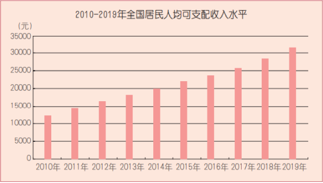
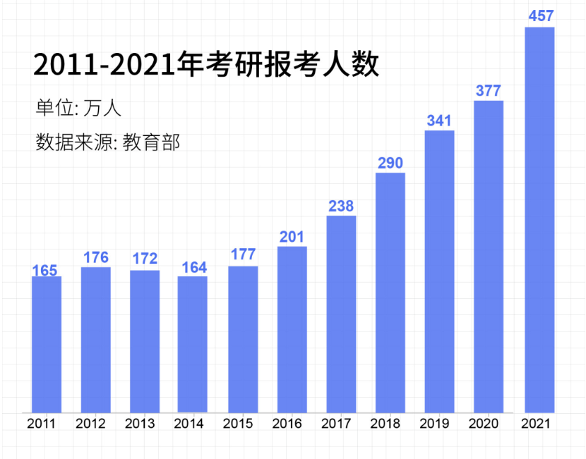
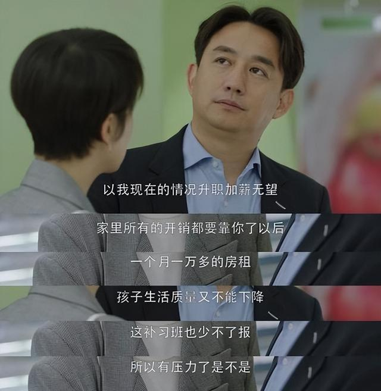

# 工资涨幅追不上“买买买”，年轻人应该反思吗？｜陌生的身边

_腾讯新闻《陌生的身边》栏目，关注社会洪流及身处其中的个体体验。通过社科学者的长期洞察与观点碰撞，带我们重新发现身边、理解身边。_

**核心要点：**

  * _1_ 当下年轻人消费趋少，从理智消费层面上来看可能意味着消费观的成熟，这是一个好现象。但值得我们注意的是年轻人的消费信心问题，即年轻人的未来预期收入是否有降低。假使年轻人对未来经济形势和自身收入的预期都没有信心，同样会影响到当下的消费行为.
  * _2_ 把贫困的结果归因于个人的观念是不公平且不客观的。贫困既有个人的原因，也有宏观结构性的原因，不能只谈个人的问题而忽视整体的环境。当下的中国社会正在经历这样的转型：从把一切成失败归结于个人，转变为更为客观公平的评价方式。
  * _3_ 当我们开始用更多元的眼光去审视这个社会、更全面地思考自己的时间安排和目标选择时，才有机会让整个社会的评价体系变得更多元和丰富，而不是拼命去卷某一个维度。
  * _4_ 年轻人要勇于犯错误。但要让年轻人敢于犯错误，社会层面也需要提高对年轻人容错率、允许年轻人犯错。只有在制度甚至观念上做出改变、降低年轻人的试错成本后，他们才会敢于犯错。
  * _5_ 希望未来有更多“赛道”提供给年轻人，让大家可以在自己擅长的领域中努力，而非只关注与他人竞争和比较。很多时候我们之所以选择玩某个游戏，只是因为我们看到这个游戏有足够多的人玩，且这个游戏会带来把输家踩在脚下的快感，这是错误的。我们玩一个游戏，应该是因为我们自己觉得这个游戏本身足够有趣。

又到一年双十一，虽然各大电商平台上线花式促销、价格战愈发激烈，但年轻人的消费似乎趋于理性，“双十一是不是卖不动了”的讨论也一度冲上热搜。而更早些时候，某主播一句“有些时候找找自己原因，这么多年了工资涨没涨？有没有认真工作？”成为出圈的“热梗”。自嘲之余，年轻人也在自问为什么努力工作工资却涨不过消费，甚至还要遭受他人的指责和非议。

事实上，面对着“996”和“35岁危机”，当代年轻人的内卷趋势越发加剧，考研人数逐年走高，中国式“Gap
Year”（间隔年）也逐渐成为落榜失业后的无奈选择。年轻人们往往并非不够努力，只是努力之后仍然过得不容易，其消费观也从“买买买”转为了“能省则省”，追求实用且高性价比的商品。

本期《陌生的身边》特约栏目主理人周睿鸣对话牛津大学哲学博士蒙克、经济学博士梁捷，关注年轻人消费观转型背后的困境与解法。

一、双十一困境：年轻人减少消费，某种程度上意味着他们对未来的不乐观

**1\.
周睿鸣：我们今天讨论的主题是《工资涨幅追不上“买买买”，年轻人应该反思吗？》。开始这个话题前，我先抛出一点个人体验。工资涨幅追不上“买买买”，其实是近年来比较容易发现的一个趋势。但后半句“年轻人应该反思吗？”，我会代入年轻人自问，我是不是应该反思点什么？从“买买买”到“能省则省”，我们这样的年轻人消费观究竟发生了什么变化？**

 _2023年，“双十一”迎来第15年｜图源：视觉中国_

**蒙克：**
消费群体分为不同的年龄层次，如年轻人、中年人、老年人等，我们似乎对年轻人群体的消费力寄予了更高的期待。但消费的核心目的是满足人的需求，抛开工资涨幅不论，您提到的当下年轻人开始偏向理性消费而非“买买买”，我们的消费观实现了从购买自己想要（want）的东西到购买自己所需要的商品的转变，这其实是个好事儿。我们不仅不需要反思，还需要庆祝。

**梁捷：**
在经济学中，生命周期模型是解释消费问题的经典模型，它认为人们的消费行为不仅仅着眼于眼下，而是会拉长时间到一个长远的时间段里去计划自己的生活消费开支，以达到在整个生命周期内消费的最佳配置。消费存在着代际差异，不同年龄阶段的人有不同的消费需求，更理性的做法是平衡好尽可能长时间段内的消费需求，尽量避免有钱疯狂消费、等到需要用钱时却没钱消费的情况。

**当下年轻人消费趋少，从理智消费层面上来看可能意味着消费观的成熟，这是一个好现象。但值得我们注意的是年轻人的消费信心问题，即他们的未来预期收入是否会降低。**
假使年轻人对未来经济形势和自身收入的预期都没有信心，同样会影响到当下的消费行为。

所以当我们看到年轻人消费减少，可能需要追问背后的真实原因。如果降低消费是为了更大的房子、因此背负债务省吃俭用，这并不意味着他们预期收入的降低，反而代表其对未来的信心。
**但显然现在更多年轻人不消费是因为担心自己失业，或是为了结婚、生育、养老等潜在的消费选择更多攒钱，在某种程度上这代表了他们对未来的不确定和不乐观。**

**2\.
周睿鸣：曾有网友在某主播直播间吐槽某产品越卖越贵，然后被该主播回怼“有时候找找自己原因，这么多年了工资涨没涨？”，这句话引来了很大的舆论争议。这番言论本质上刺痛的是什么？**

**蒙克：**
这让我想到19世纪的英国维多利亚时代，个体的贫困会被归因为懒惰或者道德上的瑕疵，这是一种完全归因至个人的贫困观。在那个时代，英国社会的心态强调自我提升（self-
improvement），也就是个体的独立。当这种心态走入极端，就会变成一切成功都归于自己、从而一切的失败也归于自己。

**这种把贫困的结果归因于个人的观念是不公平且不客观的。贫困既有微观的个人原因，也有宏观的结构性原因，不能只谈个人的问题而忽视整体的环境。**
所以后来西方有了福利国家，从更高层面上去帮助个体摆脱贫困、提高收入。在这个过程中，首先是观念的转变，从而带来政策的转型。我想，
**当下的中国也正在经历这样的转型，从把一切成败归结于个人，转变为更为客观公平的归因方式。**

**梁捷：**
类似的现象在金融学可以使用alpha和beta两个概念进行解释，以股市为例子，股票上涨，不仅受到公司业绩的影响，也受到整个大盘的影响，所以由自身原因的产生的波动叫Alpha，然后由大盘产生的影响波动叫Beta。

问题在于，对于个人而言Alpha和Beta的影响是不对称的。我们在找工作时也会遇到类似的问题，经济环境较好时，周围人都能拿到三四十万的年薪，通过个人努力就可以拿到相同的薪资水平。但是目前就业形势较为严峻，大家都很难找到工作，就是受到了Beta这个整体环境的影响，但要说Beta的影响能在多大程度上完全压倒Alpha，倒也说不好。但不管经济好还是不好，我们每个人总是应该更多地去思考Alpha和Beta的关系，尽量让Alpha发挥的作用越来越大，帮助我们能够找到更好的工作。

经济发展是有周期的，总会有起有落。大环境对于每个人来说基本相同，整体经济何时反弹未知、不同产业的反弹节奏可能也有不同。
**但需要提醒大家的是，经济下行时个人容易过于悲观，这可能使得你会错失经济反弹时本可以抓住的机会，这可能会导致个人的低谷持续时间比别人更长。所以，在当下的大环境中，根据实际情况结合自身条件判断个人处境，保持客观、理性是非常重要的。**

**3\. 周睿鸣：我们前面提到个人命运要看个人努力，也需要考虑历史进程。那么，当下这一代年轻人和上一代面临的社会环境有哪些本质变化？**

**蒙克：**
首先，最大的变化肯定是技术。现在是移动互联网的时代，它对于信息的传播扩散是影响巨大的，今天的年轻人相比上一代人所获取的信息量是截然不同的，这些信息来自全世界各地、来自各个层次，而接收到这样海量的信息量之后，就自然会产生比较，这是人之常情。同时，
**海量信息也可能会放大一些风险，尤其是放大年轻人对风险的感知，当下年轻人对风险的感知力一定是比过去敏感的。**

_成长在移动互联网时代的年轻一代｜图源：视觉中国_

另一个明显的不同是，上一代人成长在全球化飞速发展的大背景中。
**相较之下，当前全球化是下行状态，上一代人可用来分享、可供参考的很多亲身经历如今未必适用。然而，当下这批年轻人是在上一代人的经验灌输中成长起来的，但当他们长大之后发现，世界其实已经发生变化。**

二、

工资涨不涨：被隐藏的矛盾浮出水面，单一价值评价体系已不再适用

**4\.
周睿鸣：同年轻人接触时我会有这样的感受，他们在找工作、升职、涨工资等经历上遇到问题时，多多少少会因此产生一种羞耻感。您觉得这样的羞耻感为什么会产生？这是不是意味着我们当前对于年轻人和人才的评价标准需要做出调整？**

**蒙克：** 我们当下人才评价标准是相当单一的，这种单一的人才评价体系产生于经济上行周期，是经济高速发展和技术快速进步的时代所形成的标准。
**在这样的体系下，它认为个人努力就会成功，把成败简单归因于个体的努力。但在经济压力较大的当下，已经无法再用原来的标准来评价现在的年轻人。**

这也是我们当下代际之间的一个主要矛盾，上一代人基于自己实际的生活经验所得出的评价标准，照搬用以评价下一代的年轻人，给予了他们不切实际的期待，甚至是苛求。年轻人在社会的评价体系中已经处于弱势，再加上不切实际的苛求，确实容易产生羞耻感。
**从社会学角度来说，当前我们的经济正在“换挡”，社会也要“换挡”，这意味着当下的评价标准和社会风气需要改变。**

另一个层面来说，曾经我们在经济高速增长的过程当中，人与人之间的关系也很紧张，包括两性关系、家庭内部关系、劳资关系等等都在紧张地拉扯，但因为有经济上的实际回报，这一系列的矛盾和问题得以暂时被掩盖、并未浮出水面。但这种经济高速增长的发展势头是不可能永远持续下去的。于是，当经济回报相对较低，被隐藏的社会矛盾就会陆续浮出水面。我们必须重视这些矛盾、提出更多元的价值评价体系。

**5\.
周睿鸣：经济在历史前进的过程当中是会产生波动的，但是对个体来说往往经历的是很短的历史周期。普通人工资涨不涨，也需要考虑到经济波动的因素吗？面对未来不确定的经济周期，该怎么调整自己的心态呢？**

**梁捷：** 目前经济周期的波长问题依然是经济学里面的一个未解决的难题。一些经典理论认为，有五到十年的长波，也有一两年的短波。
**有个长波理论叫“康德拉季耶夫周期”，认为长波可能长达60年。那从工业革命至今，我们也不过经历了几次经济波动，有些长波就是一个人的一生。**
最近几十年，互联网革命推动了全世界的发展，也改变了我们的生活，但同时也使得经济上的短期波动增多，我们需要放平心态来看待这种周期波动。

我们现在一直说工资没有涨，但国家公布的统计数据来看，过去十年大家的可支配收入是翻了一番的。虽然也有人会说，我们“被平均了”，或者说“拖后腿了”。但是平心而论，我们目前的生活水平相比于十年前是有明显进步的。

不过，当下的中国社会也面临着贫富差距过大的问题，一方面有数据称目前有几亿人每个月的收入也就1000元。另一方面，又存在着很多富豪。在这种情况下，我们需要认清楚自己的定位，我们大部分人都是普通人，确实不是通过努力就可以实现大富大贵和财务自由。但是经过理性的判断、认真规划自己的人生并且努力工作，是可以达到平均线上的。

_图源：国家统计局_

**6\. 周睿鸣：
刚才谈到了失业和薪资不涨可能会给年轻人带来羞耻感，我们目前也需要一个更多元的评价标准。如果由您来设计的话，会期待这个新的评价体系里有哪些维度呢？**

**梁捷：**
今天我们讨论的涨工资问题，工资本身就是一个单一的标准。你可能会羡慕某一个人收入很高，但当你知道他高工资的背后是996、是舍弃了个人生活以至于连看电影的时间都没有，你可能不会羡慕他了。

现在我们确实会有焦虑。因为被所谓“优绩主义”影响，这种主义要求我们个体一定要有一个拿得出手的指标，比如工资。但我们知道评价一个人需要非常多元的标准，你的工作、收入只是其中一个方面。当你和一个人交朋友，可能会更关心这个朋友是否善良、是否有趣，这些跟工资一点关系都没有。

**当我们用更多元的眼光去审视这个社会、更全面地思考自己的时间安排和目标选择时，才有机会让整个社会的评价体系变得更多元和丰富，而不是拼命去卷某一个纬度。**

**7\.
周睿鸣：现在年轻人也在发挥主观能动性，走出自己的道路去拥抱多元价值观，比其中一种做法是选择自行"学历降级"，过去的几年这种现象越发频繁。在您看来，学历含金量下降的深层原因是什么？**

 _图源：新潮_

**梁捷：**
首先，考研的人数近几年是呈逐年上升趋势的，但是在研究生复试的时候又发现一次上岸的人很少，“三战”和“四战”等多次考研的学生很多，导致每年报考人数都在上升，据说研究生毕业生的数量已经有要超过本科生趋势了。所谓的“学历降级”包括高层次学校本科毕业的学生前往低层次研究生学校进行就读的一种现象，比如北大学生考研不考北大，而是报考其他非“985”的学校。这种向下报考的行为，就可以避免竞争，减少压力并增加上岸率。

不过，目前我们已经感受到了，研究生的学历也在迅速贬值，学历也越发内卷化，目前很多公司和中小学的应聘者都是海归博士，就造成了大量的人才浪费。在当下，很难建议年轻人到底要不要考研。就我个人看来，我们面前永远有两条路：一条就是大家一起卷，但是我需要变成卷王，杀出一条血路；另一条就是另辟蹊径，换一条赛道出发，发挥自己的独特性。因为公司在招聘的时候，除了学历之外也看我们是否有其他突出的技能。

从收入的角度来说，当前最优的学历就是研究生，博士进入高校后的收入是比不上研究生进入企业的收入的。如果是真的出于对学术的热爱，希望为科研献身，那读博是没有问题的。但是如果是从个人的收益角度来读博，就需要考虑到目前高校也越发内卷化的问题和收入降低的现实。

**蒙克：**
补充一点，面对当前学历贬值的状况，我认为大学教师们也需要做出改变，因为目前本科教育所传授的内容在某种程度上是“无用”的。教育有两个基本的功能，一是培养，二是选拔，但是当前的教育系统注意选拔，而忽视培养。如果我们大学老师PPT内容多年不变，内容不更新、不接地气，跟不上时代的变化，那就难以培养出不断变化的社会所需要的人才。换言之，
**我们教育的内容需要紧跟时代变化，实现内容转型，传授大家在当前就业市场亟需的职业技能。**

三、 **消解“无用感”：年轻人需要更多赛道，也应容纳错误与失败**

**8\. 周睿鸣:
方才评论区有网友留言，说自己硕士毕业后准备攻读博士，另一条评论也说自己朋友国外在读第二个硕士学位了。但是尽管我们在生活中在不断努力，却总有一种“无用感”，我们该怎么消解这种无用或者说无力的感觉呢？**

**蒙克：**
有本书叫做《金榜题名之后：大学生出路分化之谜》，就是讲述作者的困惑：为什么我们同样都考上了复旦大学，但是同学之间的出路却存在那么大的差异。作者经过调查后发现，出路好的同学都有着一个共同点，他们更愿意并擅长与学长学姐交流，去了解那些大学平台给自己提供的机会，从而利用这些机会来打造自己。但是许多县中来的孩子，一直生活在强调默契的熟人社会，很少和学长学姐交流，沿用着过去的思维方式，认为只要继续埋头读书，就能复制之前的成功。但是到了真正就业的时候，才发现用人单位不只是看绩点，还会考虑其他方面的内容。
**所以我们需要走出熟人社会的思维定势，学习如何与身边的人进行有效沟通和交流，去获取异质性的信息，走出自己的舒适区，实现更好的成长。**

**梁捷：**
是的，我和蒙克老师一样建议大家要将自己投入到劳动力市场当中，在校时要多出去找实习，保持开放性的思维，探索自己喜欢的领域，也去找到目前市场上的机会。目前，游戏里面的“攻略”很流行，仿佛复刻别人的成功道路就能成功，但是我们的人生没有攻略，我们要根据自己的特长和偏好进行选择。

 _图源｜网络_

**9\. 周睿鸣:
您刚刚提到“攻略人生”的概念，年轻人希望把意义感建立在某个人设定的人生攻略之上。从您的经验来看，过去的年轻人也会期待这样的“攻略人生”吗？**

**梁捷：** 我觉得没有那么强烈，或者没有那么普遍。尤其对我个人而言，性格导致我不会选择去复刻某一个人的人生。

但同样这个问题抛给我的学生，他们不这么看。曾有学生给我发过一个PDF，100页清清楚楚教你如何度过大学四年，非常详细。又过了一段时间，有学生告诉我这份攻略PDF来自一个高三学生，他甚至还没有进入大学就已经做好了攻略。
**很多年轻人特别怕走弯路，但是从我们的人生经验来说，哪有不走弯路的，我们只有经历了才能知道哪些是错误，哪些是适合自己的。**

**蒙克：**
梁老师提到了年轻人要勇于犯错误，不过我觉得要让年轻人敢于犯错误，我们社会层面也需要对年轻人提高容错率，允许年轻人犯错。东亚社会一直以来的社会容错率就不高，我们也被称为是“地狱模式”。目前社会资源相对经济上行时期较少，大家也就越发趋向于保守，所以在制度上我们需要健全的社会保障制度，提供在失业或是转换就业轨道时劳动者所需的社会安全网。不然的话，没有这样的保障性措施，大家由于害怕犯错而不敢尝试，这就无异于不给年轻人尝试的机会，让年轻人不敢试错。

在观念上，在失业期间年轻人申领了福利之后，也可能面临家庭压力和婚育压力，家长觉得抬不起头，自己在婚恋市场上也会贬值。这也是社会价值观层面上容错率太低的表现。我们只有在制度和观念上都做出改变、降低年轻人的试错成本，年轻人才会愿意去创新和试错。

**梁捷：**
我很同意蒙老师的观点。目前社会上有各种各样的歧视，也存在着一些制度性的问题，比如说35岁失业问题，年龄歧视已经成为各个行业中的潜规则，包括在大学中也存在年龄歧视，这样苛刻的年龄要求卡得年轻人都不敢犯错——因为不允许犯错。

我认识一些朋友，年轻的时候还不知道学术是什么，年过30突然觉得学术很有意思、希望投身进去。这在国外不成问题，不管你是三十岁还是五十岁，想读博士就可以回来读。但如果在国内做这样的选择，耳边可能都是关于年龄的提醒，甚至大学都不敢招你，因为申请各种青年项目已经超龄了。在这样的环境下，似乎一个人在年轻时不下决心投身学术，这辈子就再也没有机会了，其实这是不对的。

_中年失业成为当下流行话题｜图源：电视剧《小欢喜》_

**10\. 周睿鸣: 除了当下的中国社会年轻人面临着这些问题，各国的青年危机（尤其是东亚地区）有什么共通的地方吗？**

**蒙克：**
当前我们担心年轻人会像日本青年一样躺平。日本在战后经济重建的时候不是这样的，但是由于过度内卷导致的低欲望社会，价值观高度单一，在20世纪90年代经济泡沫破灭以后，就走向了现在的状态。

经济形式的转变倒逼我们的观念要走向多元化，否则我们就很有可能重蹈日本的覆辙。
**年轻人逐步“躺平”不能怪年轻人，要怪就怪目前单一的评价标准缺乏更多可供年轻人发挥的赛道。**
虽然我们今天一直在讨论年轻人的处境，但这种单一价值观影响的是包括我们在内的所有年龄段的人。

**11\. 周睿鸣：
如果把我们自己放进今天讨论的“年轻人”群体，在当下的环境中，面对自我期待、家庭期待、社会期待与现实困境的割裂，我们可以如何重建个人信心？**

**梁捷：**
对我自己来说，我对年龄并不特别看重。在我上学时，我的老师已经70多岁，但他身体非常好，每天坚持锻炼。在学术上仍然关心最前沿的学术问题、积极参与各种讲座。对我来说也是这样，在年轻时仍然要抱有理想主义情怀，但如果有什么没来得及完成的，当下继续做就好了，无需有年龄危机。在此基础上，不管是学术上的还是社会活动的工作，如果我能够多做一些事情、对社会产生一些影响，我还是可以坚持去做。尽自己所能去推动和改变一些事情，不管能改变多少。

年龄大了之后，可能会有记忆力下降和体力下降，这是客观约束。但是从心态上来说年龄其实不是问题，该干什么就干什么，这是我对自己的要求。

**蒙克：**
对我个人而言，我很相信1万小时定理，我相信当我们在一个事情上投入足够多的时间，就肯定会在这个领域略有所成，而其中的成就感应该来自于自我成长而非与他人比较。清华大学的校训是“自强不息，厚德载物”，其核心在于自强，而非竞争。《道德经》里面说“胜人者有力，自胜者强”，在1万小时定理里面，我们需要做的是今天的我比昨天有进步，从自我成长中汲取到获得感，靠着这样的正反馈坚持下去。

我对自己的期许便是这样，希望可以持续投入时间研究自己感兴趣的事情。同样的期许我也会给我的学生，希望他们可以找到自己感兴趣的领域、找到自己想走的路。只要找到了真正兴趣所在、坚持足够长的时间，一定会有所成就。

同时我也希望未来有更多“赛道”提供给年轻人，让
**大家可以在自己擅长的领域中努力，而非只关注与他人竞争和比较。很多时候我们之所以选择玩某个游戏，只是因为我们看到这个游戏有足够多的人玩，且这个游戏会带来把输家踩在脚下的快感，这是错误的。我们玩一个游戏，应该是因为我们自己觉得这个游戏本身足够有趣。我希望我们的思维方式在未来会出现这样的转变。**

**整理人：伍栋阳**

**版权声明：本文系腾讯新闻《陌生的身边》独家稿件，未经授权禁止媒体转载，但欢迎转发至个人朋友圈。**

