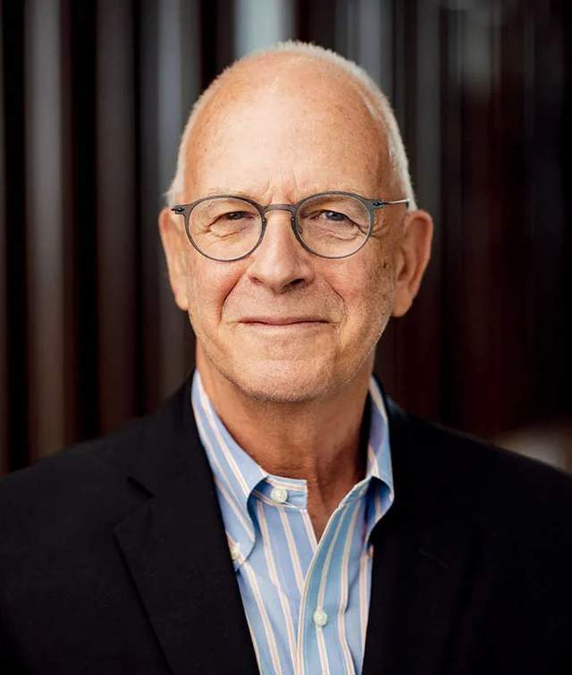

# 曾支持哈马斯，是以色列政府犯下的最大错误之一

29年前，以色列国防军中校阿莫斯·吉奥拉和巴勒斯坦同行共同起草了《加沙地带和杰里科地区的协定》，确定巴勒斯坦人在加沙实行自治。协定签署完成后，阿莫斯·吉奥拉离开营地，看到加沙民众鼓掌相送。

29年后，在最新的一轮巴以冲突中，哈马斯武装团体针对以色列平民的袭击及以色列军队随后对加沙地带展开的无差别报复，已经导致双方上万名平民遇难。

近日接受《中国新闻周刊》专访时，美国犹他大学法学教授阿莫斯·吉奥拉呼吁以色列政府考虑用巴勒斯坦囚犯交换人质，并强调以色列政府需要立刻和约旦河西岸的巴勒斯坦民族权力机构展开对话，并严格防范西岸的犹太人非法定居者对巴勒斯坦平民展开暴力报复，以免冲突局势和人道危机进一步扩大。

阿莫斯·吉奥拉的一些建议已经得到实现。11月5日，美国国务卿布林肯前往巴勒斯坦民族权力机构所在地拉姆安拉，和巴勒斯坦民族权力机构主席阿巴斯会晤，重点讨论了约旦河西岸的定居者暴力问题。

阿莫斯·吉奥拉是大屠杀幸存者后代，上世纪90年代任以色列国防军驻加沙部队的法律顾问暨首席律师，也是巴以双方在加沙地带落实《奥斯陆协议》谈判的以方代表。2000年和平进程破裂后，阿莫斯·吉奥拉继续参与和巴勒斯坦民族权力机构秘密进行的二轨对话。

阿莫斯·吉奥拉回忆称，谈判期间，巴方代表将哈马斯问题排除在议程之外，但哈马斯最终成为破坏和平的关键搅局者。对于10月7日的暴力袭击，“各方都应该负责”，哈马斯尤其要付出代价，但以军也必须“小心地划定附带损害的界限”。而最终，巴以双方还要回到和平进程中，为共同的未来找到政治解决方案。

_阿莫斯·吉奥拉。图/受访者提供_

**哈马斯阻碍了和平进程**

**中国新闻周刊：目前加沙地带还有200多名人质被扣留，获释的人数尚是个位数。以色列相关机构是否有可能就人质问题和哈马斯进行直接或间接谈判，包括用以色列关押的巴勒斯坦囚犯交换人质？**

**阿莫斯·吉奥拉：**
目前，通过卡塔尔进行的间接对话正在进行，美国也参与其中。我不知道是否能用“谈判”来描述。据我所知，以色列和哈马斯并不会直接对话。历史上，双方曾通过埃及等周边国家间接传递信息。近期，摩萨德负责人访问了卡塔尔，我希望这能带来某种解决方案。

10月底，当被绑架人质家属和以色列国防部长会面时，家属们提出了以哈马斯及巴勒斯坦囚犯交换人质的提议，国防部长说政府没有考虑这个方案。但这是否意味着内塔尼亚胡政府真的不考虑这个方案？过去，当以色列士兵被哈马斯绑架时，我们也曾表态说拒绝交换，但最终我们达成了交易。所以，这是一种“传统”：先公开说不，然后再考虑“是”。

此外，以色列军队对加沙的密集轰炸和地面进攻，是否能对哈马斯施加压力，迫使其通过卡塔尔达成某种释放人质的协议？这也是一种手段，但其结果还不确定。

**中国新闻周刊：上世纪90年代，在巴以领导人签署奥斯陆协议后，你是以色列国防军在加沙地带的谈判代表。你们当时会谈论有关哈马斯的问题吗？**

**阿莫斯·吉奥拉：**
1992年，我被任命为加沙军事法庭的法官和驻军副法律顾问，之后在1994年被任命为驻加沙部队法律顾问、首席律师，和巴勒斯坦军方进行了五年谈判，内容主要是在加沙地带落实《奥斯陆协议》。和平进程破裂后，我又参与了和巴勒斯坦民族权力机构官员进行的二轨非公开接触。

前后十余年的对话中，我从没有和哈马斯进行过谈判。据我所知，以色列从没有和哈马斯进行过围绕奥斯陆协议的谈判。其次，我们和巴勒斯坦代表也从不在谈判中讨论哈马斯。

事实上，在后来的二轨对话中，巴方代表对我们提出了非常明确的要求：不讨论哈马斯问题。我们遵守了这一点。当时，巴勒斯坦民族权力机构领导人阿拉法特的一位重要助手跟我说：请你们远离这个话题，直到我们自己“把屋子打扫好”。我想他的意思是，这是巴勒斯坦民族权力机构和哈马斯之间的事情。

不要忘了，在2004年、2005年哈马斯开始接管加沙的时候，哈马斯成员向巴勒斯坦民族权力机构的人开枪，将他们从楼上扔下来。这种斗争是残酷的。今天，约旦河西岸的巴勒斯坦民族权力机构依然高度关注着哈马斯，担心哈马斯势力会在约旦河西岸崛起。

在很大程度上，哈马斯阻碍了我们和巴勒斯坦之间的和平进程。我还记得我们双方就加沙地带落实和平进程的协议签字的那一天。签字结束，所有人乘车离开，我当时在最后一辆车上。我们都在问自己：加沙人民将对这些协议作出怎样的反应？然后我看到道路两边的民众在鼓掌，不是敷衍的鼓掌，而是明显表示欢迎的鼓掌。在那个时刻，我有一种感觉，和平的希望是存在的，尽管我从不是一个天真的人。

2005年，当以色列从加沙撤离军队和定居点时，我也看到了这种希望。但紧随其后，哈马斯就摧毁了以色列人留下的温室。温室是加沙农业和经济的一部分。我觉得这是一个明显的迹象，表明哈马斯真正想做的是扼杀加沙，或者至少显示出他们对于发展当地经济毫无兴趣。

当然，巴勒斯坦民族权力机构、哈马斯、以色列之间的关系是复杂的。以色列政府过去犯下的最大的错误之一，就是曾经支持哈马斯以削弱巴勒斯坦民族权力机构。因此，我一直认为，10月7日哈马斯对以色列的恐怖袭击，有多个方面的人要为之负责。

**“和谈就是‘和敌人和解’”**

**中国新闻周刊：你曾经回忆过关于巴以和谈的一些有趣的细节，包括双方的饮食差异。能否谈谈双方代表之间的关系，为什么你们能够就加沙居民离境的安全通道等敏感问题达成共识？**

**阿莫斯·吉奥拉：**
我对饮食问题记忆犹新。如果在以色列一边谈判，我们只能提供糟糕的部队伙食；如果在巴勒斯坦一边谈判，他们会热情款待，食物非常好吃。所以那些年我们都喜欢去他们那儿谈。

我不会说我们之间形成了朋友关系。我和巴方代表相处了数千个小时，每次相互尊敬，握手寒暄，但这是出于职业上的尊敬，不带有个人感情色彩。但是相处久了，大家会谈论各自的家庭，然后意识到对方也是一个父亲，也有孩子。这会形成一定的亲切感。

谈判往往有很多戏剧性时刻，特别是当谈判双方有相似的职业背景时，双方的“共同语言”可以推动共识的形成。记不得是哪一年了，我和一位以色列上校及一位巴勒斯坦上校同乘一辆吉普车。这位以军上校是德鲁兹人（以色列的阿拉伯少数群体），所以他会说阿拉伯语。两位上校就用阿拉伯语交流。更重要的是，他俩都是军人，所以不仅有相同的语言，更有“共同语言”。于是，就在吉普车上，他们让我现场起草了一些协议，迅速达成共识，然后很快就落实了。

对我来说，这些事情很有启发性：那些有相似背景、共同语言的人，能够在谈判中迅速熟悉起来，能够真正相互尊重，即使他们曾在战争中站在战壕的两边互相攻击。这就是和谈的真谛，和谈本来就是“与你的敌人和解，而非与你的朋友”。

**中国新闻周刊：现在，巴勒斯坦民族权力机构并不控制加沙地带。以色列政府是否还需要就当下的危机和巴勒斯坦民族权力机构进行对话？**

**阿莫斯·吉奥拉：**
我认为需要，而且现在就应该开始对话，当然主要是要谈论约旦河西岸的局势。如果我是以色列在西岸的军事负责人，我现在更关心的不是巴勒斯坦人可能发起袭击，而是那些不安分的犹太定居者。西岸的一些犹太定居者很可能认为现在是对巴勒斯坦人实施恐怖主义报复的机会。我希望以色列国防军能防范和制止西岸犹太定居者的暴力行动，避免在西岸出现一条新的战线。

**中国新闻周刊：你认为当前的冲突将如何结束？巴以双方能否再次走向和谈？**

**阿莫斯·吉奥拉：**
我认为内塔尼亚胡有一项判断是正确的：这是一次漫长的战争。我非常怀疑以色列国防军能彻底消灭哈马斯，这点上我可能是以色列的少数派。以军能做的是打击哈马斯的领导层，就像我们一直在做的那样。但他们总有能取代的新人。或许以军也能真正地摧毁哈马斯的基础设施，但这需要很长的时间，特别是摧毁地道，在实际行动上会非常困难。另一方面，军事行动无法扼杀哈马斯所代表的思想。

所以，最终我们必须通过谈判解决问题。并不是为人质谈判，而是为巴以的长期解决方案而谈判。目前不可能实现这一点，我们可能需要等到下届以色列政府，还需要等到非常不同的巴勒斯坦领导人出现。

我知道很多加沙人对哈马斯有意见，但他们不敢说出来。我希望在未来的某个时刻，更多的巴勒斯坦人会意识到是哈马斯摧毁了加沙，将他们带进了深渊。但是，加沙人民能在多大程度上站起来反对哈马斯，是个有点尴尬的问题，很难说他们能做什么。

总之，我们可以这样说：在短期内，我们不会看到和谈发生。但早晚有一天，我们将别无选择。巴勒斯坦民族权力机构是否能回到加沙取代哈马斯，开始新的和谈？美国、卡塔尔、埃及能否推动和平进程？我不知道，我也不天真。但我确信：早晚有一天，我们必然走向谈判桌。

发于2023.11.13总第1116期《中国新闻周刊》杂志

杂志标题：阿莫斯·吉奥拉：和平进程为何搁浅？

记者：曹然

编辑：徐方清

