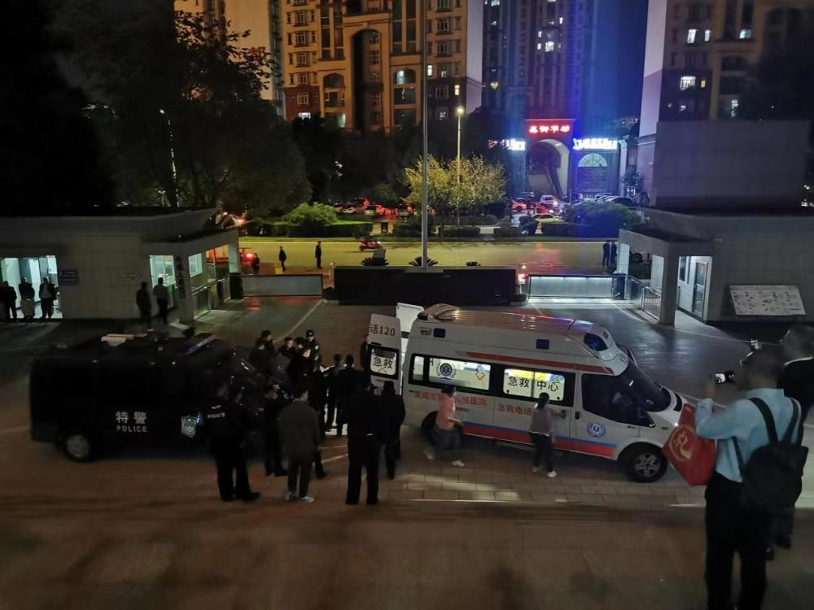
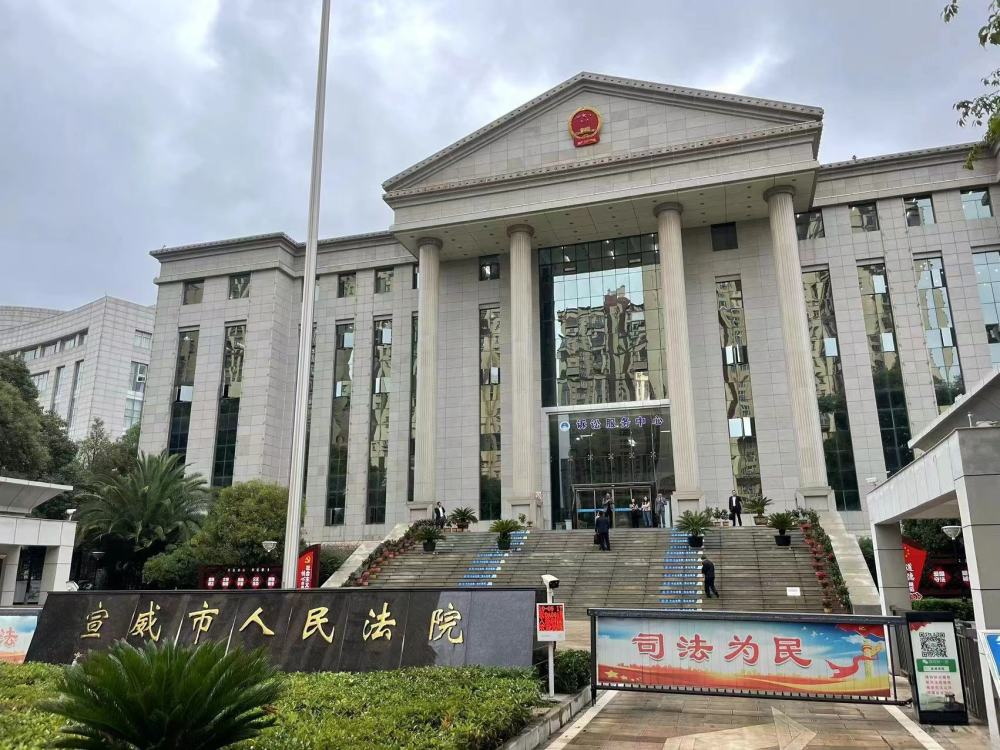
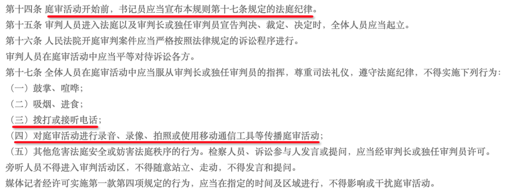

# 法治课｜专家评“公安见证法警扣押律师手机”：于法无据

11月6日，律师迟夙生在云南曲靖宣威市人民法院因手机被扣引发疾病就医，次日宣威法院院长到医院看望迟夙生，随后送还了手机。11月9日，“宣威融媒”一篇《记者回溯“迟夙生律师突发就医情况”事件全程》，再次引发舆论对这起法院扣押律师手机风波的关注。

_迟夙生律师突发疾病现场_

律师在开庭前拍摄法庭的照片，是否违法或者违反相关规定？法庭是否有权扣押律师手机，以及为何要请公安机关见证封存律师手机？公安机关在此事件中的行为是什么性质？

多名专家围绕上述问题展开讨论后认为，法律仅规定律师不得拍摄庭审活动现场，并未对开庭前的拍摄行为进行规定，因此法警无权扣押律师手机。同时，在律师没有违法的情况下，法警本身没有扣押律师手机的权力，而公安机关的见证行为，则更不是执法行为。云南宣威法院和公安的行为均属于“于法无据”。

_宣威市人民法院_

**问题一：律师是否有权携带手机进入法庭**

事件的冲突，源于律师在法庭内使用手机。

据“宣威融媒”报道，11月6日上午，律师迟夙生进入法庭后没有按照法庭要求存放手机，而是用手机在法庭内拍照。那么，律师是否有权将手机带入法庭？

《中华人民共和国人民法院法庭规则》（下称《法庭规则》）第7条规定，“枪支、弹药、管制刀具以及其他具有杀伤力的器具；易燃易爆物、疑似爆炸物”等可能危害法庭安全或者妨害法庭秩序的物品，除经人民法院许可，需要在法庭上出示的证据外，不得携带进入法庭。

手机是否属于这类物品？《法庭规则》第17条第1款第3、4项则规定了全体人员在庭审活动中不得“拨打或接听电话”“对庭审活动进行录音、录像、拍照或使用移动通信工具等传播庭审活动”等禁止性事项。

“由上述规定可见，手机不属于违禁品，带入法庭无须经法庭许可，只是不得在庭审期间进行上述有违法庭规则的使用。”湖南省刑法学研究会原副会长贺小电认为。

 _迟夙生律师放置手机的柜子_

“宣威融媒”的报道表明，在法律并未禁止律师携带手机进入法庭的情况下，宣威法院设置了律师进入法庭需先存放手机的要求。

 _宣威融媒的内容_

北京大学法学院教授陈永生认为，手机不仅是一个通讯工具，而且是一个办公用品，许多资料存储在手机上，禁止律师带手机不利于律师充分行使辩护权，是不合理的。

据澎湃新闻此前报道，在宣威法院公开开庭审理的这起案件中，迟夙生一直遵守法院的规定，开庭时，其将手机寄放在法院设置的手机柜内，并用钥匙上锁。

**问题二：律师是否有权在开庭前拍摄法庭照片**

11月6日早上，在开庭前，迟夙生律师进入法庭，并拍摄了法庭内的照片。

据南方周末报道，迟夙生到达法庭时，距开庭还有20分钟。她拍摄的内容，是法庭内被告人席位上新摆放的10张黑色铁制审讯椅。这是一种带有固定手脚的装置。《法庭规则》规定，除认为被告人人身危险性大、可能危害法庭安全外，法院在庭审活动中不得对被告人使用戒具。迟夙生下意识地举起手机拍摄了两张审讯椅的照片。

书记员发现迟夙生的拍摄行为后，当即劝阻并让其删除照片，被迟夙生以“拍照时庭审还没开始，没有违反法庭纪律”为由拒绝。随后，迟夙生走出法庭存放了手机。

《法庭规则》第19条规定，“行为人违反本规则第17条第1款第4项规定的，人民法院可以暂扣其使用的设备及存储介质，删除相关内容。”

贺小电认为，如果迟夙生使用了手机“对庭审活动进行录音、录像、拍照，传播庭审活动”，则属于妨害法庭秩序的行为，拒绝删除，法庭可以当庭强行暂扣并予以删除，但是迟夙生是在开庭前对法庭内放置“审讯椅”的被告席进行拍照，不属于对庭审活动进行录音、录像、拍照的行为。

“庭审活动固然要以审判长或者独任审判员敲响法槌、宣布开庭为前提。这样，迟夙生并没有任何违反《法庭规则》或刑诉法解释的地方。即使不当，也不属于可以对其手机暂扣并要求删除照片的范围。”贺小电说。

中国政法大学教授陈碧也认为，上述《法庭规则》第19条是对庭审活动的保护。法庭要适用上述规定的前提是其拍摄了庭审活动，“迟夙生在开庭前，对无人的审讯椅拍照，无论如何解释，都不属于拍摄庭审活动”。

陈永生也认为，在书记员宣读法庭纪律以前，庭审尚未开始，迟夙生拍照并无不当，法警扣押迟律师手机是错误的。相关规定是《法庭规则》第14条：“庭审活动开始前，书记员应当宣布本规则第17条规定的法庭纪律。”也就是说，书记员没有宣布法庭纪律前，不算庭审活动。

_《法庭规则》的相关规定_

**问题三：公安见证法警扣押律师手机是什么性质的行为**

据“宣威融媒”的报道，上午法庭休庭期间，审判人员再次要求迟夙生删除手机中的法庭照片，迟夙生依然拒绝。合议庭随即决定暂扣迟夙生手机，并通知其本人。

据澎湃新闻此前报道，下午庭审结束，迟夙生发现自己手机失踪后，向看管手机柜的法警询问，法警不置可否。其后又询问审判长丁敏法官，丁敏说“手机失踪你报警啊”。迟夙生在法院继续查询手机，其后被多名法警强行拖进法院另一个房间，关上房门。

“宣威融媒”报道称，“11月6日中午，按照有关程序，在宣威市公安机关的见证下，宣威市人民法院司法警察用备用钥匙打开手机柜，取出手机当场用信封装存，由取件人、见证人签字后，将手机交合议庭存放于保险柜中。当天下午庭审中，迟夙生又提出法庭扣押其手机的问题，合议庭对相关情况进行了说明并记录在卷。”

对此，此前在广西冯波案中因被法院禁带电脑的律师王昊宸公开质疑，“在公安见证下，法院有权偷律师手机？”金宏伟律师也发言称，“中国的哪条‘相关程序’允许警察见证法官私拿律师手机？”

既然法庭本无权扣押涉事律师手机，那么公安见证法院封存律师手机，是否有法律依据？

贺小电认为，“迟夙生的手机既然不符合暂扣的前提条件，即使有公安人员见证，也属违法。不会因为公安的见证，不法变成合法。反之，如果迟夙生的手机满足暂扣条件，属于可以暂扣的物品，无需公安人员见证，亦系合法正当。因此，让公安人员在场进行所谓的见证，要么是此地无银三百两，要么是画蛇添足。”

陈碧也用“多此一举”形容公安的行为。“公安有侦查权，有权在自己职责范围内立案，并申请相关令状进行搜查和扣押。但是《人民警察法》规定的公安应履行职责中，并无见证司法警察扣押律师物品的职责。”陈碧说，“在该事件中，我认为公安机关并不是在执法，所以也谈不上越权。这有点类似于有人报案，公安赶到现场，但什么都没做。”

陈永生也认为，“公安本身可以扣押公民手机等物品，但前提是公民涉嫌违法犯罪并经立案。迟律师在庭审未开始时对法庭进行拍照，不构成任何违法犯罪。”

三位专家均表示，上述“宣威融媒”通报中的由公安见证法警封存律师手机的行为，只能表述为：于法无据。

**问题四：法院扣押律师手机是否侵权**

宣威法院扣押、封存迟夙生律师的行为，是否侵犯其权益？

据澎湃新闻此前报道，迟夙生律师因在法院设置的手机柜内未取到手机，寻找手机过程突发疾病。

一位不愿透露姓名的中级法院人员告诉澎湃新闻，“如果已经给了迟律师放置手机的柜子以及钥匙，那么在未经当事人允许的情况下开箱取手机，侵犯了对方的物权和隐私权。”

贺小电认为，法院对给辩护人、旁听人员存放物品的存放柜，负有保管之责。在物品并非违禁品、犯罪工具、证据、民事被告人的财产等可以依法查扣或者保全的情况下，不能“偷偷地暂扣”。在迟夙生的手机不应暂扣的情况下，按照《民法典》第240条，所有权人对自己的财产“依法享有占有、使用、收益和处分的权利”，私自强行暂扣的行为显然侵犯了其对手机的占有、使用权。具体的法条为《民法典》第888条：“保管合同是保管人保管寄存人交付的保管物，并返还该物的合同。寄存人到保管人处从事购物、就餐、住宿等活动，将物品存放在指定场所的，视为保管，但是当事人另有约定或者另有交易习惯的除外。”及第889条：“寄存人应当按照约定向保管人支付保管费。当事人对保管费没有约定或者约定不明确，依据本法第五百一十条的规定仍不能确定的，视为无偿保管。”

“法院设立存储柜让律师、旁听人员等免费存放物品，显然形成了无偿保管合同，应妥善保管，如不予返还，则违反上述法律。”贺小电说。

据南方周末报道，11月7日，宣威法院院长陈永福在当天下午1点左右到医院看望迟夙生，并在3点多归还了她的手机。

澎湃新闻注意到，“宣威融媒”的报道最后提到，“宣威市人民法院表示，宣威市人民法院高度重视、尊重和保障律师执业权利，律师也应当遵守和维护法庭纪律，共同促进律师和法官的良性互动，凝聚法治建设合力，宣威市人民法院将依法公正审理该案，欢迎社会各界继续监督。”

上述匿名的中院人员则认为，“法院或法官与律师之间的互动应该遵循三个维度的原则：一个是规则维度，大家都要在法律法规制度规定的范围内行事；第二是语言表达的维度，既要遵守规定，又要注重基本的司法礼仪；第三个维度是职业共同体的一个维度，要有基本的信任和认同。”

