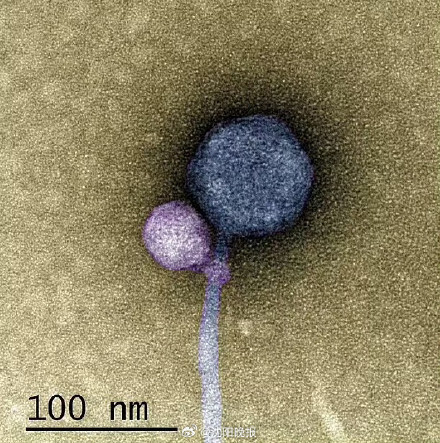
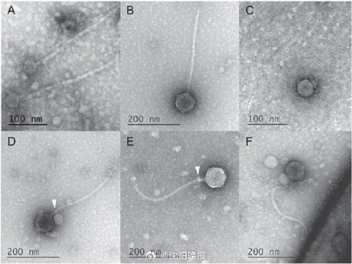

# 研究称美国首次发现“吸血鬼病毒”，可附在其他病毒的“脖子”上

每经编辑：杜宇

11月10日，美国首次发现吸血鬼病毒的话题冲上热搜第一。

据沈阳晚报美国马里兰州和密苏里州的土壤样本中首次发现了“吸血鬼病毒”。该病毒可以附着在其他病毒的“颈部”，并完成自我复制。从理论上讲，研究人员几十年前就知道这种病毒的存在，但这是在美国首次发现它们的踪迹。

_图片来源：沈阳晚报_

病毒的增殖过程大致是：入侵宿主细胞、利用宿主的核苷酸和氨基酸合成自身组件、复制完成后裂解宿主细胞。但在某些情况下，病毒也会遭到伏击。这些伏击的病毒被称为卫星病毒，这类病毒进入宿主细胞后会保持休眠状态。
**当新病毒进入细胞时，休眠病毒才会苏醒并接管指令完成复制** 。新发现的MiniFlayer就是这样一种卫星病毒，不过它没有休眠的能力，
**而是直接附着在其他病毒的“脖子”上** 。

据南方都市报，据报道，论文主要作者、马里兰州大学巴尔的摩分校（UMBC）的生物学家德卡瓦略（Tagide
deCarvalho）表示，当看到这种被称为“吸血鬼病毒”的噬菌体时，他简直不敢相信。

**此前，从未有人见过噬菌体或其他病毒附着在另一种病毒上** ，两种病原体之间的病毒关系被称为“卫星”和“助手”。

实验表明，80%（50个中的40 个）的“助手”颈部都有一颗“卫星”。

_图片来源：沈阳晚报_

由于它不能整合到宿主细胞的DNA（脱氧核糖核酸） 中，因此每次进入宿主细胞时，它都必须靠近它的“助手”MindFlayer才能存活。

生物科学教授埃里尔（Ivan
Erill）表示，MiniFlayer和MindFlayer已经共同进化了很长时间，这颗“卫星”一直在调整和优化自己的基因组，以便与“助手”联系在一起，共同进化至少有一亿年了。

相关研究已发表在《国际微生物生态学会杂志》上。专家指出，该发现有望能成为抗病毒疗法的研发关键。

每日经济新闻综合沈阳晚报、南方都市报

