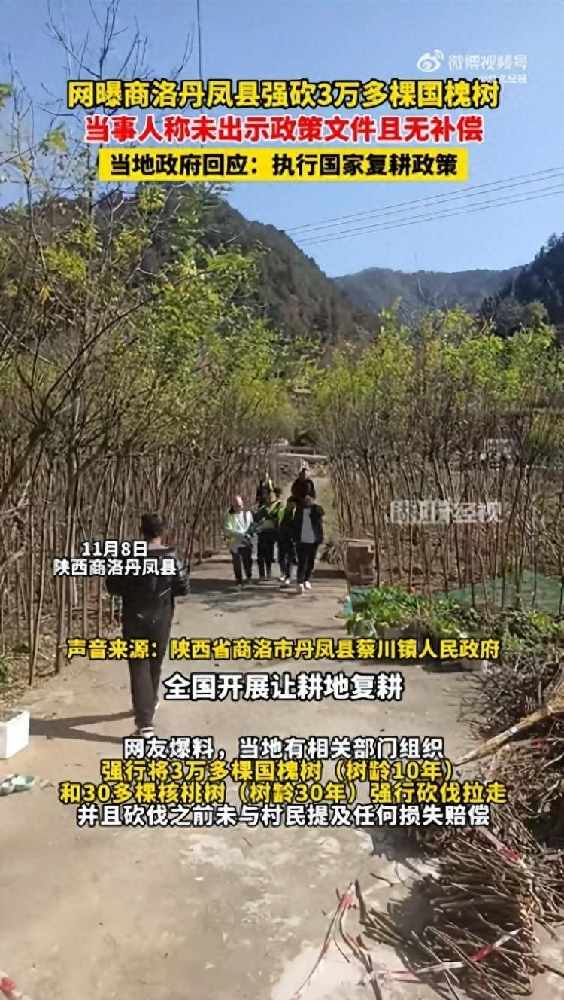
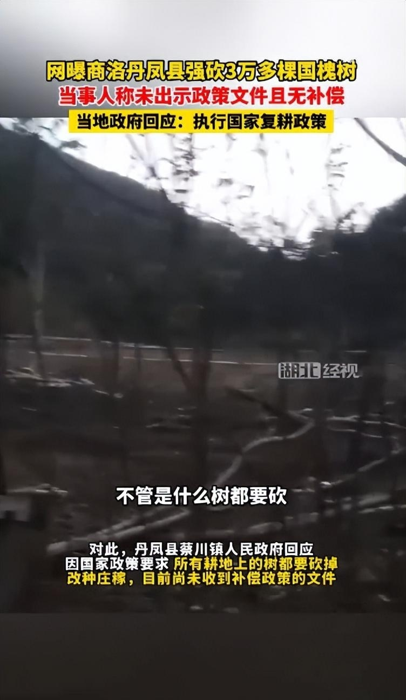
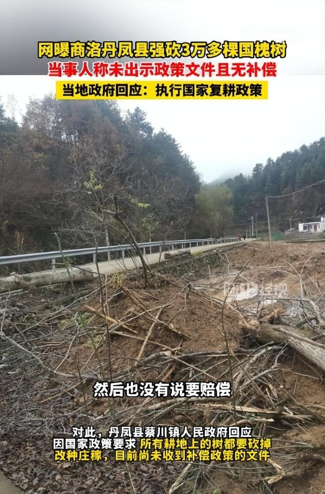

# 网曝陕西丹凤县强砍3万多棵国槐树 当地政府：所有耕地上的树都要砍掉

11月10日，据湖北经视报道，11月8日，在陕西商洛丹凤县，网友爆料，当地有相关部门组织强行将3万多棵国槐树（树龄10年）和30多棵核桃树（树龄30年）强行砍伐拉走，并且砍伐之前未与村民提及任何损失赔偿。

对此，丹凤县蔡川镇人民政府回应，因国家政策要求，所有耕地上的树都要砍掉，改种庄稼，目前尚未收到补偿政策的文件。“全国开展让耕地复耕，重新种上粮食，只要是那块耕地上面的，不管是什么树都要砍，目前这个政策是，然后也没有说要赔偿。”

**【来源：九派新闻综合湖北经视】**

