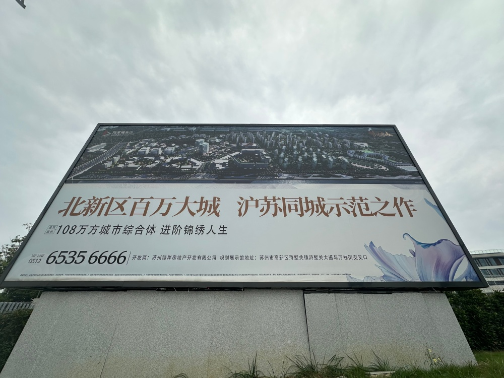
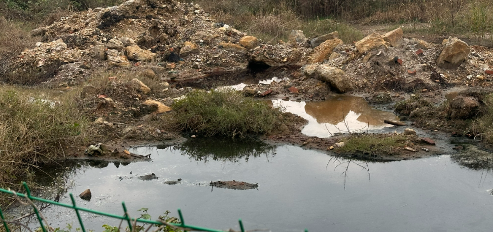
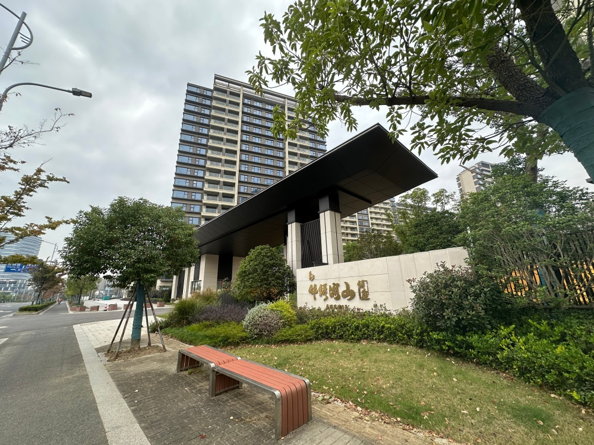

# 苏州“毒地”调查：源起国际学校环评，业主称买毒地房比买烂尾楼还惨

近日，“陆家嘴公司买到毒地索赔100亿元”持续发酵。

陆家嘴11月3日发布公告，其控股子公司名下14块土地污染面积和污染程度远超苏钢集团挂牌出让时所披露的污染情况。因此诉请法院判令苏钢集团赔偿100.44亿元。

10日凌晨，苏钢集团发布情况说明，称股权转让时如实披露了土地存在部分污染的调查结果和报告全文。并在资产评估报告中明确提示了该范围部分地块原为钢铁焦化生产区域，可能存在土壤污染风险。目前正积极应诉。

11月9日，九派财经记者实地探访了这片地块，并对依然居住在这片地块上的14号、15号地（尚不明确是否污染）的业主进行了采访。业主告诉九派财经，目前担心毒土地扩散，只想退房，并称“买到毒地房比买到烂尾楼还惨”。

**【1】“只想让大家知道，这片土地上依然有人居住”**

“我就想让大家知道，在这片土地上，依旧有人居住。”业主范小琪告诉九派财经。

在过去的72小时里，范小琪所在的锦绣澜山景园小区被贴上“毒土地”标签，反复出现在社交平台的热搜热榜，而一切的源头，来自上市公司陆家嘴的那则公告。

随着这桩百亿诉讼案被公开，苏州绿岸“毒土地”一事随之浮出水面。陆家嘴称，苏州绿岸名下土地的污染面积和污染程度，远超苏钢集团挂牌出让时所披露的污染情况；而根据2022年4月，第三方检测机构检测结果显示，苏州绿岸项目多处地块土壤中苯并芘、萘严重超标，不符合用地标准。

11月10日凌晨，苏钢集团发布情况说明，称股权转让时如实披露了土地存在部分污染的调查结果和报告全文，系陆家嘴联合体方在开发建设苏州绿岸地块期间，没有按照有关要求建设地下水阻隔墙及采取其他防护措施，造成二次污染。对于这起官司，苏钢集团称正在积极应诉。

为了解事情来龙去脉，11月9日，九派财经记者实地探访陆家嘴集团位于苏州市虎丘区浒墅关镇的17宗的土地（包含受污染的14块）。南起锦绣澜山锦园小区，北至苏州雷丁学校，曾经被誉为首个百万方城市区域综合体的苏州绿岸项目，如今却显得有些荒凉。

探访当天，路上仅能见到保安和环卫工，偶尔有一两台车呼啸而过。据当地人说，这里盖好的现房有上千套，但一到晚上就亮灯的房子并不多。

_苏州绿岸项目的招商宣传。 记者黄依婷/摄_

但就是在这番景象之下，却有一批业主在此居住生活了两年之久。有业主告诉九派财经，苏州绿岸锦绣澜山地产项目分为锦园、绣庭、峰誉庭三大楼盘。目前锦园有入住业主二十多个人；峰誉庭业主群（不包括安置三幢）300多人；绣庭已盖好但未交付。这些留下来的人，时刻被“毒地”阴影所笼罩。

“就像在地里埋了颗炸弹，而我们就生活在这上面。可以说比买到烂尾楼还惨，他们至少不会影响到健康。”范小琪说。更让她感到发慌的是，开发商陆家嘴公告上的毒地范围，似乎表现出还在扩大蔓延。如今，最近的污染地块距离的范小琪所在的锦园小区，仅隔着一条马路，中间距离不到20米。

**【2】雷丁学校和4号地块**

最先暴露出污染问题的苏州雷丁学校，位于最北边的2号地块。

记者探访当天，雷丁学校南门半开，旁边设置了一座保安亭。不远处是停车场入口，铁门紧闭，贴着红黄色的警示牌，上写“本地块存在污染风险，未经许可，严禁入内”。雷丁学校物业方告诉记者，目前苏州雷丁学校还没有交付，平时进出的维修人员很多。

这一说法却与业主说法有说不同。据范小琪回忆，2021年“毒地”事件还未爆发前，雷丁学校已经正式公开招生了，任课老师也已配齐，可临近入学时，校方请来的检测机构发现了土壤存在污染，导致雷丁学校环评不过关，匆匆关停。

随着污染问题传出，最开始冲着“雷丁国际学校”而来的业主跑到绿岸的开发商办事处讨要说法。

范小琪回忆，当时开发商负责人向业主承诺，将会对地块进行重新检测，一个月后会反馈结果。但当一个月后业主们再去找绿岸开发商时，被告知检测报告显示的锦园所在14号地块不存在污染问题，开发商也并没有向业主展示任何的书面文件或公示文件。

 _雷丁学校铁护栏上的警示标语。 记者黄依婷/摄_

另一名业主谢瑶（化名）则告诉九派财经，苏州绿岸项目污染问题早有传出，早期她们询问过开发商，被告知问题不大，污染集中在雷丁学校周边的几块地皮，即4号地块。

根据苏钢集团于2016年8月挂牌时披露的信息，苏州绿岸名下地块中，焦化区域的污染主要集中在4号地块局部区域。根据修复目标值，最终确定0-18米深度内，污染范围为17542平方米，污染土方量为39604立方米。2017年8月至2020年4月，苏州绿岸宣称完成了4号地块治理修复，修复效果评估通过专家评审。

穿过苏州雷丁学校南面的马路，来到正常开放的白豸山运动公园，而该公园西面是污染最严重的4号地块。透过公园西边的栅栏，依稀可见4号地块内有一滩颜色乌黑的死水，水面上飘着浮萍、泛着油光。

再往里走到地势稍高，里面堆放着砂石，露出些砖红色、有圆孔的块状物，积水的黑更深一些，风吹过来，有股类似沥青挥发的味道。此前有业主反映，早上会偶尔会闻到那种很刺鼻的味道。

 _4号地上乌黑的死水。 记者黄依婷/摄_

事实上，绿岸项目地块原为苏钢集团的老厂区，而经确认的几个污染地块，正是分布在老厂区的焦化区，以及原用途为炼钢厂的非焦化区内。据一位当地人说，原来苏钢厂生产的老式的管道煤气，属于钢铁厂变焦炭的副产品，污染性很强。

**【3】“再也捂不住”**

从4号地块再往南走，便能来到苏州绿岸项目的住宅区——锦绣澜山。三大楼盘之一的锦园小区入住率肉眼可见的低，记者只在锦园小区一幢、三幢外层，看到有几位住户晾衣服。一位在锦园小区做绿化工作的女士透露，到该小区做绿化两周，她没和小区住户说过一句话，也几乎没见过有人走动。

范小琪在2019年底买下了这里145平的房子，花费370多万。她告诉记者，雷丁学校毒地事件传出不到一年的时间里，无论是物业经理、还是苏州绿岸负责人都无法联系，售楼处在一年半前直接关停、相关销售也已离职。

“网上说的维权退款，没有一个人是真正买房退了款的。”谢瑶称，退款指的是极少部分交定金没有交房，只退几万块钱定金。谢瑶居住的峰誉庭小区总共是6栋楼，前三栋是苏钢集团家属的安置房，然后有三栋是商品房，可容纳600多户，据谢瑶称已全部住满。

如今，锦园入住二十多位业主以及峰誉庭的数百号人，皆处于“毒地”阴影的笼罩之下。

_苏州绿岸锦绣澜山项目。记者黄依婷/摄_

“其实我们大多数人对毒地污染也是心肚明，只是一直捂着。没有报道出来，我能捂下去，也没有多大膈应，能住就住下去了。但现在，可能捂不住了。”范小琪坦言，自己早期并不觉得污染问题严重，开发商都正常售卖，也给房产证，周边苏高新区的中学、住宅和一些配套设施也都有在建，这些都短暂打消了自己的疑虑，直到近期“毒地”事件登上热搜。

让范小琪和谢瑶感到“再也捂不住”的原因，来自于不断扩大的“毒地”面积。九派财经在此前《百亿“毒地索赔案”背后：耗时7年的项目沦为空城，仍有业主不愿离开》报道中提到，根据陆家嘴此前公告，截至今年7月25日，苏州绿岸持有7幅地块存在不同程度的污染。而到了11月4日披露的公告，已确定存在污染的土地变成了14块，分别是1至13号地、17号地。

值得注意的是，绿岸项目的17个地块中，仅有14号、15号、16号地块还未有信息披露，根据陆家嘴的公告，这三个项目是两个住宅用地和一个教育用地。九派财经经过实地探访发现，14号地块正是锦园，15号地块则为峰誉庭，16号地块为一所幼儿园。

“为什么除了住人的这两块地，其他都有污染了。难道说污染源特意绕开我们这两个商品房。”范小琪发出疑问。而最让她感到担心的是，爆出来有污染的13号地块离景园只有20米，中间仅隔着一条马路。“没有任何书面的监测报告显示说没有污染，那我们离得这么近会不会有扩散风险？”

虽然每月要还万把块房贷，但谢瑶一家还是决定出去租房子。“第一，我们对自己的身体健康有一定的担心；第二，就是这相当于房子烂在手里了。”谢瑶称。

当下，谢瑶希望能找到“消失”的开发商。“这块地肯定是有安全隐患，检测报告一会儿说有污染，一会儿说没污染。我们不确信脚下的地到底有没有污染，唯一的诉求就是退房，不敢奢望赔偿。”

未来，范小琪所在三块土地是否会有被列入“毒土地”行列的风险，暂不得而知。但“毒地”的阴影早已笼罩在锦绣澜山业主们心头，很难挥散出去。

**九派财经记者 黄依婷 郭梓昊**

【来源：九派财经】

