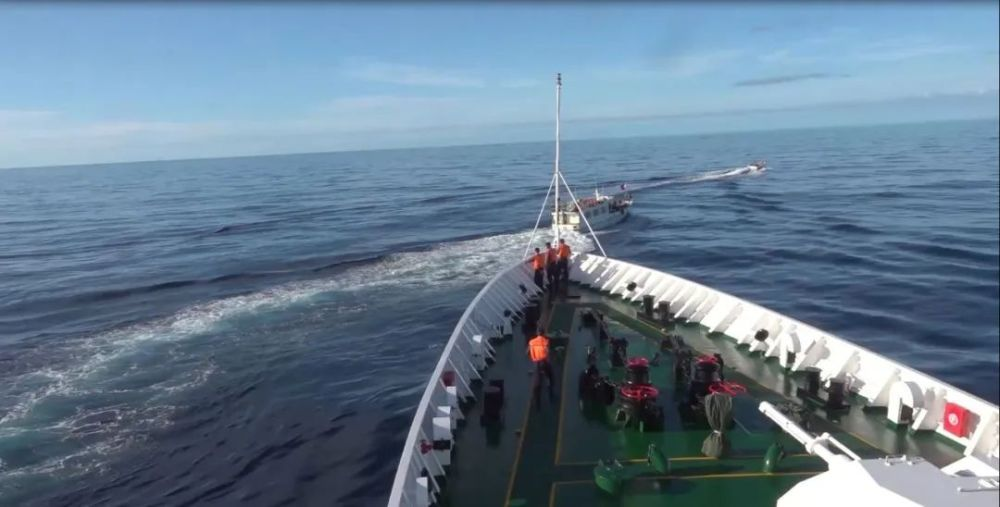
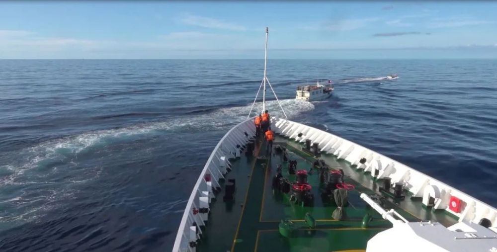

# 视频公布！中国海警依法规范处置菲非法进入仁爱礁邻近海域船只

中国海警局新闻发言人甘羽表示，11月10日，菲船只在向非法“坐滩”军舰运送物资过程中，以不安全不专业方式执意冲闯，严重违反国际海上避碰规则。中国海警依法依规对菲船只进行规制，拦阻菲海警船、抵近查证菲运输船，现场操作专业规范、正当合法。我们正告菲方立即停止侵权挑衅和污蔑炒作，中国海警将加强在中国管辖海域维权执法，坚决维护国家主权和海洋权益。

谁在危险机动？！

来源 中国海警

编辑 实习编辑 赵司尧

流程编辑 刘伟利

