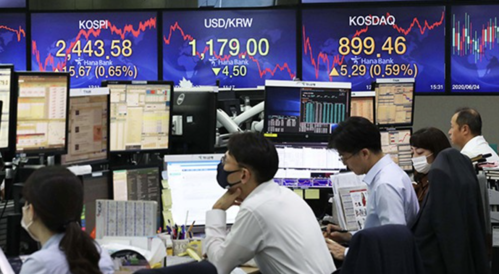
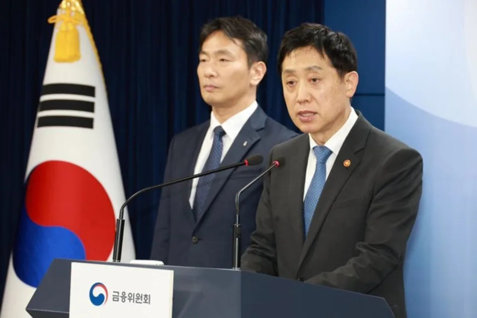
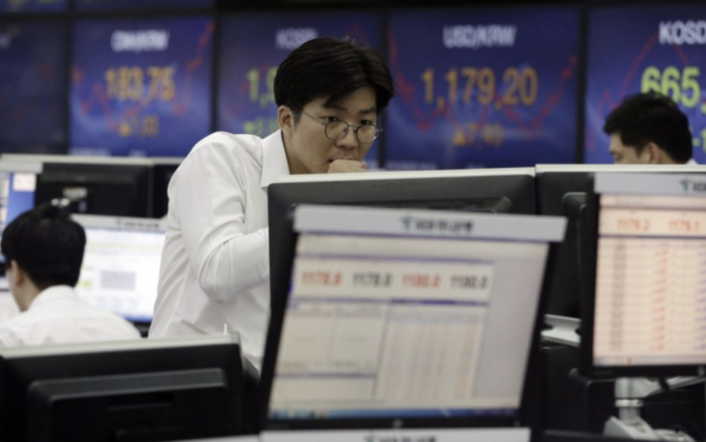

# 韩国散户还是不买账？重启“限空令”96小时，股市下跌近100点

本文来源：时代周报 作者：马欢

韩国股市的卖空禁令，或将延长。

据媒体报道，韩国金融服务委员会（FSC）负责人金周显（Kim Joo-
hyun）11月9日在国会审计会议上被问及可能延长卖空禁令时，表示：“我认为如果目前的情况得不到改善，我们将不得不考虑许多问题。”

他的这一表述，被不少媒体解读为“暗示将延长股票卖空禁令”。

从11月6日开始，韩国股市就开始实行“限空令”。据韩联社报道，韩国金融服务委员会和金融监督院11月5日举行记者会，宣布将从11月6日起，全面禁止股票卖空。该禁令将持续到2024年6月30日。

这是自2008年全球金融危机、2011年欧洲债务危机、2020年新冠疫情以后，韩国金融部门第4次在股市采取禁止卖空的措施。

韩国金融监管机构表示，由于韩国股市不稳定，导致难以维持公平的交易秩序，所以才出次禁令，进行规范。

金融观察人士认为，韩国金融部门近8个月的禁令可能有助于安抚散户投资者，避免明年4月选举前，民众抱怨做空机构给股市投资带来的影响。然而，这同样会阻碍国际投资者对韩国股市的兴趣。

市场很快就对禁令作出了反应。11月6日当天，韩国股市大涨，韩国综合指数KOSPI指数上涨5.6%，报2501.57点，创2021年1月以来最大单日涨幅。

_图源：社交媒体_

但大涨并没有持续很久，接下来的两天均出现不同程度的下跌，虽然11月9日有所回升，但截至当天收盘，韩国KOSPI指数还是没能涨回去，报2427.08点，与11月6日的高位相差了74.49点，跌幅近3%。

而有可能延长禁令的风声，也没能让韩国散户买账。11月10日，KOSPI指数开盘报2406.40点，较前一交易日下跌20.68点，与11月6日相比下跌近100点。

平息散户怒火？

韩国金融监管机构突然出手的背后，是韩国股市的持续走低。

到10月底，KOSPI指数已跌至2273.97点，相较今年8月初的高点2668.21点，跌幅近15%。

也是在10月，韩国股市净卖出2.9万亿韩元的股票，这是连续第5个月净卖出，也是自2022年6月以来，资金流出最多的一个月。

在这期间，韩国媒体还爆出“监管调查两家国际投行涉嫌裸空560亿韩元股票”的消息，引发韩国下至散户、上至国会议员对做空行为的激烈声讨。

股市持续下跌，韩国国内的散户们对严打非法做空行为的呼声越来越大。

韩国金融服务委员会委员长金周显表示，监管机构发现，在这一波股市动荡中，存在跨国投资银行大规模非法裸卖空(Naked Short
Selling)以及更多非法活动的情况。

_韩国金融服务委员会委员长金周显在发布会上讲话（图源：社交媒体）_

所谓裸卖空，指的是交易者在不拥有股票或债券的情况下，在市场上借入和出售根本不存在的股票或债券，然后在股价进一步下跌时再买回去，从而获得利润的投资手法。

“这些非法的行为，破坏公平价格形成，损害市场信心，情况严重。”在金周显看来，与机构投资者相比，个人投资者的偿还期限更短、抵押比率也更高，更容易吃亏。

他表示，韩国将在未来几个月寻求“根本性改进”，为散户投资者创造公平环境，包括设法缩小机构和个人投资者之间不同的卖空要求和条件。

韩国金融管理机构还表示，11月6日当天起，即成立一个特别调查小组，负责调查全球银行的卖空交易。

对此，金融监督院院长李卜铉指出，大约有10家国际银行将面临调查，这些银行占韩国做空交易的大部分。

至于卖空禁令，韩国金融监管部门表示，会先观望这一波的运作情况，到明年6月，再决定是否解除。

有弊也有利

虽然韩国金融监管机构认为卖空禁令有助于维持市场公平，不过，还是有部分专家和机构的观点与之不同。

韩国现代经济研究院经济研究室长朱元表示，股市卖空是在发达国家金融市场得到允许的制度，所以股市卖空，具有两面性。

“卖空是投资者在资金不足或不持有股票的情况下，按证券交易所规定的信用保证金或抵押制度而采取的一种投资方式，它有利于搞活股市和投资者受益，但也有一定的风险。”韩国KBS在报道中表示。

实际上，韩国不止一次实施股票卖空禁令了。路透社表示，上一个在新冠疫情期间实施的禁令，直到今年5月才解除，没想到这么快又行动了。

机构分析认为，其实在今年7月底左右，韩国股票有涨过一阵子，主要是依靠人工智能（AI）、电动车电池以及半导体等行业。接下来，受到全球地缘政治紧张和全球经济不确定等因素，加上韩国利率又居于高位，所以KOSPI指数或持续下跌。该机构指出，只有宏观经济形势改善，股市才会反弹。

如今，卖空禁令来了，有人担心会适得其反，减弱股市流动性，并影响国际投资者对韩国股市的布局。

韩国多年来一直在努力，想要将该国指数从MSCI的“新兴市场名单”提高至“发达国家名单”。在过去两年的评估中，MSCI都指出韩国市场存在国际投资者可及性的问题，卖空制度也是其中之一。

新加坡投资分析平台Smartkarma的分析师Brian
Freitas认为，卖空禁令将进一步损害韩国从新兴市场转向发达市场的机会。Freitas甚至预计，因为无法卖空，股市中受散户投资者青睐的部分有可能形成泡沫。

占比达80%的散户

在韩国，散户是一群无法忽视的群体。

据2022年的数据显示，韩国股市活跃账户已经超过6000万个，约为全国人口的1.16倍，股民中大约80%是散户。

_图源：社交媒体_

韩国金融投资协会的数据还显示，在韩国股市中，个人投资者对交易的贡献最大，其次才是外国投资者和机构投资者。个人投资者占2022年KOSPI市场韩元总交易量的53.12%。

如此大的散户体量，韩国金融监管机构，对他们的诉求，无法忽视。

然而，这些个体的投资模式，风险巨大。韩国散户，特别是偏年轻的投资者们，并不相信市场的长期收益，甚至不愿意购买三星这样的蓝筹股，因为觉得波动太低、涨得太慢，他们更钟情于动辄暴涨暴跌的股票。

不仅如此，很多韩国散户都是以股票为担保从证券公司贷款，即通过信用融资来炒股。他们对杠杆和波动性的热爱，远超全球其它投资者。换句话说，他们更渴望“一夜暴富”。

IBK Investment & Securities的研究主管Lee Seung-
hoon说：“这些散户投资者追求高风险高回报的策略，非常容易受到社交媒体和短视频平台标题党的刺激。他们的投资时间越来越短，容易被没有基本面依据的新闻信息流所左右。而市场规模和盈利等数据清晰可见的公司对他们不再有吸引力，因为他们追求的是超过10倍的投资收益。”

由于杠杆率大，在交易点差扩大时，散户面临更高的风险，所以他们普遍认为，卖空交易给外国和机构投资者带来了优势，对他们不公平。韩国散户们此前也不时对这一策略提出抗议，要求金融监管部门和执政党作出回应。

早在2021年，韩国股民联盟近30000名投资者，就曾集体呼吁永久禁止卖空股票。这些散户投资者将该运动称为“K-streetbets”，超过20万人在韩国总统的网站上签下请愿书，要求政府永久禁止卖空股票。

现任韩国总统尹锡悦去年5月上台之时，选民就已经向他表达过对股市卖空的不满。一些执政党议员也曾敦促政府暂时停止股票卖空，以响应散户投资者的要求。

韩国金融监管机构表态称：“鉴于人们强烈认为只有大机构和大股东才能从股票交易中获利而牺牲散户的利益，为了重拾投资者的信心，必须清除机构、大股东和内部人士的不公平交易。”

Exome资产管理公司分析师Wongmo
Kang认为，目前这种禁止卖空的政策是没有根据的。“许多人认为这是针对明年大选的政治举措。没办法，韩国市场就是深受散户投资者的影响。”

“这时候实施禁令有些奇怪，”另一家机构的分析师表示，“韩国的散户不少，但大部分习惯做多不会做空，做空股票的几乎都是以法人为主。我想可能是散户抗议部分法人做空害股票一直跌，为平息这些股民的怨气，加上还有半年又要大选了，政府才会又再全面禁止做空。”

公开资料显示，韩国将于明年4月举行国会大选，韩国股市能否强势反弹呢？

