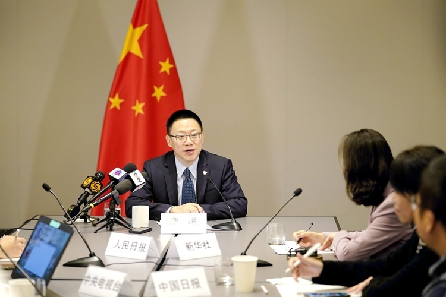

# 中美经贸关系是否出现拐点？财政部副部长廖岷回应

据财政部网站消息，当地时间11月10日，财政部副部长廖岷在美国旧金山主持召开吹风会，介绍中共中央政治局委员、国务院副总理、中美经贸中方牵头人何立峰访美情况，并回答记者提问。吹风会文字实录如下：

**一、情况介绍阶段**

廖岷：各位记者朋友，下午好！欢迎参加今天的吹风会。应美国财政部部长耶伦邀请，中共中央政治局委员、国务院副总理、中美经贸中方牵头人何立峰于11月8日至12日访问美国。今天我向大家介绍此次访美情况，并回答各位提问。

访美期间，何立峰副总理与耶伦财长举行多轮会谈并共进工作晚餐，会谈时间累计达10个小时。会谈的目的是在7月双方北京会谈基础上，持续落实两国元首重要共识，为两国元首旧金山会晤做好经济成果准备，推动中美经贸关系回到健康稳定发展轨道。会谈期间，双方就中美经济关系、中美及全球宏观经济和金融稳定、应对全球性挑战和双方关切等议题交换意见，会谈坦诚、务实、深入，富有建设性。双方达成如下重要共识：

一是同意加强沟通，寻求共识，管控分歧，避免误解意外导致摩擦升级。欢迎成立由副部级官员牵头、向双方牵头人汇报的中美经济、金融工作组并举行会议。双方牵头人同意定期直接沟通。

二是强调中美不寻求经济“脱钩”，欢迎发展健康的经济关系，为两国企业和工人提供公平竞争环境，增进两国人民福祉。

三是同意一道努力应对共同挑战，包括经济增长、金融稳定和监管。同意就气候变化相关经济问题，低收入和新兴经济体债务问题开展合作。同意强化国际金融架构，推动国际货币基金组织开展有意义的份额增资并努力通过新份额公式增加代表性不足成员/区域的话语权，加速推动多边开发银行改革，使其更好、更大、更有效。

会谈中，中方重点向美方介绍了今年以来中国宏观经济形势及政策。中方指出，当前中国经济回升势头不断巩固，经济发展新动能持续涌现，经济长期向好的基础进一步夯实。中国发展有强大内生动力，中国人民过上好日子的决心是坚定的，中国政府推进高质量发展的决心是坚定的。我们也相信，中国好，世界会更好，中国经济持续健康发展，必将为世界各国带来更大机遇。

同时，中方明确表达了在美对华双向投资限制、制裁打压中国企业、对华出口管制、对华加征关税等方面的关切。这些措施干扰了两国间正常经贸往来，影响了企业经营预期，也无益于美国企业的长远利益，中方强调，美方应采取切实行动回应中方关切。中方将坚定不移捍卫自身正当发展权益。

中方应询介绍了对乌克兰危机、巴以冲突的立场。

访美期间，何立峰副总理还分别与中资、美资企业代表座谈，阐述了中方对中美关系、中美经济关系的政策立场，宣介了中国经济持续恢复向好态势及扩大对外开放、优化外资营商环境等一系列重要举措，倾听回应了企业代表对两国经济关系的意见关切。

以上是何立峰副总理此次访美的主要情况。在此，我愿回答各位的问题。

**二、媒体提问阶段**

新华社记者：何立峰副总理与耶伦财长此次完成互访，双方经济领域、商务领域工作组也走上正轨，这是否意味着中美经贸关系出现拐点？

廖岷：中美经济关系根植于中美经济领域的共同利益，客观上造福两国和两国人民。中美之间的互利合作动力强劲、基础雄厚、空间广阔，但前提是平等和相互尊重。双方的正当关切应得到妥善回应，只有如此，中美经贸关系才能真正行稳致远。

中央广播电视总台记者：耶伦财长此前在何立峰副总理访美前发表文章称美政府将采取务实的经济战略，即在保护其重要的国家安全利益同时，寻求建立中美间稳定健康的经济关系。中方在此行后，对此有何评价？

廖岷：任何国家在构建对外经济关系中，都需要平衡发展和安全两大目标，包括按照市场化原则寻求多元化战略。但市场化原则下企业自主选择的多元化与当下以“国家安全”为由进行的所谓“去风险”有本质不同。后者违反分工合作等基本经济原理，会造成市场分割，成本上升，不利于维护良好经济关系。希望美方与中方相向而行，采取切实行动，为维护和发展两国经济关系创造必要条件，共同造福两国企业和人民。

