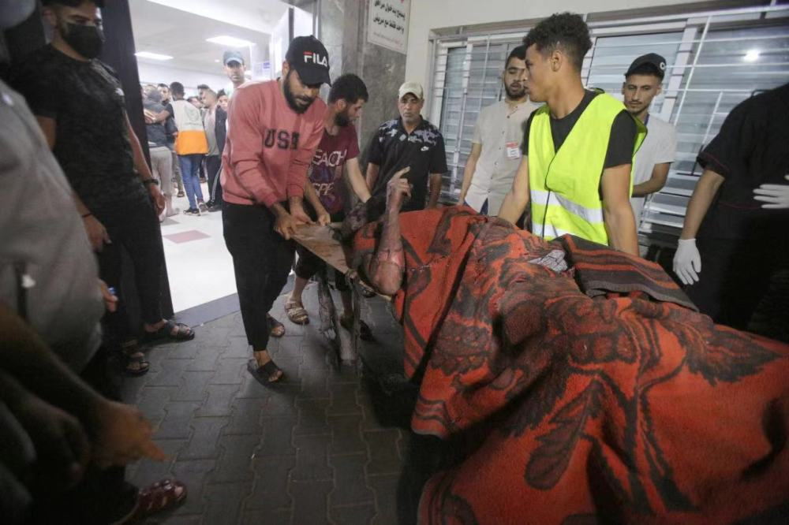
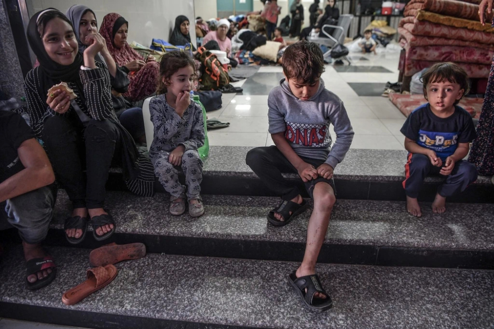
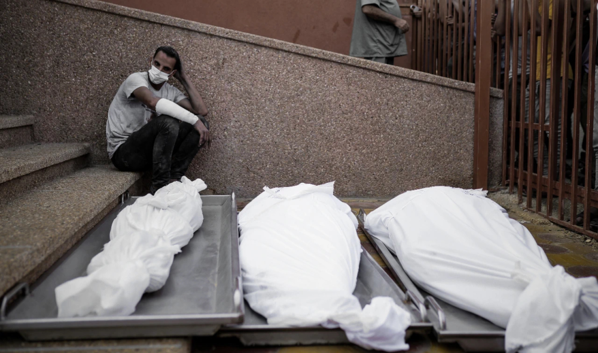

# 困于战火中的加沙医院：“每天都是有史以来最糟糕的一天”

当地时间11月10日，以色列军队接近位于加沙城中心的希法医院、圣城医院、兰提西儿童医院、纳斯尔儿童医院等主要医院。当天，这些医院受到了不同程度的袭击，造成人员伤亡。以军命令位于加沙城内的医院进行疏散，但当地医生表示，大量病人在医院中需要救治，难以进行疏散。

即使没有受到直接袭击，在缺乏物资、电力和清洁用水的情况下，加沙地带的医疗机构只能艰难维持运转。国际组织呼吁停止对加沙医院的破坏，保护医院和平民的安全。

**加沙地带最大医院暂停运营**

“希法医院周围到处都是枪声和爆炸声，很可怕。”希法医院一名负责人说，一些人出于安全原因，已从希法医院撤离，但医院的工作人员仍坚守在岗位上，该医院继续接收伤员和病人。

希法医院骨科医生阿德南·阿尔伯什对媒体说，11月10日，医院周围发生了多次爆炸，当天晚上，爆炸更加密集了。“每分钟，我们都听到周围传来的爆炸声，医院的大门被炸毁了。”

阿尔伯什说，许多人逃离了医院，但目前医院内仍有数千人。“我们无法疏散医院，因为这里有很多病人，包括儿童、妇女，各个年龄段的病人都有。”他说，当天的袭击在医院造成了人员伤亡。

_当地时间2023年11月6日，加沙城，受伤的巴勒斯坦民众被送往希法医院。图/IC photo_

希法医院是加沙地带最大的医院，字面意思为“治愈之家”。该医院设有外科、内科和妇产科等。自新一轮巴以冲突爆发以来，该医院便成为冲突的焦点之一。

巴勒斯坦民族权力机构官员11月10日表示，希法医院遇袭造成多人伤亡。该官员称，以色列军队从11月9日夜间到11月10日，在加沙北部的一些医院附近进行军事行动。

以色列官员称，在希法医院11月10日遭遇的袭击中，至少有一次是加沙境内激进组织发射火箭弹失败造成的。该官员称，以军正在对这次袭击进行调查，但其没有指明具体是哪个组织发射的火箭弹，也没有说明以军当天是否对希法医院和其他医院进行轰炸。

巴勒斯坦伊斯兰抵抗运动（哈马斯）否认以色列方面有关从加沙地带发射的火箭弹击中医院的说法。

以军多次声称，哈马斯武装人员通过希法医院地下隧道进行活动。以色列军方近日发布了一段视频，声称有情报证据表明，哈马斯在希法医院的地下活动，其地下设施包括隧道、会议室等。哈马斯对此予以否认。

当地时间11月11日，希法医院再遭袭击，其用于供电的太阳能电池板损坏。该医院的发电机燃料也已耗尽，呼吸机、透析机等重要设备无法运转。巴勒斯坦卫生部当天表示，希法医院由于彻底没有电力和燃料，目前已暂停运营。

**以军称医院内有武装人员，遭医院否认**

除了希法医院，加沙北部的其他主要医院也受到不同程度的袭击。据外媒援引目击者说法报道，当地时间11月10日，以色列军队接近位于加沙城中心的主要医院，包括希法医院、圣城医院、兰提西儿童医院和印尼医院等。这些医院或医院附近发生了爆炸。

一段在社交媒体流传的视频显示，兰提西儿童医院被坦克包围，医院中的人员被要求撤离。

加沙地带卫生部门11月10日发布的声明表示：“以军坦克包围了加沙地带的兰提西儿童医院、纳斯尔儿童医院等多家医院，数千名患者、医护人员和流离失所者被困在医院内，没有水和食物，随时面临死亡的危险。”

_当地时间2023年11月6日，加沙地带，巴勒斯坦人在医院避难。图/IC photo_

纳斯尔儿童医院的一名医生11月10日说，“我们被轰炸了两次。第一次是在医院门口，第二次是在科室里。”他说，至少有一名儿童在轰炸中丧生，还有一些儿童被困。

与此同时，巴勒斯坦红新月会表示，圣城医院发生了激烈冲突，狙击手向医院开火，有人受伤。

以色列国防军发言人理查德·赫克特表示，“以色列国防军不攻击医院，但是如果我们看到哈马斯恐怖分子在医院开枪，我们就会采取必要行动。”

“哈马斯已经把医院变成了防御阵地。”以色列军方官员对媒体称，在医院内部、周围和地下，有哈马斯的指挥系统、火箭发射场地和隧道系统。

哈马斯和医院内部人员均否认以色列方面的相关说法。希法医院的一名医生说，“除了医生和病人，我们不允许任何人进入。”该医生说，如果他知道医院里有哈马斯武装人员，就不会在这里继续待下去。

**医院面临超负荷运转等多重困境**

“每天，我们都说今天是有史以来最糟糕的一天，然而第二天只会更糟。”希法医院的一名外科医生近日对媒体说，她已经连续工作了72个小时。医院内外一片混乱，甚至没有足够的冷柜来保存尸体。

除了爆炸、枪击，加沙地带的医院还面临人手不足、物资不足、卫生条件不足、超负荷运转等多重困境。

一名加沙地带的医生说，医院只能为急诊室、重症监护室和手术室保留电力供应，“我们正在努力继续为需要肾脏透析、紧急导尿的病人，以及恒温箱中的新生儿提供服务，但只能提供最低限度的服务。”

加沙北部的主要水源为一家海水淡化厂和一条来自以色列的供水管道，自新一轮巴以冲突爆发以后，这些水源已经停止供水。医院只能使用地下咸水，这些水不适合饮用，也不符合卫生条件。

由于医院卫生条件不足，接受外科手术的病人有很高的感染风险。“我们这里有一种蠕虫，手术后第二天就会出现在病人的伤口上。”一名加沙地带的医生说。

_当地时间2023年11月7日，加沙地带，遇难者遗体被送往一家医院。图/IC photo_

无国界医生组织的报告称，由于药品不足，加沙地带的医生在没有止痛药的情况下给病人做手术；由于床位不足，当地外科医生在地板上给病人截肢。该组织的报告称，希法医院仅有能力接收700名病人，但实际接收了约5000名病人。同时，成千上万失去家园的人将医院作为避难所，住在医院的走廊和院子里。

**国际组织呼吁保护医院和平民**

世界卫生组织发言人玛格丽特·哈里斯11月10日对媒体表示，加沙地带的医院遭到了轰炸，那里发生了“激烈的暴力事件”。她说，自新一轮巴以冲突爆发以来，加沙地带至少有20家医院已经瘫痪。

红十字国际委员会11月10日发表声明强调，在不断升级的冲突中，加沙的病人、医护人员和医疗设施必须得到保护。

声明称：“加沙医疗系统已经超出其承受能力范围，在极其有限的物资和愈发不安全的环境下勉强运行。加沙医疗系统的困境已到了无以复加的地步，成千上万名伤者、病人和流离失所者的性命堪忧。”

红十字国际委员会表示，交战规则很明确，医院和平民受国际人道主义法保护，任何在医院附近的军事必须慎重考虑。“加沙医院已经无法承受更多破坏，必须停下来。”红十字国际委员会加沙分代表团团长威廉·朔姆伯格说。

联合国人权事务高级专员蒂尔克称，冲突双方都违反国际人道主义法。他指出，根据国际人道主义法，在任何时候都必须给予医疗单位特别的保护和尊重。以色列对加沙城医院及其周边地区“特别密集的袭击”违反了国际人道主义法。另一方面，巴勒斯坦武装团体利用平民和民用物体掩护自己免受攻击的行为也违反了国际人道主义法。

据加沙地带卫生部门发言人当地时间11月10日表示，自10月7日新一轮巴以冲突爆发以来，加沙地带死亡人数已上升至11078人。另外，据媒体报道，约旦河西岸巴勒斯坦人死亡人数已增至183人。

当地时间11月10日，以色列方面已将本轮巴以冲突爆发以来，以方死亡人数修正为约1200人，此前以方通报的死亡人数为约1400人。以色列外交部发言人表示，袭击发生后，许多遗体身份没有立刻得到确认。目前能够确认，部分遗体属于袭击者，因此不计入以色列的伤亡人数。

新京报记者 陈奕凯

编辑 樊一婧 校对 卢茜

