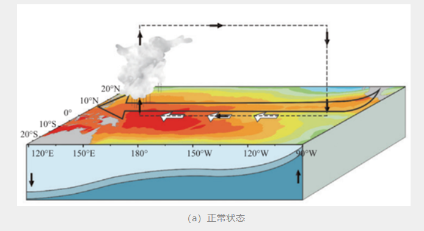
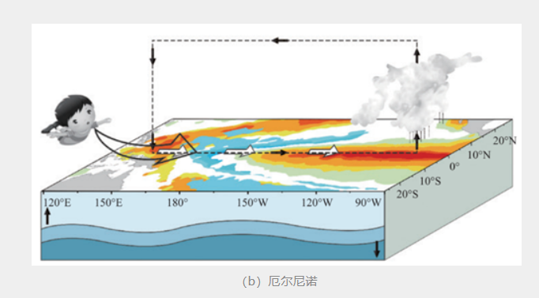

# 国家气候中心：预计今冬到明春我国大部地区气温接近常年同期或偏高

国家气候中心11月11日通报称，根据国家气候中心最新监测，一次中等强度厄尔尼诺事件已经形成，并将持续到明年春季。受其影响，并叠加全球气候变暖的大背景，2023年全球平均气温或将打破2016年最暖年纪录。预计今冬到明春我国大部地区气温接近常年同期或偏高，但阶段性冷空气活跃，南方地区降水偏多，复合型气象灾害风险加大。

据介绍，自2023年5月赤道中东太平洋进入厄尔尼诺状态以来，5-10月关键区海温指数呈现快速增暖持续趋势，已经连续五个月超过0.5℃，达到形成一次厄尔尼诺事件的标准，其强度为中等，类型为东部型（即海温暖中心位于赤道东太平洋）。

根据国内外多家气候动力模式和统计方法的预测，预计此次厄尔尼诺事件将持续到2024年春季，关键区海温指数峰值将出现在2023年11月至2024年1月。综合厄尔尼诺事件对气候系统的影响，并叠加全球变暖的作用，极端天气引发的复合型气象灾害风险将加大。

国家气候中心表示，厄尔尼诺会加剧全球变暖。厄尔尼诺事件在热带太平洋地区主要通过加热大气，使得全球温度升高。研究显示，赤道东太平洋海温区每升高1℃，将会使全球年平均温度上升0.12℃。一次中等或以上强度的厄尔尼诺事件通常大约能够使年平均的全球表面温度上升0.1℃-0.22℃。随着2023年5月以来的逐月最暖纪录的出现，较有可能打破2016年最暖年这一纪录，2023年或将成为1850年以来最暖的年份。

厄尔尼诺使我国南方降水偏多，北方偏暖。20世纪90年代以来，从厄尔尼诺发展年夏季到次年夏季，全国降水偏多区域大多从江南北扩至淮河一带，其中冬季降水异常偏多最明显。厄尔尼诺对当年冬季及次年夏季的影响均强于当年夏季和当年秋季，如1998年汛期我国出现“暴力梅”，长江流域持续性特大暴雨引发流域性洪水。在厄尔尼诺发生的冬季，我国淮河、长江、珠江流域的降水异常偏多，我国东北地区的气温异常偏高，即南方冬季多雨、北方暖冬。

国家气候中心已于今年11月初发布了今冬明春我国气候趋势，综合厄尔尼诺事件和气候系统其他因素的影响，预计冬季北方和青藏高原地区可能发生低温雪灾，供暖用能需求可能高于历史同期，并出现阶段性用能峰值。

冬季南方地区可能发生阶段性低温雨雪冰冻天气，华中南部、华东南部、华南北部和西南地区东南部可能出现阶段性低温和雨雪冰冻天气，对输电线路、能源运输、交通出行等可能造成较大影响，阶段性强降温造成农作物冻害的风险较高。但出现类似2008年1月上旬末至2月初的南方持续时间长、影响范围广的低温雨雪冰冻灾害可能性较小。

冬春季西南地区中西部冬季气温偏高降水偏少，森林火险等级较高。西北地区东南部、西南地区北部气象干旱可能发展。

冬春季我国中东部大气污染扩散条件总体偏差，建议关注冷空气间歇期静稳天气的发生，预防京津冀及周边地区、汾渭平原等地雾-霾天气对交通及人体健康的影响。

**延伸：什么是厄尔尼诺和拉尼娜**

正常情况下，赤道西太平洋是大片的暖水区，其面积相当于我国陆地面积的两倍多，而东太平洋是一片冷水区。但在一些年份，原本堆积在西太平洋的暖海水会往东蔓延，使得赤道中东太平洋海温持续异常升高；而另一些年份，赤道中东太平洋冷水区范围扩大，海水变得更冷。当赤道中东太平洋海温出现这种异常现象，就有可能发生厄尔尼诺或拉尼娜。

厄尔尼诺是西班牙文El Niño的音译，原意为“圣婴”，它是赤道中东太平洋海温持续偏高并造成大气环流异常的一种气候现象，是洋海的暖事件。

拉尼娜是西班牙语“La Niña” 的音译，原意为“小女孩”，也称为“反厄尔尼诺”，它是赤道中东太平洋海表温度大范围持续异常偏冷的现象，是洋海的冷事件。

（北京青年报记者 屈畅）

