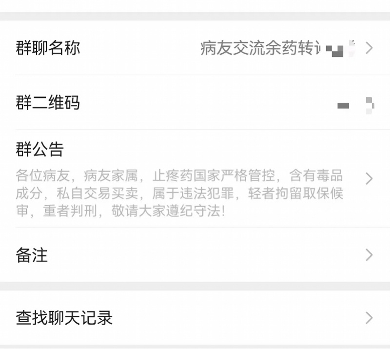

# 对话转卖父母生前镇痛药获罪当事人：未找到相关药品回收机构

今年7月，来自广东的阿华（化名）加入一个400余人的“余药转让群”，向群友董某以260元的价格出售了50片盐酸曲马多缓释片和22片氨酚羟考酮片。随后，阿华因涉嫌犯罪被公安机关带走，后被取保候审。

在一审中，阿华表示涉案药品是其父母生前未用完的镇痛药品，因为医院不回收才在微信转药群卖。她称，不知道问题那么严重，不知道董某所说的“溜冰”是吸毒的意思。最终，山东省阳信县人民法院判处阿华犯贩卖毒品罪，拘役二个月，缓刑三个月，并处罚金一千元。阿华不服上诉。10月底，本案二审开庭审理，阿华的辩护律师为其作无罪辩护。目前二审尚未宣判。

11月10日，阿华告诉南都记者，“不太清楚如何处理类似药品，更不知道药品属性，家附近也没有药品回收点”。法律人士提出，有必要建立对精神药品、麻醉药品的回收机制。一方面避免浪费、避免污染，另外一方面避免此类药品被盲目利用。

**转卖父母生前镇痛药获罪**

2023年上半年，阿华的父母亲先后因病离世，留下很多镇痛药品，其中就包括列入我国第二类精神药品的曲马多和麻醉药品羟考酮。“我妈做了肾移植，爸有癌症。他们同时还有老人的其他基础病，所以余药的品种多，但单一品种的数量不多。”

阿华称，之后她询问当地肿瘤医院和药店能否回收余药，被告知“暂时无法回收”。

 _阿华父母生前余留的药品，其中包含镇痛药。_

在病友的介绍下，阿华加入了一个400余人的“余药转让群”。7月8日，阿华将父亲去世后的剩余药品照片发至群内进行售卖。同日，来自山东的董某联系阿华购买部分药品。二人约定阿华以260元的价格将50片盐酸曲马多缓释片（规格0.1g）和22片氨酚羟考酮片（考酮规格5mg）售卖给董某。阿华称，董某在拿到药后便前往派出所自首。

一审判决书显示，在交易过程中，董某通过微信明确告知阿华其系吸毒人员，购买上述药品以替代毒品使用，阿华仍予以销售。7月10日，阿华通过快递将药品邮寄给董某，并通过微信转账方式收取董某人民币260元。经鉴定，盐酸曲马多缓释片中检出曲马多成分，氨酚羟考酮片中检出羟考酮成分。

公诉机关认为，阿华违反国家对毒品的管理规定，以牟利为目的，贩卖国家规定管制的能够使人形成瘾癖的精神药品，其行为触犯了刑法相关规定，应当以贩卖毒品罪追究其刑事责任。阿华认罪认罚，可以从宽处理。阿华自动投案并如实供述了其主要犯罪事实，建议判处阿华拘役二个月，缓刑三个月，并处罚金。

阿华对起诉书指控的犯罪事实、罪名无异议，并自愿认罪认罚。但阿华辩称，该药是其父母离世留下的，因为医院不回收才在微信转药群卖，对问题不敏感，不知道问题那么严重，不知道“溜冰”是吸毒的意思等。

其次，阿华出售该药品只卖了260元，购买者在收到后第一时间投案，没有使用，客观上并没有产生很大的社会损害后果，社会影响较为轻微，其节俭的心态是构成本次犯罪的主要诱因；最后，阿华系自首且认罪认罚。综上，阿华虽然构成贩卖毒品罪，但情节轻微，请求法院对其免予刑事处罚。

8月31日，山东省阳信县人民法院判处阿华犯贩卖毒品罪，拘役二个月，缓刑三个月，并处罚金人民币一千元。阿华不服上诉。10月底，本案二审开庭审理，阿华的辩护律师为其作无罪辩护。目前二审尚未宣判。

**法律人士建议建立特殊药物回收机制**

阿华称，转让药物是出于节约和帮助他人的意图。据聊天记录显示，董某在购买药品时曾说自己“玩音乐抽大麻，现在不好找了！用这个药代替它。”阿华表示，“当时正在整理相关的药物，并没有留心董某发的内容”。

此外，南都记者注意到，阿华曾向董某询问：“我卖这个药给你会不会有问题呢？”董某回复称：“有啥问题啊！我买了好多次了！”

《麻醉药品和精神药品管理条例》规定，国家对麻醉药品药用原植物以及麻醉药品和精神药品实行管制。除本条例另有规定的外，任何单位、个人不得进行麻醉药品药用原植物的种植以及麻醉药品和精神药品的实验研究、生产、经营、使用、储存、运输等活动。

_阿华加入的余药转让群发布公告提醒。_

在阿华所在的药物转让群里，有一则公告提醒：“各位病友，病友家属，止疼药国家严格管控，含有毒品成分，私自交易买卖，属于违法犯罪，轻者拘留取保候审，重者判刑，敬请大家遵纪守法！”

阿华向南都记者表示，“不太清楚如何处理类似药品，更不知道药品属性，家附近也没有药品回收中心”。

个人该如何处理以精神药品为例的特殊药物？法律人士告诉南都记者，“目前药店无法回收，因为没有回收资质和合作机构。个人要么扔掉，或者转让给别人。但客观上可能会导致一些问题，比如被吸毒人员购买。”

法律人士提出，有必要建立对精神药品、麻醉药品等特殊药物的回收机制。一方面避免浪费、避免污染，另外一方面避免此类药品被盲目利用。

南都记者查询发现，按照《国家危险废物名录》（2021年）附录《危险废物豁免管理清单》规定，家庭日常生活或者日常生活提供服务的活动中产生的废药品属于生活垃圾中的危险废物，只要未集中收集，按照生活垃圾处理。

依据《关于在全国地级以上城市全面开展生活垃圾分类工作的通知》，“废药品及其包装物”按有害生活垃圾回收，所以如果家庭过期闲置药品没有被分类集中收集，可以破坏药品包装盒后，随生活垃圾分散丢弃，分类回收，相对风险较小。

采写：南都见习记者 周敏萱 实习生 徐妍迪

