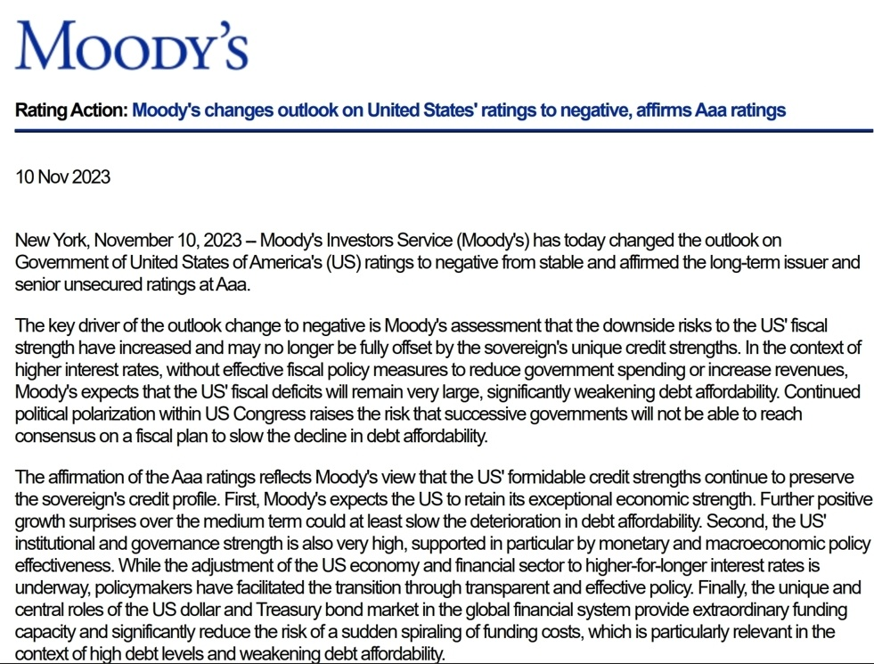

# 巴菲特持股的穆迪公司将美国主权评级展望调整至负面

**财联社11月11日讯（编辑 史正丞）** 北京时间周六清晨，在本周美股收盘后不久， **穆迪评级宣布将美国的主权信用评级展望从稳定调整为负面**
，不过依然维持Aaa的最高一档评级。

_（来源：穆迪）_

作为背景，在全球三大评级公司中，标准普尔早在2011年就将美国评级从最高一档的AAA降至AA+。今年8月，惠誉也将美国信用评级从最高一档撤下。因此，只有伯克希尔持股的穆迪仍给予美国最高级别的评级。

穆迪在公告中表示，
**美国财政实力的下行风险已经增加，可能不再能完全被特有的信贷优势所抵消。在更高利率的背景下，如果没有有效的财政政策措施来减少政府支出或增加收入，穆迪预计美国的财政赤字将保持非常大的状态，显著削弱债务可承受性。美国国会内持续的政治两极分化，增加了无法就放缓政府债务可承受性下降（所需的计划）达成共识的风险。**

值得一提的是，如果美国国会无法就财政拨款达成一致，现有的短期财政案将会在11月17日（下周五）到期，通俗来讲这就是美国政府潜在的“关门时间”。

对于穆迪的决定，财政部副部长沃利·阿德耶莫在一份声明中表示，尽管穆迪维持了美国的Aaa评级，但财政部不同意其将展望转向负面的决定。阿德耶莫强调，美国经济依然强劲，而且美国国债是世界上最安全、最具有流动性的资产。"

**为何做出这样的决定？**

在详细的评级理由中，穆迪写道，今年美国国债收益率的急剧上升增加了对美国债务可承受性的已有压力。在缺乏政策行动的情况下，穆迪预计美国的债务可承受性将进一步、稳定而显著地下降至与其他高评级主权相比“非常弱”的水平。

美联储的加息，将在接下来几年继续推高美国政府的利息支出。同时，尽管政府的收入基础将随整体经济增长，但
**在没有特定政策行动的情况下，这将比利息支出的增长速度慢得多。**

穆迪预计， **到2033年，联邦利息支付相对于收入和国内生产总值的比例将分别从2022年的9.7%和1.9%上升至约26%和4.5%。**
这些预测考虑了穆迪对长期更高利率的预期，预计平均每年10年期国债收益率在2024年达到约4.5%的峰值，并最终在中期稳定在约4%。

对于像美国这样的储备货币国家来说，债务可承受性——而不是债务负担——决定了财政实力。因此，在缺乏限制财政赤字规模的措施的情况下，财政实力将越来越多地影响美国的信用记录。

穆迪特别指出，由于财政实力的削弱，政治分歧可能进一步限制政策制定的有效性，阻止采取措施减缓债务可承受性的恶化。

不过，据最新报道，美国财政部称，不认同穆迪公司下调美国主权评级的前景展望至负面的做法。

（财联社 史正丞）

