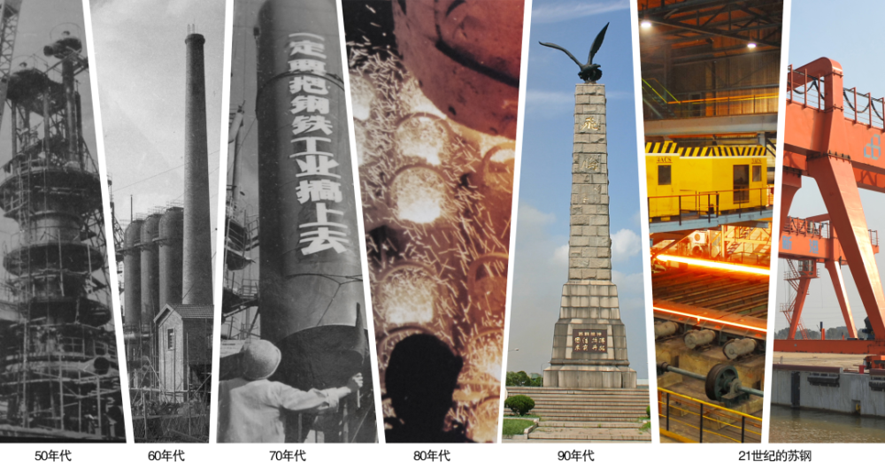
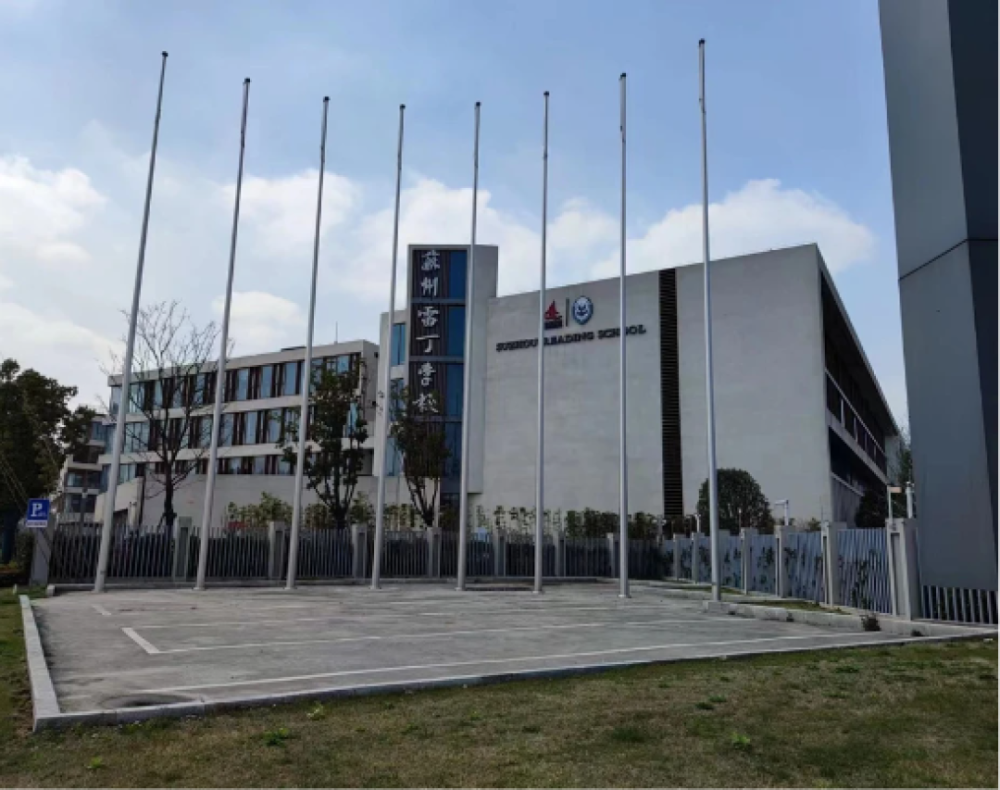
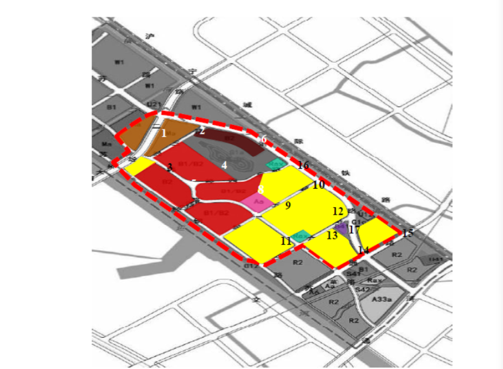
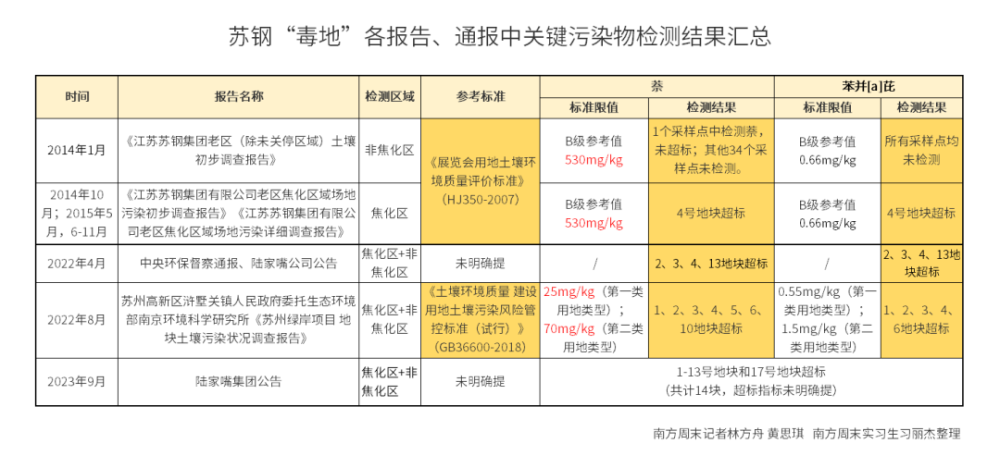
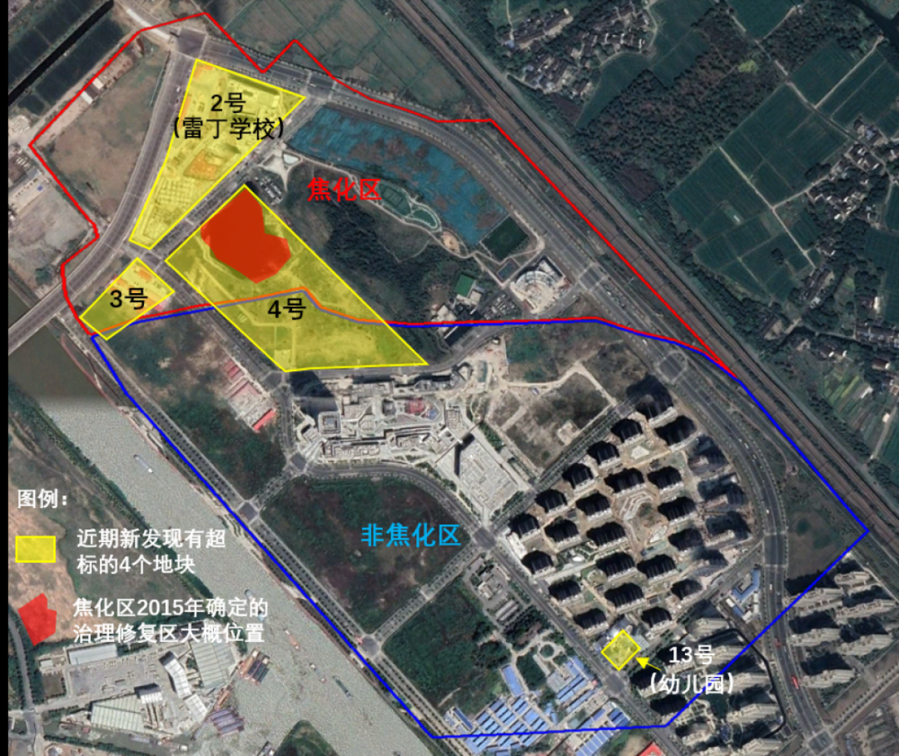

# 弄虚作假？二次污染？85亿元苏钢“毒地”疑云

_2023年3月18日，公益组织“北京草原之盟”技术顾问及志愿者前往苏州雷丁国际学校调研，大门有红色警报。多家公益组织对此事发起了公益诉讼。受访者供图_

花85亿抢拍到的地块竟然含“毒”，开发建设后不能投入运营，上市公司上海陆家嘴金融贸易区开发股份有限公司（以下简称陆家嘴）要求对簿公堂。

2023年11月4日，陆家嘴发布公告，因土壤污染问题向江苏苏钢集团有限公司（以下简称苏钢集团）及多家苏州政府机构、事业单位发起诉讼，并向苏钢集团索赔100.44亿元。目前江苏省高级人民法院已立案，尚未开庭审理。

7年前，陆家嘴高价拍下苏钢集团厂区旧址的17块地，总建筑面积超100万平方米。陆家嘴在2023年9月29日发布的公告中称，2021年，其中2号地块已建成学校，在申请办学许可证的过程中，陆家嘴陆续发现包括
2 号地块在内的诸多地块存在污染。

2023年以来，陆家嘴多次发布公告，表示调查得知共有14块土地污染，污染面积和程度远超挂牌出让时披露的情况。2022年，相关地块被中央环保督察点名，当地政府委托第三方调查也发现污染超标。

陆家嘴在公告中表示，这块土地的“调规变性及出让过程中，各被告存在一系列违法违规、弄虚作假、不依法履职的侵权行为”。

陆家嘴发布公告6天后，2023年11月10日，苏钢集团发布情况说明，称正在积极应诉，把确保群众身体健康和购房者合法权益放在首位。表示陆家嘴一方“在2019年已知悉2号地块不符合环保要求，但未依法完成土壤污染调查和修复治理就启动了该地块项目建设。且在开发建设期间，存在施工作业不规范造成二次污染等情况”。

南方周末记者采访发现，苏钢集团地块是典型的工业用地再开发案例，土壤调查评估、修复和土地转让开发利用跨越了七年，其间我国土壤污染防治的法律法规、技术规范和标准从少到多、不断完善。前后评估结果不同，可能由于土壤污染评估标准一再变更、不断加严，且江南水系丰富，污染容易迁移。此种情况下，污染修复由谁负责，也是法律难题。

高价买下“毒土地”？

2016年，苏钢集团将全资子公司苏州绿岸房地产开发有限公司（以下简称苏州绿岸）95%股权挂牌出售，苏州绿岸的核心资产是17块国有土地。地块位于苏州市高新区浒墅关镇苏通路北、苏钢路东，原是苏钢集团的生产厂区。经过222轮激烈的报价竞争，陆家嘴以85.25亿元成为拿下土地的赢家。

_苏州钢铁历史。苏钢集团官网/图_

陆家嘴公告中披露了苏钢集团2016年8月挂牌时的信息，苏州绿岸名下地块中，非焦化区域的土壤和地下水基本未受到污染，可再开发利用；焦化区域的污染主要集中在4号地块局部区域。

陆家嘴在2022年4月14日发布的公告中称，“基于对公开市场股权挂牌信息的信任，以及对政府部门行政行为的合理信赖”竞得苏州绿岸股权。

苏钢集团情况说明透露，“在2016年转让股权时，我司已如实披露了第三方专业机构关于苏州绿岸名下土地存在部分污染的调查结果及报告全文，并在资产评估报告中明确提示了该范围中部分地块原为钢铁焦化生产区域，可能存在土壤污染风险。”

陆家嘴与苏钢集团签署的《股权交易事宜备忘录》显示，双方约定“关于部分地块存在土壤污染事宜，根据经苏州市环境保护局备案的相关调查评估报告，该等土壤环境治理不存在技术上的障碍，治理完成后将符合国家和地方性环境质量标准，可根据现有规划文件的要求进行开发建设。苏钢集团将就环境治理事宜为绿岸公司提供协调及支持”。

根据规划，陆家嘴将在此建设苏州高新区首个百万方城市区域综合体项目，项目于2017年5月启动，开发周期计划为8年。

除了打造商业体和“锦绣澜山”住宅，陆家嘴还引进了由苏州伦华教育集团与英国雷丁学校共同打造的九年一贯制国际化学校——苏州雷丁学校，选址定在了项目的2号地块。

没想到学校建成了，却不能顺利招生。

据上游新闻报道，2021年，苏州雷丁学校校方在办理办学许可证过程中，根据苏州高新区环保局要求，陆家嘴委托第三方机构调查学校所在地块的土壤污染状况，发现存在严重污染，无法通过环评投入使用。

苏钢集团在情况说明中提到：2019年，陆家嘴一方知悉2号地块不符合环保要求，且未依法完成2号地块土壤污染调查和修复治理，即启动了该地块项目建设。2021年，因无法通过环评验收而未能启用。

陆家嘴公告还显示，苏州市资规局将 2 号地块恢复为工业 (研发)用地，雷丁学校项目客观上无法完成综合验收。

_2023年3月，公益组织“北京草原之盟”技术顾问及志愿者前往苏州雷丁国际学校调研。多家公益组织对此事发起了公益诉讼。受访者供图_

一年后，“毒地”遭中央环保督察组点名。

2022年4月，江苏省公布的《中央第二生态环境保护督察组向我省移交的第六批信访事项办理情况》中提到，第三方检测机构检测结果显示，苏州绿岸项目多处地块土壤中苯并[a]芘、萘严重超标，不符合用地标准。在苏州高新区管委会的要求下，陆家嘴已暂停苏州绿岸相关开发、建设、销售工作，并对上述污染地块实施了严格管理。

督察通报显示，苏州高新区管委会高度重视，成立了工作专班。

南方周末记者获得的调查报告显示，2022年8月，苏州高新区浒墅关镇人民政府委托生态环境部南京环境科学研究所进行详细调查，发现7个地块超标。

苏钢集团情况说明提到了此7个地块：2022年，陆家嘴一方与苏钢一致同意委托的第三方专业机构南京环科所对地块污染情况进行了详细调查。焦化区1、2、3、4、5、6号和非焦化区10号地块（其中仅2号地块已开发建设），经治理修复后可安全利用。已有居民入住的14、15号地块、已开发建设的8、9、12、13、16号地块和未开发建设的7、11、17号地块，属可安全利用地块。

_地块规划示意图。陆家嘴公告/图（编辑注：因图有倾斜，地块编号和地块位置未完全对齐。）_

根据陆家嘴发布的公告，污染地块数目不止7块，2022年以来，陆家嘴及各方环境调查机构确定苏州绿岸名下 14
块土地存在污染。陆家嘴一纸诉状将苏钢集团及其委托检测的苏州市环境科学研究所、苏州市苏城环境科技有限责任公司以及相关方苏州国家高新技术产业开发区管理委员会、苏州市自然资源和规划局告上法庭，苏州绿岸作为案件第三人。

南方周末记者致电案件原告方及第三人，多名工作人员表示有关案件事宜需询问陆家嘴集团董秘办，11月9日，董秘办回复，“集团统一口径，不接受采访”。

根据两份环评公示，南方周末记者尝试联系苏钢集团、苏州市环境科学研究所和环评承担方苏州科技大学的相关人员，均未取得联系或拒绝采访。

参考标准不同，检测结果不同

污染场地的开发利用，需要经过严格的环境监测、评估、修复等流程，为何房子都造好了，才向外界说有污染？

中央环保督察提到了两种超标污染物：苯并[a]芘和萘。比对这两个污染物在2014-2022年的多份报告中的数值可以发现，苏钢地块“毒地”的后知后觉，有可能是污染的确存在，而评估时依据的标准不同，导致结果不同。

2014年，苏钢将地块分为非焦化区和焦化区（污染较重），委托第三方环境公司分别进行土壤调查。

环保组织广州绿网环境保护服务中心向苏州市生态环境局申请公开，获得了《江苏苏钢集团老区（除未关停区域）土壤初步调查报告》《江苏苏钢集团有限公司老区焦化区域场地污染初步调查报告》《江苏苏钢集团有限公司老区焦化区域场地污染详细调查报告》和《江苏苏钢集团有限公司老区焦化区域土壤和地下水人体健康评估报告》，四份报告调查范围涵盖了非焦化区和焦化区。

苯并[a]芘是一类致癌物，烧烤时也会产生，属于半挥发性有机物；萘介于挥发性有机物和半挥发性有机物之间。非焦化区在2014年1月进行了土壤调查，在35个采样点中，均未测苯并[a]芘，大部分样点（34个）未检测萘。

彼时，调查依据的标准是《展览会用地土壤环境质量评价标准》（HJ350-2007）（下称“展览会用地标准”），是原环境保护部制定的行业标准，没有明确这两种污染物需强制检测。

而在后续的其他的报告中，如2022年4月中央环保督察组通报、陆家嘴发布的公告、2022年8月苏州高新区委托生态环境部南京环境科学研究所的调查均显示，非焦化区部分点位也存在苯并[a]芘、萘超标。此时，参考的标准是2018年8月1日实施的国家标准《土壤环境质量
建设用地土壤污染风险管控标准（试行）》（GB36600-2018）（下称“建设用地标准”），此前不是必测的苯并[a]芘和萘已要求必测。

“苯并[a]芘和萘在非焦化区的污染可能一直存在，只是因为之前没有检测所以未发现。”绿网工作人员郭磊猜测。

而焦化区发现的部分污染物，各阶段报告中有检测，但可能由于新标准中限值加严，导致之前达标，之后超标。

萘就是这样。2014年、2015年焦化区土壤调查结果显示，仅有污水处理区和粗苯车间（也就是前文提到的4号地块的部分区域）受到污染，其他区域萘未超标。此时参考的是“展览会用地标准”的B级标准，萘的限值为530mg/kg。

而在后续的检测报告中，不只是4号地块，有多地块萘等污染物超标。后续报告参考的萘限值加严了，分别为25mg/kg(第一类用地)和70mg/kg(第二类用地)，均远低于此前标准的530mg/kg。“此前标准限制得过于宽泛，现有标准基于人体健康等因素更科学评价，比较严格。”郭磊说。

 _苏钢“毒地”各报告、通报中关键污染物检测结果汇总。南方周末记者林方舟 黄思琪 南方周末实习生习丽杰整理_

检测中的“保守性原则”

虽然2014年的土壤污染检测要求中没有强制检测名录，但业内有一项“保守性原则”。

2014年2月，原环境保护部发布的《场地环境调查技术导则》（HJ25.1-2014）提到了“检测项目应根据保守性原则”：一般工业场地可选择的检测项目包括半挥发性有机物。

也就意味着苯并[a]芘这样的半挥发性有机物按照保守性原则，建议检测。但郭磊指出，苏钢委托的第三方环境公司并未采纳，非焦化区没有检测。

郭磊介绍，半挥发性有机物是钢铁厂地块土壤中的常见污染物，它们在焦化、燃煤过程中的热解和不完全燃烧过程中释放，排放到大气中，又沉降到附近的地面，进而污染土壤，“不只非焦化区，甚至厂区外的土壤也可能会超标”。其他钢铁厂也曾发生过类似情况。

“苏钢地块是典型的工业用地再开发的案例，它的土壤调查、土地转让和开发跨越了我们国家土壤污染防治领域的法律法规、技术规范和标准从无到有、从少到多的过程。”郭磊说。

在2014年苏钢地块开展土壤调查的时段，我国土壤污染防治的相关法律法规、标准、技术规范建设也才刚刚起步。直至2014年上述技术导则才诞生；直至2017年7月1日，污染地块土壤环境管理办法才施行；2019年1月1日，土壤污染防治法才施行。

在此之前，仅有原环保部等部门出台的几项部门通知，并不具备较高的法律效力。一位土壤修复行业人士向南方周末记者回忆，2014年左右，行业非常混乱。

重庆市生态环境局、规划和自然资源局于2021年发布《关于进一步加强建设用地土壤污染分类分级管理工作的通知》曾表述：“早期土壤污染状况调查的认识不到位，相关技术导则规范不健全，调查技术手段受限等原因，导致部分重污染行业建设用地地块调查结果失真，修复不到位……部分建设用地土壤污染调查、风险评估、风险管控及修复效果评估报告编制质量不高、专家评审把关不严，对从业企业、评审专家缺乏约束管理。”

“且不论弄虚作假等，光上述因素就会造成土壤调查精度不高，导致调查结果跟实际情况间可能有较大差距。”郭磊称。

二次污染？

南方周末记者发现，焦化区域的污染主要集中在4号地块，陆家嘴一方在交易时即知晓，也曾编制修复方案和治理。

2018年9月，《苏钢地块老区焦化区域污染场地修复工程环境影响评价报告表及专项评价》公示，建设单位为苏州绿岸，内容为土壤原位和异位修复。公示原网页环评报告链接已经失效，但网传有一份97页的同名称环评报告（以下简称环评报告）。南方周末记者联系环评承担方苏州科技大学技术人员确认，未获得回应。

环评报告提到了苏钢老区焦化场地，自2015年启动初步调查、详细调查、修复方案等历时三年多，每一环节均经过专家评审，符合当时的环保要求，但是土壤修复中萘的修复目标值不符合新标准要求，修改后符合“建设用地标准”（GB36600-2018）。评价适用标准中，修复后规划为商业用地，土壤参考也是“建设用地标准”第二类用地，萘的标准为70mg/kg。

_红色为曾进行土壤修复的大概位置。黄色为2022年新发现的4块污染地块。绿网公众号截图。_

环评报告显示，4号地块将进行土壤修复。但2022年后的多份检测报告显示，4号地块仍然有污染。有土壤修复业内人士向南方周末记者提醒，“焦化厂污染是疑难杂症，非常难治理。在江南地区的水文地质条件下，还需要特别注意污染迁移”。

雷丁学校所在的2号地块也被多次报告污染，地图显示，2号地块和4号地块相连。

苏钢的情况说明提到：陆家嘴方在开发建设苏州绿岸地块期间，没有按照有关要求建设地下水阻隔墙及采取其他防护措施，存在扰动地下水、搬运土壤造成部分环境交叉污染的行为和施工作业不规范造成二次污染的行为。

对此，陆家嘴还未有回应。

2022年7月，苏州绿岸被苏州生态环境局处罚1.88万，原因是违反土壤生态环境管理制度，违法事实对应土壤污染防治法第四十二条第三款：“风险管控、修复活动完成后，需要实施后期管理的，土壤污染责任人应当按照要求实施后期管理。”

陆家嘴在2023年1月10日发布公告表示，苏州生态环境局作出该项处罚的原因是，苏州绿岸在之前依据苏钢集团披露的污染区域对 4
号地块土壤修复后未按要求实施后期管理。

汇业律师事务所合伙人、环境资源与能源专委会执行主任张秀秀向南方周末记者表示，如果苏州绿岸施工作业导致污染扩散，应对生态环境损害的扩大部分承担责任。但不能排除苏钢集团是否需要对4号地块的污染负责，“其中可能涉及多因一果的共同侵权，依据民法典第1231条的规定，在责任大小认定上需要结合污染范围、程度，以及行为对损害后果所起作用等因素确定”。

毒地修复责任归谁

张秀秀认为，根据已有材料，目前难以断定苏钢集团在交易时是否有所隐瞒、场地调查过程中是否存在不规范行为。

土地出让了，标准更迭加严，应该由谁来承担土地污染修复责任？

张秀秀告诉南方周末记者，评价交易双方的土地污染修复责任，关键看土地交易交割时期的标准，尤其是强制性标准。

如果交易前，场地调查已有明确的国家标准，出让方不存在未披露风险情形，在企业存续期间也做到了合法合规达标排放，即使倒查，也无法追究其历史上生态环境损害赔偿责任，交易后的土壤污染风险也应由继受人承担。

如果土地交易时缺乏明确的标准，双方也没有遵循保守性原则严格排查，那么现有土地使用权人就具有土壤污染风险管控和修复的义务，在本案中，也就是苏州绿岸。这在一定程度上归因于受让方在交易前缺乏独立严谨的环境调查。

“苏州绿岸作为现有建设用地使用权人，具有对土壤污染的风险管控和评估义务，应承担土地污染修复责任。至于修复费用的追偿问题，有两种途径，一是行政途径，通过土地污染责任认定程序；二是通过民事诉讼途径，基于投资并购交易合同。”张秀秀介绍。

2021年1月，生态环境部会同自然资源部制定了《建设用地土壤污染责任人认定暂行办法》，规定建设用地使用权人可以向有管辖权的生态环境主管部门提出土壤污染责任人认定申请。

不过，张秀秀认为陆家嘴与苏钢集团的责任认定存在较大难题。主要原因是目前国内土壤污染责任人认定办法出台时间短、实践案例少，推行阻力较大。“很多地方的主管部门对于受理申请、启动认定程序非常犹豫，因为可资借鉴的案例很少。如果不被受理，使用权人只能通过交易合同关系去追究历史的污染责任人。但一般的合同关系里，如果双方对于土壤污染的约定不明确，受让了污染场地的一方就会比较吃亏。”

南方周末记者查询发现，陆家嘴目前的公开披露信息中，未明确提及是否启动土地污染责任认定程序。

张秀秀表示，该起环境污染责任纠纷案件的启示意义在于，土地交易中买受人应注重环境法律风险的排查。

首先，买受人要深度了解土壤污染状况和历史用途，如果地块历史用途或周边涉及污染，应重点关注土壤污染的风险。其次，买受人应对地块的调查保持一定的独立性，对于既有的专业报告、评审结论保持警惕性，不可轻信结论，如有必要，可以聘请第三方开展更详细的土壤调查。最后，基于投资的通盘考虑，愿意承担一定环境法律风险的交易，应对土壤污染治理成本进行评估，就土壤污染状况、风险转移及可追溯的相关法律责任，在交易合同予以明确。

南方周末记者 林方舟 南方周末记者 黄思琪南方周末实习生 习丽杰

责编 汪韬

