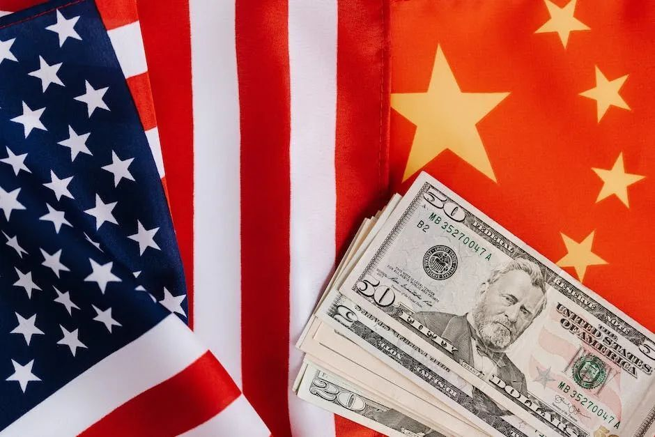
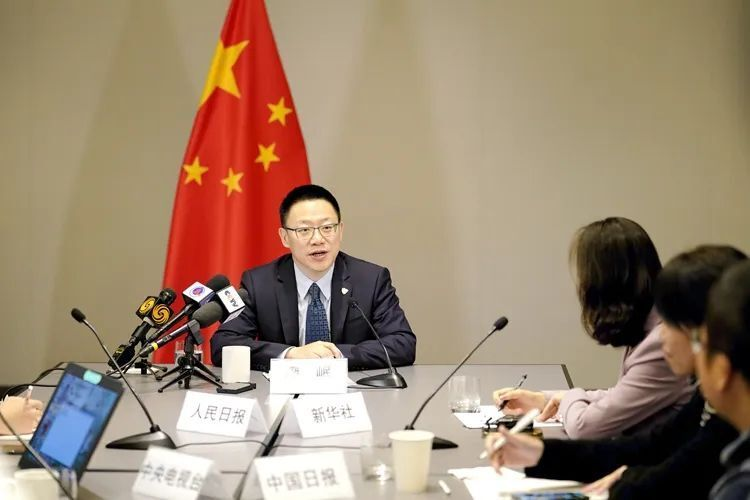

# 新一轮中美经贸对话：强调不寻求经济“脱钩”，什么信号？

**文/李晓喻**

中国国务院副总理、中美经贸对话中方牵头人何立峰于11月8日至12日应邀访美，其间与美财长耶伦举行数次会谈。

双方同意加强沟通，寻求共识，管控分歧，避免误解意外导致摩擦升级。此外，双方还强调中美不寻求经济“脱钩”，欢迎发展健康的经济关系，为两国企业和工人提供公平竞争环境，增进两国人民福祉。

“中美不寻求经济‘脱钩’”，什么信号？

现代国际关系研究院世界经济研究所原所长陈凤英接受中新社国是直通车采访时称，中美此次对话达成共识不寻求经济“脱钩”，是理性的体现。

陈凤英说，作为务实派，耶伦实际上已经很清楚美国对华经贸“脱钩”既不现实也不可行。中国在基础设施、资源、产业链方面的综合竞争优势，在相当长时间内都是其他国家难以比拟的。因此，美国想要“去中国化”非常难。

今年8月，《经济学人》曾发表一篇名为《拜登的中国战略不起作用》的报道，其中提到，尽管美国采取了一系列“脱钩断链”的措施，以减少所谓的对中国的依赖，但实际上，美国对中国的依赖“依然完好无损”。

这篇报道中提到，2018年，美国从“低成本”亚洲国家进口的商品中，有66%左右来自中国，到2022年，这一数据变成了刚过50%，美国将其中的订单转移到了印度、东南亚国家等。

从数据来看，美国的政策取得了“效果”。但报道也提到，数据变化背后的真相是，美国将这些订单从中国转给其他国家的同时，接受美国订单的国家又将生产转给中国。

从第六届进博会上美企竞相“用脚投票”，参展面积约占全部企业展面积六分之一来看，美国推行“脱钩断链”“去风险化”也不得人心。不少美企高管表示，中国经济持续发展，市场规模不断扩大，中产阶层日渐崛起，给在华美企带来大量发展机遇。

欢迎成立中美经济、金融工作组

双方还提出，欢迎成立由副部级官员牵头、向双方牵头人汇报的中美经济、金融工作组并举行会议。双方牵头人同意定期直接沟通。

日前，中美经济、金融工作组已分别举行会议。10月24日，中美经济工作组以视频方式举行第一次会议。财政部介绍，此次会议由两国财政部副部长级官员主持。双方就两国及全球宏观经济形势和政策、双边经济关系、合作应对全球挑战等议题进行了深入、坦诚、建设性的沟通。

10月25日，中美金融工作组以视频方式举行第一次会议。此次会议由中国人民银行和美国财政部副部级官员共同主持，国家金融监管总局、中国证监会以及美联储、美国证券交易委员会等相关金融监管部门参会。

双方就两国货币和金融稳定、金融监管、可持续金融、反洗钱和反恐怖融资、全球金融治理等议题以及其他双方重点关切的问题进行了专业、务实、坦诚和建设性的沟通。

分析人士认为，成立工作组是一种更务实、更具体的方式，有助于更快捷高效反映中美双方特别是企业诉求，推动具体问题的解决。

拐点来了吗？

据中方统计，今年前10个月中美贸易总值同比下降7.6%，远低于同期中国外贸整体增速。

根据中美达成的共识，双方“欢迎发展健康的经济关系”。这是否意味着中美经贸关系拐点将至？

 _当地时间11月10日，财政部副部长廖岷在美国旧金山主持召开吹风会。（图源：财政部网站）_

当地时间11月10日，财政部副部长廖岷在美国旧金山主持召开吹风会，介绍访美情况。廖岷表示，中美经济关系根植于中美经济领域的共同利益，客观上造福两国和两国人民。中美之间的互利合作动力强劲、基础雄厚、空间广阔，但前提是平等和相互尊重。双方的正当关切应得到妥善回应，只有如此，中美经贸关系才能真正行稳致远。

此次会谈中，中方明确表达了在美对华双向投资限制、制裁打压中国企业、对华出口管制、对华加征关税等方面的关切。这些措施干扰了两国间正常经贸往来，影响了企业经营预期，也无益于美国企业的长远利益，中方强调，美方应采取切实行动回应中方关切。中方将坚定不移捍卫自身正当发展权益。

陈凤英说，此次会谈将为一段时间以来龃龉不断的中美经贸关系注入更多稳定性。经贸关系健康了，中美关系也将呈现更积极的状态。

不过，在中国人民大学重阳金融研究院研究员刘英看来，拜登政府的确在反思对华政策，尤其是经贸领域对华政策的错误，这在实践中也有所体现。但美国对华的遏制打压，以及这背后根本性的对华竞争思维并没有彻底扭转，“现在只能说，有一些向好的迹象”。

来源：国是直通车

编辑：诸葛瑞鑫

责编：魏晞

