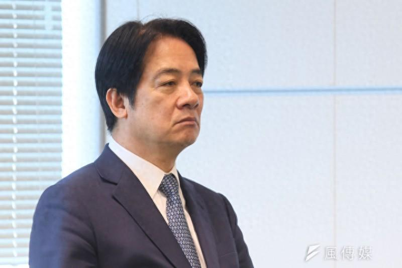

# 民进党负面声量大增，好感度大输国民党，大数据揭台湾十大民怨

岛内2024“大选”倒数60多天，在“蓝白合”结果不明的状况下，民进党参选人赖清德的支持度依旧维持领先，不过却出现缓降趋势，且根据网络数据分析结果，国民党与民进党的政党好感度，虽然负面声量都大于正面声量，但国民党好感度0.45仍胜过民进党0.35，民进党负面声量总则数499万则也高于国民党的457万则。

TPOC台湾议题研究中心透过QuickseeK快析舆情数据库，搜集今年1月至10月底的网络舆情声量数据资料，借此了解民进党的正负面声量趋势。总体而言，民进党的每月的负面声量均远超正面声量，截至十月底总负声量为499万则、总正声量为174万则，负声量超过正声量65％，且自今年8月选战逐渐升温开始，负面声量高出一个档次。

TPOC台湾议题研究中心指出，对比今年1月至7月的平均每月声量约41.4万则，8月民进党的负面声量直接冲破78.1万则，9月负面声量超过73.7万则，包括赖品妤“云豹小公主”、“农业部前部长”陈吉仲去职的进口蛋争议等话题，都是负面声量飙增原因。

TPOC台湾议题研究中心透过大数据，统计出民进党10大惹民怨议题排行榜。结果显示，负面声量则数最高的，是“缺蛋与进口蛋争议”，负面声量超过10.1万则，网络好感度（P／N值）仅0.14；第二名是“台海和平与战争”，负面声量超过8.2万则，好感度0.3。

TPOC台湾议题研究中心表示，十大民怨第三名是“诈骗猖獗与资安议题”，负面声量则数8.2万则，好感度0.21；第四名是“缺电、电价与能源议题”，负面声量则数6.2万则，其中最被热议的是蔡当局发展绿电，却遭质疑沦为黑金政治的温床，而赖品妤被封“云豹小公主”争议中，在野阵营质疑绿电成为民进党政治人物的“炼金术”也引发讨论。

此外，民怨议题第五名到第十名，依次分别是“行人地狱交通议题”、“居住正义议题”、“职业驾驶计点议题”、“私校补助与私校退场议题”、“美猪标示不清”、“流感疫苗接种争议”。

TPOC台湾议题研究中心表示，近期赖清德积极布局陆战，想借由“陆战辅空战”的策略拼胜选；不过，面对种种施政争议所引发的民怨，势必成为他的一大包袱。

**海峡导报驻台记者 薛洋**

