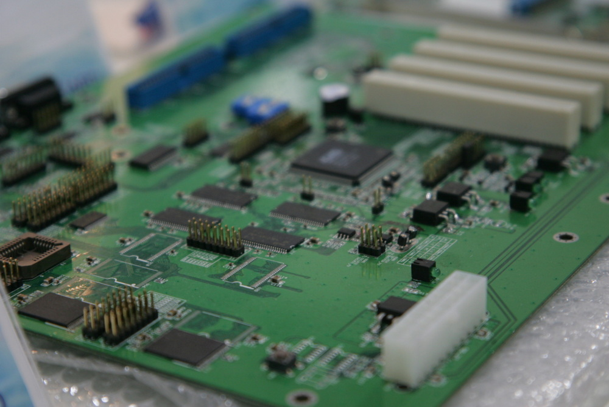

# 涉专利侵权！中国最大闪存芯片制造商长江存储在美起诉美光

11月11日，第一财经记者从美国加利福尼亚北区法院公布的信息了解到，长江存储已于11月9日起诉美光科技有限公司（下称“美光”）及全资子公司美光消费产品集团有限责任公司侵犯其8项美国专利。长江存储在专利侵权起诉书中称，诉讼是为了终止美光广泛且未经授权使用长江存储专利创新。

长江存储是国内最大的3D NAND
Flash（闪存芯片制造）厂商。长江存储在起诉书中提到，美光使用长江存储的专利技术，以抵御来自长江存储的竞争，并获得和保护市场份额。诉讼旨在解决以下问题的一个方面：美光试图通过迫使长江存储退出3D
NAND Flash（闪存）市场来阻止竞争和创新。

长江存储指控美光侵犯了美国专利号为“10,950,623”“11,501,822”“10,658,378”“10,937,806”“10,861,872”“11,468,957”“11,600,342”和“10,868,031”的专利。美光被控侵权的产品包括96层、128层、176层和232层3D
NAND产品。

长江存储在以上起诉书中称，长江存储不再是新秀（upstart），而已成为全球3D
NAND市场的重要参与者。长江存储表示，去年11月，分析和跟踪闪存市场的TechInsights公司得出结论：长江存储是3D
NAND闪存领域的领导者，超过了美光。

NAND Flash和DRAM是目前最主要的两种存储介质，NAND
Flash可制造SSD（固态硬盘）等存储器，用于手机、服务器、PC等产品。集邦咨询数据显示，今年第二季度，全球NAND
Flash品牌厂商中，三星、铠侠、SK
Group、西部数据、美光的市占率分别为31.1%、19.6%、17.8%、14.7%和13%，其他厂商占比仅3.8%。

2018年，长江存储量产第一代32层3D NAND Flash芯片，2019年量产64层256Gb TLC 3D
NAND闪存，2020年跳过96层研发两款128层闪存产品。长江存储此前还推动扩产。集邦咨询分析称，2022年第三季度，受长江存储扩大笔电Client
SSD出货等影响，价格战日益激烈，原厂不得不拉大议价空间，吸引客户提高订单数量。

2022年10月，美国商务部工业和安全局发布出口管制新规，限制对中国出口芯片制造设备等，将长江存储NAND
Flash芯片层数卡在已量产的最新工艺上。当年12月，美国又将长江存储纳入出口管制“实体清单”。

除NAND
Flash外，美光也是主要的DRAM生产商之一。2016年，生产DRAM的另一大存储芯片厂商福建晋华与联电签署技术合作协议，开发DRAM相关制程技术，在福建晋江投资56.5亿美元建设一条12英寸晶圆厂生产线。2017年，美光在美国起诉晋华与联电，称晋华员工窃取其知识产权交给晋华。2018年，美国商务部又将晋华列入出口管制“实体清单”。

