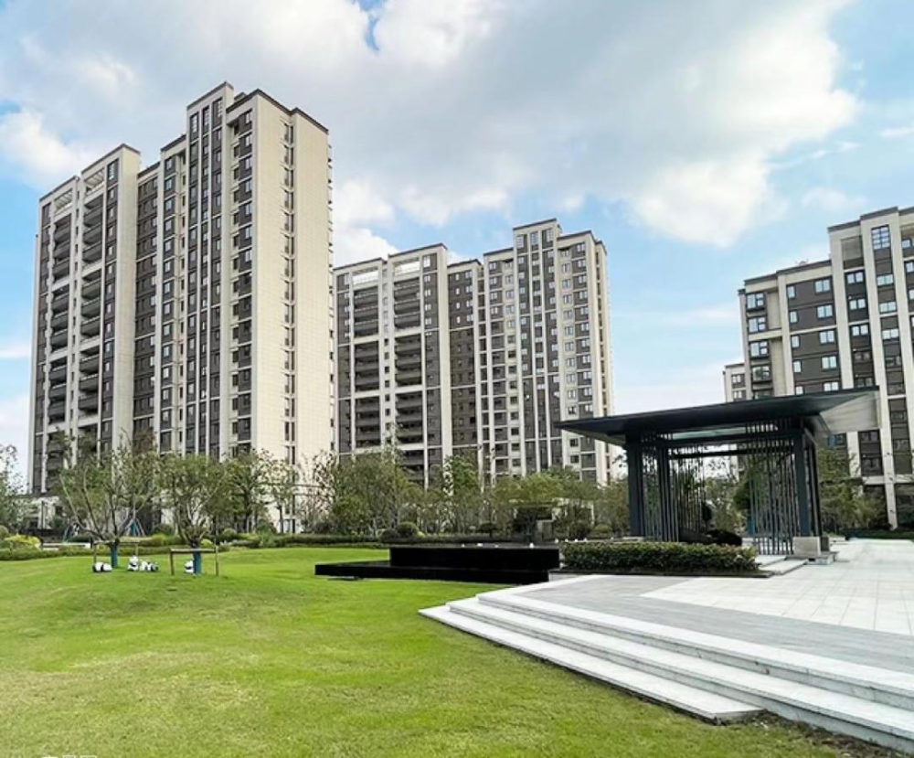

# 苏州百亿“毒土地”污染问题两年前已浮现，陆家嘴、苏钢集团隔空推责

本报记者 郭阳琛 张家振 上海报道

江苏省苏州市，正因为一场涉诉案值超百亿元的“毒土地”事件吸引着外界关注的目光。

日前，上海陆家嘴金融贸易区开发股份有限公司(以下简称“陆家嘴”，600663.SH)发布公告称，控股子公司佳湾公司、佳二公司与江苏苏钢集团有限公司（以下简称“苏钢集团”）、苏州市环境科学研究所、苏州市苏城环境科技有限责任公司、苏州国家高新技术产业开发区管理委员会（以下简称“苏州高新区管委会”）、苏州市自然资源和规划局因土壤污染产生侵权纠纷，已向江苏省高级人民法院提起民事诉讼。

据了解，陆家嘴受污染地块共有14宗，土地面积共计57.3万平方米。目前，公司已暂停上述地块项目的开发、建设、销售工作。陆家嘴方面认为，上述地块污染面积和污染程度远超苏钢集团挂牌出让时所披露的情况，并要求苏钢集团承担赔偿100.4亿元的侵权责任。

_苏州绿岸此前发布的、由相关地块开发建设的陆家嘴锦绣澜山锦园交付实景图。目前官方公众号已停更近两年。图片来源：陆家嘴锦绣澜山官方公众号_

对此，11月10日，苏钢集团通过官方渠道发布《情况说明》并强势回应称，公司在2016年转让股权时已如实披露了上述地块存在部分污染的调查结果及报告全文，并在资产评估报告中明确提示了该范围中部分地块原为钢铁焦化生产区域，可能存在土壤污染风险。当时，陆家嘴在交易时即已知悉上述情况，并承诺接受所有现状、瑕疵和风险。

《中国经营报》记者调查发现，涉事的“毒土地”是一片有着15年历史之久的旧地。2008年，苏钢集团以6.48亿元竞得该地块。此后，由于产业转型、业绩下滑等原因，苏钢集团于2016年以85.25亿元转让苏州绿岸房地产开发有限责任公司（以下简称“苏州绿岸”）95%的股权；2021年6月，在2号地建设的苏州雷丁学校办理办学许可证过程中发现污染问题。

针对相关争议，苏州市自然资源和规划局相工作人员11月10日向记者表示，目前，该事件已经进入司法程序，暂时没有可以对外公布的信息。

**“毒土地”孰是孰非？**

陆家嘴方面表示，2016年，佳湾公司和佳二公司(通过信托计划)组成联合体在上海联合产权交易所联合竞得苏钢集团挂牌出让的苏州绿岸95%股权，苏州绿岸名下的主要资产为位于苏州高新区苏通路北、苏钢路东的17宗土地使用权。

彼时，苏钢集团披露的信息显示，在苏州绿岸名下地块中，非焦化区域的土壤和地下水基本未受到污染，可再开发利用；焦化区域的污染主要集中在4号地块局部区域。根据修复目标值，最终确定0～18米深度内，地块污染范围为17542平方米，污染土方量为39604立方米。股权交易后，苏州绿岸已就苏钢集团所披露的污染范围进行了治理修复。

可好景不长，2022年4月10日，江苏省政府官网公开的《中央第二生态环境保护督察组向我省移交的第六批信访事项办理情况》显示：“根据现场核实情况和苏州绿岸提交的土壤污染状况初步调查报告，部分地块可能存在土壤污染风险（2、3、4和13号地块部分点位存在苯并[a]芘、萘超标）。”

“2022年以来，公司及各方环境调查确定苏州绿岸名下14宗土地存在污染，且污染面积和污染程度远超苏钢集团挂牌出让时所披露的污染情况。”陆家嘴方面指出，同时，公司委托专业机构核查发现，在案涉土地的调规变性及出让过程中，各被告存在一系列违法违规、弄虚作假、不依法履职的侵权行为，共同导致了公司受让存在严重污染的案涉土地。

根据陆家嘴2022年4月发布的公告，截至当年4月12日，17宗地块已开发8宗。但苏州绿岸意外发现已建设教育设施的2号、13号地块及尚未开发的3号、4号地块均存在严重污染风险，土壤或地下水中诸多元素大幅超标。

然而，苏钢集团方面却给出了截然不同的说法。苏钢集团回应称，2022年，第三方专业机构南京环科所对地块污染情况进行了详细调查。有关结果表明：已有居民入住的14、15号地块、已开发建设的8、9、12、13、16号地块和未开发建设的7、11、17号地块，属可安全利用地块；焦化区1、2、3、4、5、6号和非焦化区10号地块（其中仅2号地块已开发建设），经治理修复后可安全利用。

尤其是对于2号焦化区地块，苏钢集团方面进一步表示，2019年，陆家嘴在知悉该地块不符合环保要求且未依法完成土壤污染调查和修复治理，即启动了该地块项目建设。2021年，该地块因无法通过环评验收而未能启用。

此外，苏钢集团还指责陆家嘴在开发建设整个地块期间，没有按照有关要求建设地下水阻隔墙及采取其他防护措施，存在扰动地下水、搬运土壤造成部分环境交叉污染的行为和施工作业不规范造成二次污染的行为。

“2016年，我司披露报告中已明确指出，‘要严格控制场地内及场地附近开展造成地下水扰动的施工’‘场地开挖前必须做好适当的防护措施，进行环境监理，避免污染物扩散，对周边环境及居住区产生影响’。”苏钢集团方面表示。

**15年旧地何去何从？**

事实上，这块价值超百亿元的“毒土地”历史最早可追溯至15年前。早在2008年，苏钢集团以6.48亿元竞得该地块。

记者了解到，上述地块原计划在2011年6月前开工，2013年6月末竣工，但苏钢集团受困于钢铁产业下行持续亏损而无力开发。同时，为响应国家有关部门节能减排要求，苏钢集团从2013年11月至2014年8月起陆续关停了三台焦炉。几乎在同一时间，苏钢集团成立全资子公司苏州绿岸，并于2016年在上海联合产权交易所挂牌转让公司95%股权，最终成交总金额为85.25亿元。

2016年，正值房地产行业的“黄金时代”，作为“楼市四小龙”之一的苏州市涌现了多个“地王”。彼时，苏州绿岸的股权竞拍战异常激烈，共有19家企业参与，竞价多达222轮，最终被陆家嘴摘得，溢价率高达117.14%，成交综合楼面价为7882元/平方米。

此后，陆家嘴方面计划将该地块开发建设为苏州绿岸项目。苏州高新区管委会曾发文称，苏州绿岸项目总占地面积约66万平方米，开发总体量（建筑面积）约157万平方米，是苏州高新区首个百万平方米规模的城市区域综合体项目。

按照陆家嘴的最初计划，2017年5月，苏州绿岸项目正式启动开发建设，整体开发周期计划为8年，原预计于2025年左右基本开发成熟，商业地块还将成为浒墅关区域的重要核心商业项目。

值得注意的是，2018年11月，苏州绿岸项目引进苏州雷丁学校；2020年2月正式步入施工阶段，该学校所在的建设用地正是2号地块；2020年9月底，苏州雷丁学校完成主体结构封顶工作，原本计划2021年4月完成正式交付，并于9月迎来首批新生。但当年6月，苏州雷丁学校在办理办学许可证过程中对2号地块的土壤污染状况进行调查，发现存在污染物。

自此，苏州绿岸项目的污染问题被摆上台面。针对这起“毒土地”争端，北京金诉律师事务所主任王玉臣律师分析认为，一方面，要厘清当年工业用地转为住宅用地时相关手续是否完备；另一方面，要弄清苏钢集团在转让苏州绿岸股权时是否对相关信息进行了充分披露，提供的相关检测报告是否完全属实。此外，陆家嘴方面在收购股权前的尽职调查时是否充分注意到相关问题，是否尽到自己的审慎义务也值得关注。

“在项目开发建设过程中，还要关注施工作业是否合法合规，是否存在损失进一步扩大问题。如果有楼盘已经入住，环评是否已经通过验收，如果已经通过验收是如何通过的？这些问题也都是判定责任的关键点。”王玉臣进一步表示。

上海瀛泰（临港新片区）律师事务所主任翁冠星律师则认为，如果陆家嘴方面的说法属实，苏钢集团需承担相关的环境污染行政责任；检测机构可能出具了不符合事实的环评报告，苏州高新区管委会、苏州市自然资源和规划局可能存在未能履行监督职责的情况。涉事的相关负责人员，还有可能面临刑事追责。

事实上，在发现土地存在污染时，苏州绿岸项目中的部分住宅、学校、幼儿园、商业体、健身公园等已完工且达到交付标准。11月6日，陆家嘴董事长徐而进在公司三季度业绩说明会上向投资者透露，目前，苏州绿岸已暂停相关开发、建设、销售工作。

在王玉臣看来，对于购房人而言，如果住房还没有入住，可以基于商品房买卖合同的法律关系，向开发商提出解除合同，退回房款并支付违约金或损失赔偿的诉求；如果已经入住，身体受到了损伤，除了上述主张外还可以主张身体受损的相关损失赔偿。此外，作为侵权行为，购房者还可以视情况基于侵权问题向相关侵权主体主张赔偿。

（编辑：张家振 校对：燕郁霞）

