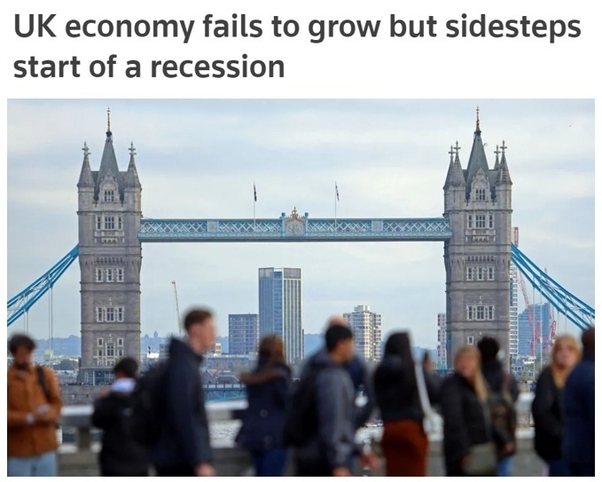
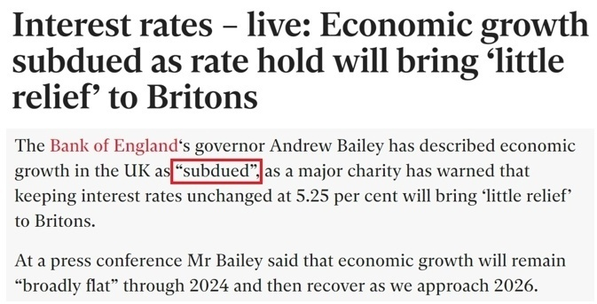
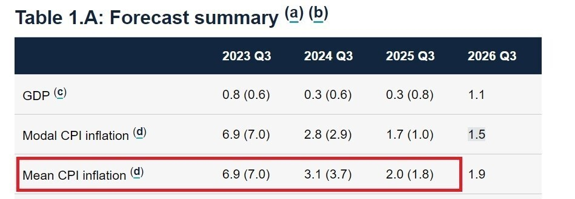

# 英国三季度GDP环比增速为0：经济低迷，民调显示60%民众支持重新入欧

受通货膨胀加剧和英国央行持续加息的影响，英国三季度GDP停滞不前。

根据英国国家统计局11月10日公布的数据，英国三季度GDP环比初值为0%，好于预期的-0.1%，同比增长0.6%。

_英国《晨星报》网站报道截图_

分析师和经济学家们认为，最新的经济数据已经证实了英国经济的疲软。

**英国经济“必然处于低迷状态”带来哪些影响？**

虽然经济学家暂时降低了2023年英国经济衰退的风险，但英国经济正面临着一个长期的停滞期。

_路透社：英国经济停滞不前，刚好躲过陷入衰退。_

**中国现代国际关系研究院欧洲研究所英国研究室主任杨芳** 分析认为，多重原因导致英国经济陷入停滞。

英国经济增长乏力是一个长期问题，自金融危机以来始终得不到解决。英国自身的经济增长没有韧性，动力不足。”脱欧”以后，英欧贸易下滑，使对外市场出现不稳定性。同时，英国在新市场方面开拓不足，缺乏新动能。内外双重压力，对英国经济造成负面影响。

为抑制高通胀，英国央行——英格兰银行自2021年12月以来持续加息。

今年9月，英国央行在货币政策会议上宣布维持利率不变，结束了连续14次的加息。

英国央行行长贝利本月初表示，将长期保持高利率，以确保通胀率降至2%的目标，但目前考虑降息为时过早。

贝利同时强调，英国当前高达6.9%的高利率正在持续影响英国经济，预计未来英国经济增长“将必然处于低迷状态”。

_英国《独立报》报道截图_

英国财政大臣杰里米·亨特则表示，高通胀仍然是英国“经济增长的最大障碍”。

由于通胀高企、民众实际生活水平不断下滑，英国各行业罢工此起彼伏。

今年以来，英国铁路工人已经连续多次举行罢工。

英国火车司机工会表示，自2019年以来，大多数火车司机实际收入停滞不前，而不断攀升的物价让他们的收入缩水。

英国火车司机工会秘书长米克·蕙兰直言，政府的不作为，是造成英国高通胀的主要原因。

**米克·蕙兰** ：“英国有1400万贫困人口、150万赤贫人口，我们的学龄儿童在非上课时间正在挨饿，而这一切就发生在世界第六大经济体——英国。”

_英国《独立报》报道截图_

面对如今经济停滞、通胀高企的局面，以及“脱欧”等因素造成的劳动力严重短缺问题，当前，很多英国民众寄希望于重新加入欧盟。

英国预算责任办公室曾表示，从长远来看，“脱欧”将使英国生产力下降4%。

上月底，数千名英国当地民众高举欧盟旗帜或标语，穿过伦敦市中心到达议会广场，呼吁英国重新加入欧盟。

参加游行示威的人群中，有老人，也有七年前没有资格参与“脱欧”公投的学生。他们都有一个共同的特点，就是对英国政府和当前英国的经济形势感到不满。

_英国《卫报》报道截图_

最新民调显示，迄今为止，有约60%的英国民众支持重新加入欧盟。

**英国经济失去动力？**

在英国央行看来，迄今为止，加息政策只发挥了一半作用。

市场利率和模型预测，2024年英国第三季度的通胀率为3.1%，2025年第三季度才能回归到2%的目标水平。

_英国央行数据截图_

而随着高利率影响的加剧，英国经济将进一步失去动力。

需要警惕的是，在通胀尚未受控之际，英国经济已经濒临衰退。

英国央行预计，2024年，英国经济衰退的可能性为50%。

 _英国《卫报》报道截图_

而根据彭博社本周发布的一份报告，利率飙升、失业率上升，让英国家庭的支出更为谨慎，“英国很可能已陷入衰退”。

此外，英国央行预计，目前4.3%的失业率到2026年将升至5.1%。

 _彭博社报道截图_

作为世界主要经济体之一的英国，其经济如果陷入长期低迷，将给全球经济带来不小的负面影响。

中国现代国际关系研究院欧洲研究所英国研究室主任杨芳分析认为，通货膨胀和货币政策等原因叠加，导致目前看不到英国经济好转的迹象。

虽然英国政府会在秋季预算中出台一些推动科技进步和创新的政策，但在推动经济增长以及控制通胀的货币政策方面，并没有看到明显效果。英国经济政策也面临两难情况：通胀导致物价飙升，对中等收入和低收入家庭带来极大冲击，同时增加了工资增长的压力；但工资增长会进一步加剧通胀，这也增加了英国未来经济前景的不确定性。

