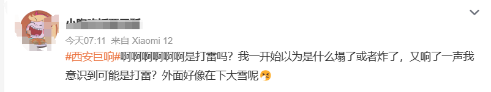
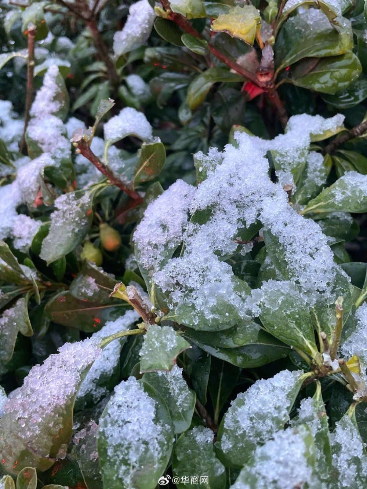

# 西安下雪时传出巨响，网友调侃是雷震子找妈妈，专家：冬天打雷较少见

11月11日早晨

**#西安巨响#** 登顶微博热搜

一位西安网友今早发布微博表示，西安下雪同时听见巨响。不少坐标西安的网友都表示听到巨响，称被惊醒；还有网友开玩笑道：“雷震子在找妈妈吗？”

**原来是打雷！**

**西安初雪和冬雷一起来了**

晨间的冬雷把许多周末睡梦中的西安人吓醒了。11月11日，伴着降温，西安迎来初雪，早上天空更是响起阵阵雷声。

陕西省气象台2023年11月11日07时21分发布雷电黄色预警信号：预计下述地区未来6小时内可能发生雷电活动，可能会造成雷电灾害事故：西安市新城区、碑林区、莲湖区、灞桥区、未央区、雁塔区、阎良区、临潼区、长安区、鄠邑区、高陵区、蓝田县、周至县、西咸新区，咸阳市秦都区、渭城区、兴平市、三原县、泾阳县、礼泉县、淳化县，渭南市临渭区、华州区，请注意防范。

西安气象台在系统中已监测到闪电发生情况，并对位置进行了定位。

**有网友疑惑：这是下了场“雷阵雪”？下雪天打雷是天气在“作妖”？**

**据@华商报 报道，气象专家表示，冬天打雷是一种相对较少见的现象，也被称为“冬雷”或“冷雷”。通常情况下，雷电活动在夏季较为常见。**

然而，在某些特殊气候条件下，冬天也可能出现打雷的现象。这通常是由于冷空气与暖湿空气相遇，形成不稳定的大气层结，导致对流活动增强而产生的。在这种情况下，如果大气中的电荷分布不均匀，就可能产生雷电放电。

据@中国天气，这种现象也叫“雷打雪”。其实只是在特定天气条件下出现的一种特殊的天气现象，虽然少见，但算不上特别反常。

雷电发生，首先要有充足的水汽，其次还要有使湿空气上升的动力，空气能产生剧烈的对流运动，能够具备上述雷电发生的这些条件，打雷在任何季节都有可能发生的。当某地前期气温偏高，之后又有较强冷空气南下，剧烈的温差就使得暖湿空气被迫抬升，对流加剧，造成强烈的对流天气，雷电就在这个过程发生了，上升的暖湿空气发生凝华，就会形成降雪，两者同时出现，就是“雷打雪”了。

（综合@西安气象、@中国天气、华商报、新浪微博网友评论）

（作者：读特客户端综合）

