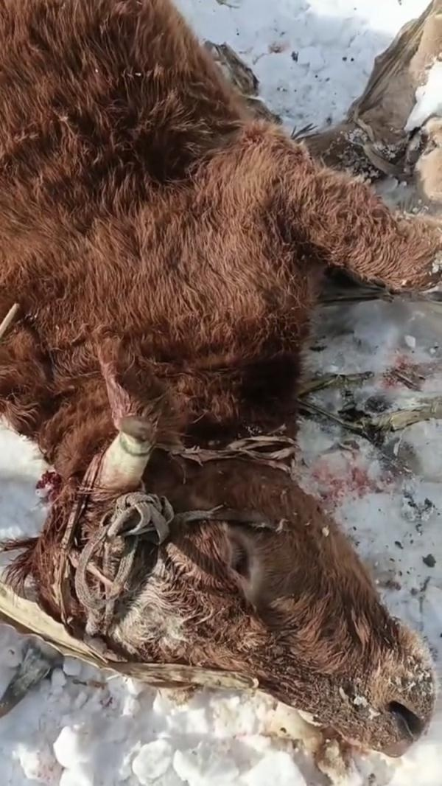

# 野生东北虎为何频繁下山咬死家畜，专家：数量增加，暴雪下食物缺乏

近日，黑龙江省多次发现野生东北虎活动踪迹。网传黑龙江省哈尔滨市依兰县新胜村长山屯疑似有老虎下山觅食，先后有两头牛被咬死。依兰县委宣传部表示，经当地林草部门联合专家对现场痕迹等因素进行分析，确认该野生动物为国家一级保护动物东北虎。依兰县应急管理局发布紧急通知称，辖区内群众禁止入山，养殖户要做好安全防范。

_依兰县被野生东北虎咬死的牛。图/视频截图_

11月9日，黑龙江省虎林市人民政府发布紧急提醒：7日以来，黑龙江省虎林市虎头镇江边和周边村屯附近陆续发现野生东北虎活动踪迹，通过巡护监测及现场勘查判断，至少有2只野生东北虎在虎林市域内活动。并提醒居民注意安全，建议非必要不外出。

11月5日以来，东北地区遭遇罕见强降雪，黑龙江佳木斯、双鸭山等多地出现特大暴雪。局地降雪量具有一定极端性，突破历史同期极值。野生虎频繁下山，和本次大雪是否有关？

10日下午，九派新闻联系到大庆市野生动物保护协会秘书长付建国，他介绍，野生东北虎下山有多方面原因。

首先，近几年生态环境恢复得较好，东北虎的数量有所增加，其活动范围有所扩大。东北虎虽然会划定自己固有的生存环境，很少在多个交叉的范围内活动，但由于近期暴雪，山上的野兔、野猪等动物会卧在雪地里不动、活动得少，很难捕猎，东北虎的食物紧缺，只能下山来找食物。

此外，也和人类活动相关。人类的活动范围扩大，从而导致一些原本是东北虎生存的空间经过人为的开发，现在变成了人类的活动空间。譬如经常看到东北虎出现在公路边，也许之前此处并没有公路，反而附近原本是它熟悉的生存环境。而现代交通工具及监控设备的进步，也使得人们能够更加容易地发现和记录东北虎的踪迹。

他总结，近期野生东北虎频繁下山是有一定科学依据在的，是正常情况，应当正确看待。实际上，80%左右的东北虎还是比较怕人的，大部分都会躲着人走，很少与人正面接触。并且一般野生东北虎出没的地带离山及森林较近，很少深入聚居的自然村落，最多也是到人数较少、基本不超过十户人家的独立居民点，或是山上养牛羊的放牧点，除非是真的饿到极端的程度，才会到居民家找食物。

付建国提醒，到了冬季，建议大家尽量不要去山上或森林中，少在分散的居民点或在野外放牧点放牧，最好把牲畜赶回自然村落里，避开东北虎出没的区域，以减少生命财产损失。此外，如果开车途中遇到，尽量为其让出通道，使野生东北虎回归森林；如果单个人遇到，尽量还是躲避、不要伤害它。尽管野生东北虎的数量有所增加，但还是比较濒危，建议大家以保护为主，不要太恐慌。

**九派新闻记者 代梦颖**

**编辑 武菲菲**

【来源：九派新闻】

版权归原作者所有，向原创致敬

