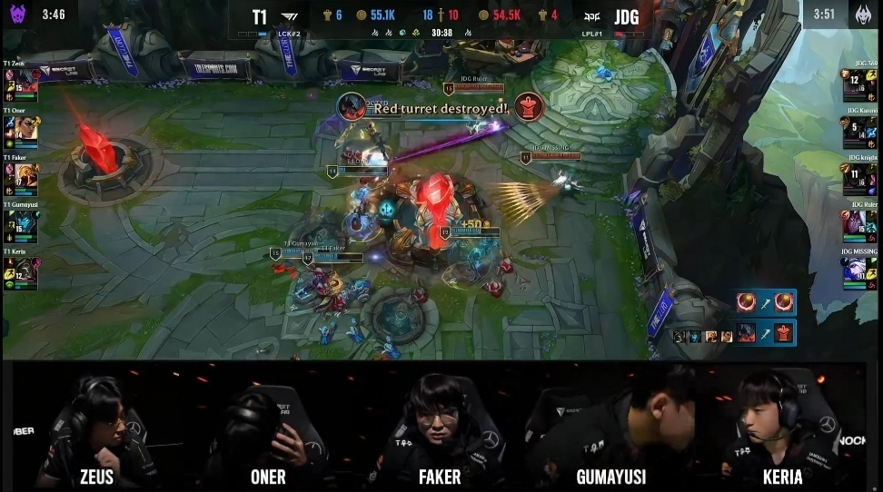

# JDG1-3不敌T1，止步4强！kanavi狂失误，JDG痛失好局

S13全球总决赛T1和JDG的半决赛，最终T1以3-1的战绩淘汰JDG，晋级决赛，JDG止步4强。

第一局T1选择了上单剑魔，打野芮尔，中单剑魔，下路烬加巴德；JDG选择了上单兰博，打野蔚，中单阿卡丽，下路霞加牛头。2分钟oner芮尔抓上，击杀369兰博，Zeus剑魔拿下了一血。6分钟Zeus剑魔在上路单杀369兰博。前期T1推掉了上路一血塔，经济领先3K。中期24分钟T1在野区开团，发条、芮尔配合烬大招瞬间团灭JDG，之后T1光速拿下第一局的胜利。首局输出如下，Faker发条打出全场最高伤害，JDG这边伤害最高的是369兰博。

第二局JDG选择了上单奎桑提，打野蔚，中单发条，下路滑板鞋加赛娜；T1选择了上单剑魔，打野大树，中单沙皇，下路女警加艾希。开局T1抱团入侵JDG野区，打出1换2，Oner大树拿下了一血。前期JDG推掉了上路一血塔，经济领先2K。中期24分钟双方中路混战，JDG打出1换2后拿下第一条大龙。后期31分钟，kanavi蔚绕后开团直接秒掉Faker沙皇，之后双方混战，369奎桑提收割，JDG打出2换5团灭T1，随后拿下第二条大龙。34分钟JDG拿下听牌龙。最终37分钟，Zeus剑魔TP绕后，但是knight发条金身规避伤害，369奎桑提再次收割，JDG成功追回一局。MVP给到了kanavi蔚。

第三局T1选择了上单剑魔，打野芮尔，中单沙皇，下路滑板鞋加烈娜塔；JDG选择了上单鳄鱼，打野猴子，中单岩雀，下路韦鲁斯加寒冰。2分钟kanavi猴子抓下，击杀Guayusi滑板鞋，但是JDG扛塔失误2人被换掉，JDG拿下了一血。14分钟JDG推掉了下路一血塔。前期JDG经济领先2K。中期17分钟双方争夺小龙，Oner芮尔闪现开团，Faker沙皇进场R两人，T1抢下听牌龙并且团战大胜击杀JDG三人。20分钟Ruler韦鲁斯在中路被抓死，Kanavi猴子赶来救援也被打残，T1拿下第一条大龙。28分钟Missing艾希大招配合队友击杀oner芮尔，随后Zeus在眼上埋伏也被击杀，JDG拿下第二条大龙，T1则是拿下风龙魂。最终后期30分钟Faker沙皇完美大招开团，T1团灭JDG后，拿下第三局的胜利。

第四局JDG选择了上单剑魔，打野虚空女皇，中单发条，下路泽丽加璐璐；T1选择了上单永恩，打野皇子，中单沙皇，下路韦鲁斯加巴德。7分钟双方野区混战，JDG打出1换2，Ruler泽丽拿到双杀，不过Faker沙皇拿下了一血。前期JDG经济领先1K。中期21分钟JDG在野区抓死Keria巴德，随后抱团推中，但是kanavi想要越塔反而被击杀，T1拿下第一条大龙。22分钟T1拿下听牌龙。27分钟双方争夺小龙，kanavi失误直接被秒，Ruler尽力输出但被gumayusi击杀，T1拿下水龙魂和第二条大龙。最终31分钟T1直接平推拿下比赛的胜利。

那么，对于这场比赛，你们有什么想说的吗？欢迎在评论区留言探讨。

