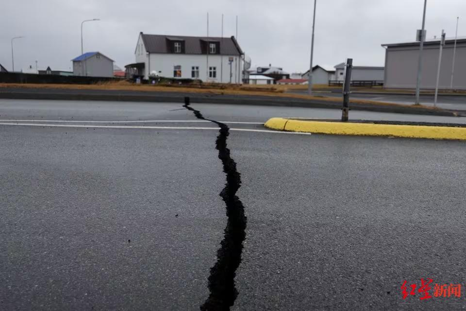
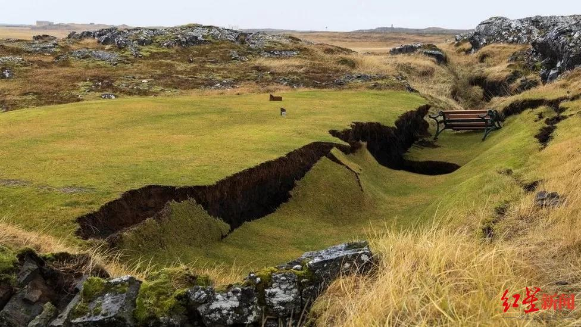
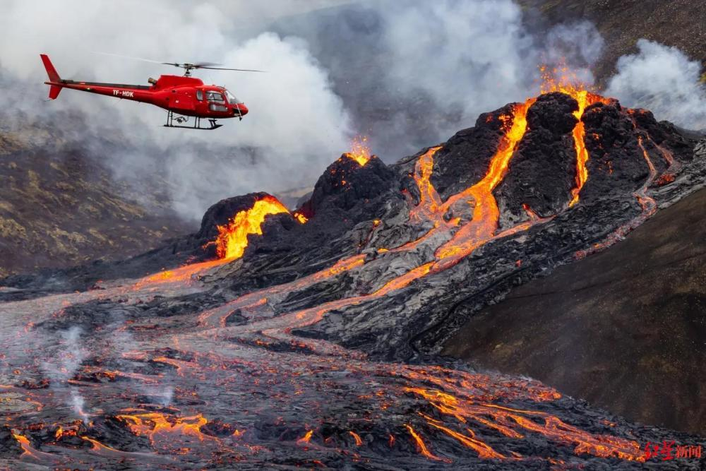

# 一天1400次地震！冰岛火山或再次喷发，游客凌晨逃离，专家：前所未有

本周，在每天上千次频繁地震引发人们对火山爆发的担忧后，冰岛宣布进入紧急状态。

当地时间11月11日，冰岛当局表示，在出现一系列地震和岩浆在地下迅速扩散的迹象后，目前正为未来几天冰岛西南部的火山喷发做准备。

_格林达维克路上出现的裂缝_

**冰岛发布预警：**

**未来几天随时可能喷发**

冰岛气象局11月11日表示，由于地下岩浆侵入的规模和移动的速度，该国西南部雷克雅内斯半岛或附近地区火山喷发的风险“相当大”。该机构在一份声明中称：“自今天早上开始，火山喷发的可能性已经增加，可能在未来几天的任何时候开始喷发。”

11月10日晚些时候，一条岩浆或熔岩隧道向东北方向延伸，穿过格林达维克，向内陆延伸约10公里，深度不到800米，而当天早些时候的深度为1500米。

据报道，为了以防万一，冰岛民防和应急管理部门11月11日凌晨已全面疏散了西南部城镇格林达维克的数千名居民。

冰岛气象局称，最新的一次火山喷发预计将在格林达维克西南的海底开始。近年来，在雷克雅内斯半岛发生的几次火山喷发都位于无人区，但此次喷发或将令格林达维克严重受损。这个小镇位于首都雷克雅未克西南约40公里处，靠近Svartsengi地热发电厂，该发电厂是雷克雅内斯半岛3万居民的主要电力和水供应商，附近还有一个淡水水库。

_地震已导致格林达维克高尔夫球场和其他地方的地面滑动_

**24小时内1400次地震**

**可能爆发地点距知名景点3.2公里**

据报道，自10月下旬以来，冰岛西南部已发生了2.4万次地震。根据冰岛气象局的数据，在本周三至周四的24小时内就报告了多达1400次地震。在地震活动激增之后，著名旅游景点蓝色泻湖已在本周四宣布关闭。蓝色泻湖运营方在其网站上发布的一份声明中表示，经历了多日的地震活动及一个强烈地震的夜晚，“对客人的干扰和对员工的持续压力是我们做出这一决定的主要原因。”

当局表示，此次火山喷发可能发生在距离这一景点不到2英里（约3.2公里）的地方。而在关闭前，因频繁地震，蓝色泻湖地热温泉出现了“恐慌”。周四凌晨，游客被地震震醒后，纷纷逃离了酒店。当地出租车司机比贾尼·斯蒂芬森描述了酒店的混乱景象，“熔岩落在道路上，停车场挤了20到30辆出租车。”他说道，“当时情况很恐慌。人们以为火山即将爆发。”

据冰岛地质物理学家表示，有迹象表明该地区近期可能发生较大规模地震和火山喷发。其中，蓝色泻湖（Blue
Lagoon）、Svartsengi发电厂、Northern Light Inn、Silica-hotel Bláa lónin和Retreat Bláa
lónin三家酒店附近面临岩浆吞噬危险。

据悉，冰岛民防部门已制定紧急疏散蓝色泻湖附近地区及格林达维克市镇的计划，格林达维克附近地区风险级别提升。中国驻冰岛使馆也提醒在冰中国公民提高安全意识。

此前，中国驻冰岛大使馆发布提醒称，10月27日以来，冰岛西南部雷克雅内斯半岛的格林达维克北部和西北部地震活动明显增加，余震不断，每日记录地震次数多达900余次，整个雷克雅内斯半岛面临山体滑坡和落石危险。

**“前所未有的事件”：**

**岩浆量远超法格拉达尔火山爆发**

据报道，雷克雅内斯半岛是冰岛的火山和地震热点。2021年3月，在经历了15个月渐次频繁的地震后，该地区的法格拉达尔火山爆发，熔岩从地面长500米至750米的裂缝中喷发，在大地上奔涌。在此之前，法格拉达尔火山系统已有6000多年没有活动了，雷克雅内斯半岛的火山活动也已休眠了800年。

 _2021年3月，法格拉达尔火山爆发_

而2021年的这次火山喷发，似乎预示着新的“雷克雅内斯火山活跃期（Reykjanes
Fires）”已开启。2021年9月18日，在持续6个月后，第一场火山喷发结束。过了319天，2022年8月，该地区火山再次喷发，并在持续三周后结束。323天后，2023年7月10日该地区火山系统第三次喷发。火山学家认为，新的火山活动增加周期可能会持续几十年或几个世纪。

冰岛气象局在最新声明中称：“有迹象表明，相当数量的岩浆正在从北部的Sundhnjúkagígum向格林达维克延伸。所涉及的岩浆量远远超过了在法格拉达尔火山爆发时观察到的最大岩浆侵入（量）。”

冰岛气象局火山灾害协调员萨拉·巴索迪表示，专家们对岩浆的数量和积聚的速度感到惊讶。“这一过程的速度，以及到目前为止我们在半岛上看到的（岩浆）数量或流入率，我们现在看到的是一个前所未有的事件。”

红星新闻记者 徐缓

编辑 潘莉 责编 邓旆光

