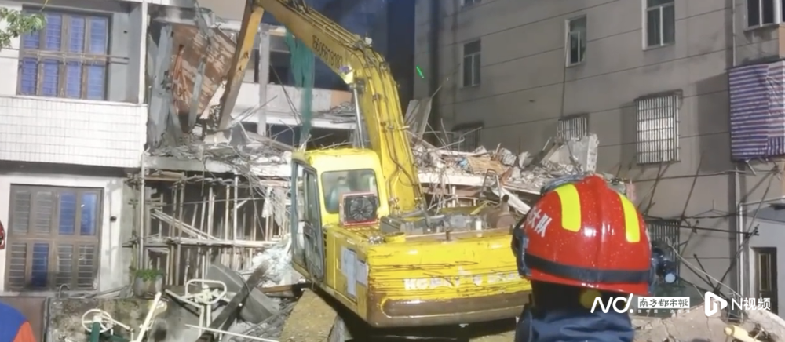

# 又见“领导刚走就出事”，安全排查到底查了啥

又一起令人痛心的建筑坍塌事件！11月11日中午，浙江温州永嘉县桥头镇岩头巷一民房在翻修过程中发生坍塌。据当地政府通报，4名施工人员被埋后不幸遇难。目前，正组织房屋坍塌原因调查和善后处置工作。

几天前，黑龙江桦南县悦城健身体育馆发生部分坍塌，导致3名正在打篮球的初中生遇难；今年7月，共造成11人死亡的齐齐哈尔市第三十四中学校体育馆坍塌事件，更是让全社会聚焦建筑安全问题。

在为死伤者表达惋惜、哀悼的同时，必须痛定思痛，持之以恒做好安全排查，尽最大努力防止发生下一场事故。

值得注意的是，永嘉县政府新闻办公室发布的消息显示，11月6日，副县长张长霓刚刚来到发生事故的桥头镇开展周一“夜查、夜巡、夜访”行动。在常态化的安全风险排查之下，坍塌依然在县领导“眼皮子底下”发生了，个中原因值得深思。

而就在今年7月24日，齐齐哈尔学校体育馆坍塌事件发生次日，黑龙江桦南县领导就到悦城健身体育馆检查指导安全生产工作。遗憾的是，这次检查同样没有阻止事故的发生。

建筑安全风险隐患表现为多种形式，有的因为建造、维修时不规范的操作而产生，有的因为年久失修、缺乏管理而暴露，有的则因为建筑质量不合格，在落成使用之际就暗藏风险。

这也要求安全排查不能只停留于“面上”，而要抓细抓实。如果发现不了真正的风险、解决不了真正的隐患，那排查就是对上糊弄、对下敷衍的“走过场”。

海因里希法则认为，一件重大的事故背后必有29件轻度的事故，还有300件潜在的隐患。安全排查就是要把这些轻度事故和潜在隐患揪出来，主动打好补丁。领导干部下到基层进行安全排查，不能满足于听一听汇报，而要多看一看实际情况，掌握安全生产的一手信息。

平心而论，政府领导干部不一定具备安全排查的所有专业知识，由领导干部“挂帅”进行排查，为的是突出责任、强化担当。在领导干部进行安全排查的同时，应当由专业部门和专业技术人员进行更加周密的检查，将检查落实到日常安全工作中，不让安全排查沦为“走马观花”。

防范事故风险隐患，还要走出“一人感冒，大家吃药”治理路径。重特大事故发生以后，各地组织安全排查当然是必要的，但要避免异化为一种危机应对模式。每当事故发生，政府组织突击检查，责任单位和个人准备材料、填补漏洞迎检，似乎存在心照不宣的默契。

可是，往往越是这样的“应景式”检查，越容易掩盖问题，导致麻痹大意。而遵循风险隐患的一般性规律，有针对性地检查具体问题，更应当成为安全排查的实施原则。

随着我国城镇化率的提升，城市发展已经进入城市更新的时期，由大规模增量建设转为存量提质改造和增量结构调整并重。这也意味着，建筑的风险隐患会不断积累，甚至可能集中释放。

因此，各级政府必须不断增强安全意识和应急处置能力，将安全生产检查融入日常工作的每一时刻，切实提升城市安全韧性。

文｜王钟的

