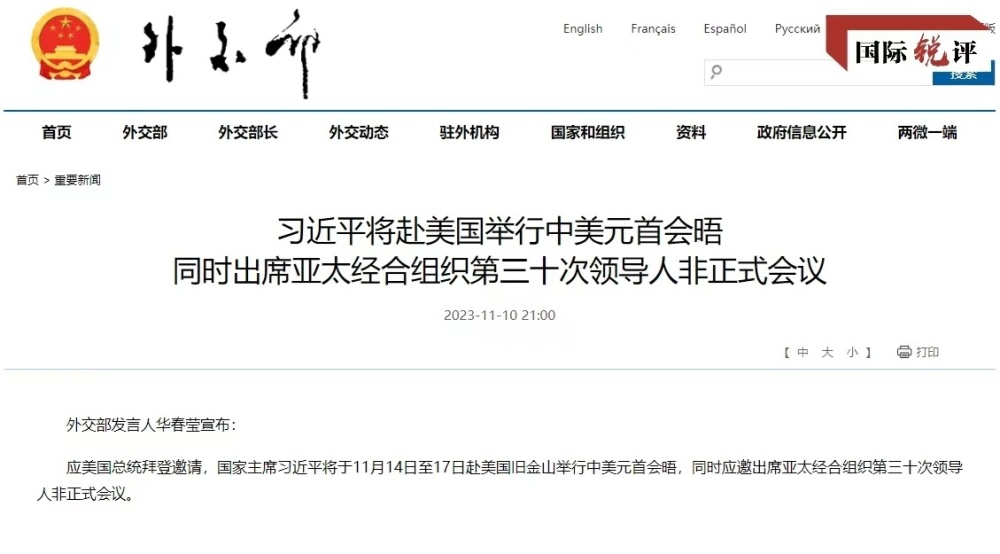

# 国际锐评丨事在人为 中美元首旧金山会晤值得期待

11月10日晚，中国国家大剧院，一场纪念美国费城交响乐团访华50周年的音乐会在这里举行。当融合西方与中国交响乐的《唐诗的回响》唱起，一座心灵之桥也在中美人民之间架起，续写了“跨越半个世纪的音乐友谊”。

从历史到现实，中美之间有一千条理由把关系搞好，没有一条理由把关系搞坏。在民间交往升温的同时，官方交往也在提速。外交政策磋商、海洋事务磋商、气候变化会谈、军控与防扩散磋商、新一轮经贸对话……中美近期一系列交往对话，发出了稳定双边关系的积极信号，也为中美元首下周的旧金山会晤打下基础。

这是两国元首继去年巴厘岛会晤后举行的首次面对面会晤。双方将就事关中美关系的战略性、全局性、方向性问题，以及事关世界和平与发展的重大问题深入沟通。世界期待中美元首旧金山会晤聚焦合作、谈出成果。

这是一次来之不易的会晤，“重回巴厘岛共识”是关键。过去一年中美关系之所以遭遇困难，原因就在于巴厘岛共识没有得到落实。美国当政者出于错误的对华认知，采取了错误的对华政策。今年上半年，从上演“气球政治秀”，到纵容中国台湾地区领导人蔡英文“过境”窜美，再到实施对华半导体出口管制，美方一系列行径背离两国元首共识，损害中方利益，打断了中美对话进程。

从6月份美国国务卿布林肯访华开始，美方表现出缓和中美关系的姿态。美方应该意识到，对华遏制打压行不通、办不到，解决气候变化、地区热点乃至美国经济复苏等问题，都离不开同中国的合作。绕了一个大弯，美方不得不回到巴厘岛共识和议程上来。

重回巴厘岛共识，关键在行动。这其中，台湾问题是中国核心利益中的核心，是中美关系第一条不可逾越的红线。近期美方再次作出一个中国政策没有变、不支持“台独”的表态。另外，美方官员多次表示“不寻求同中国脱钩”，认为美中经济脱钩会给“两国和世界带来灾难性后果”。这些表态值得重视，更重要的是转化为行动。

但同时，人们看到，美方依然在操弄与台湾问题相关的法案、向台湾地区售武；依然以“国家安全”为名打压中国。就在上个月，美国商务部进一步收紧对华半导体出口管制规则，并将13家中国企业增列到出口管制“实体清单”里。美方应当改弦更张，不折不扣地落实美国领导人对华作出的政治承诺，不玩火、不折腾。

世界还期待，中美通过旧金山会晤进一步正确认知彼此，理解对方的发展对于自身的意义。“宽广的地球完全容得下中美各自发展、共同繁荣”——在中方看来，中美两国应该是伙伴而不是对手，应该互利共赢而不是零和博弈。但美方错误地将中国视为“最大战略竞争对手”，从“竞争、合作、对抗”的对华政策三分法到“投资、结盟、竞争”的三点论，不变的是背后的霸权逻辑与零和思维。

但是现实呢？在刚闭幕的第六届中国国际进口博览会上，美国联邦政府首次以官方名义参展，参展的美企超过200家，规模创下历届之最。这充分说明：中美利益深度交融，谁也离不开谁、谁也改变不了谁、谁也不必取代谁。怎样看待中国？美方应从“意识指导型”转向“务实指导型”。正如前不久美国加州州长纽森访华时所说，“中国越成功，我们就都会越成功”。

当前，全球经济复苏乏力，地缘政治冲突加剧，不确定不稳定因素增多。中美经济总量超过世界三分之一、人口总数占世界近四分之一、双边贸易额约占世界五分之一。中美两国如何相处，决定着人类的前途和命运。巴厘岛会晤时，中国国家主席习近平强调应从把握世界大势的高度看待和处理中美关系。什么是世界大势？就是和平与发展是国际社会共同期待，搞集团对抗与圈子政治不得人心，也没有出路。人们也期待，中美元首旧金山会晤就世界和平与发展重大问题进行的深入沟通，让世界安心，令全球受益。

一直以来，中方按照相互尊重、和平共处、合作共赢的原则看待和发展中美关系。近半年来，习近平主席会见了美国国务卿布林肯、美国比尔及梅琳达·盖茨基金会联席主席比尔·盖茨、美国前国务卿基辛格、美国国会参议院多数党领袖舒默、加州州长纽森等各界人士，与美各界友好人士互通书信，持续引领中美关系发展。“‘修昔底德陷阱’并非必然”“中美关系基础在民间、希望在人民、未来在青年、活力在地方”等论述，引发两国广泛共鸣。

这次中美元首旧金山会晤，进一步体现了中方的诚意以及对中美关系、对世界和平与发展的高度负责。希望美方跳出大国竞争的思维窠臼，摆脱国内党争和政客私利的影响，真正从国家利益与人民利益、从对世界负责的角度，与中方展开理性务实的对话，并做好“全过程管理”，以诚意对诚意，以行动对行动。中美关系能否持续“稳下来、好起来”，事在人为。

（国际锐评评论员）

