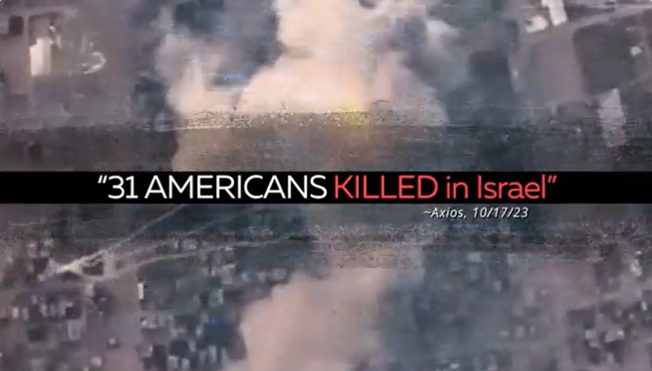
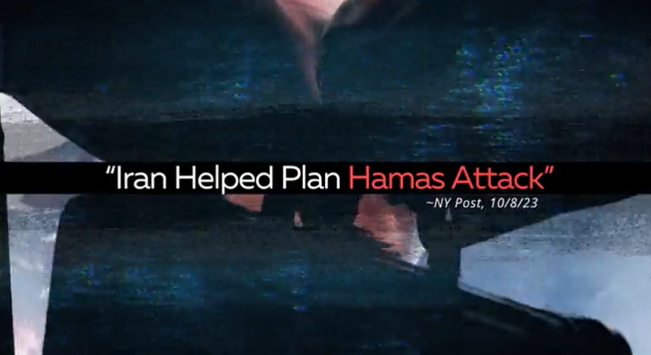
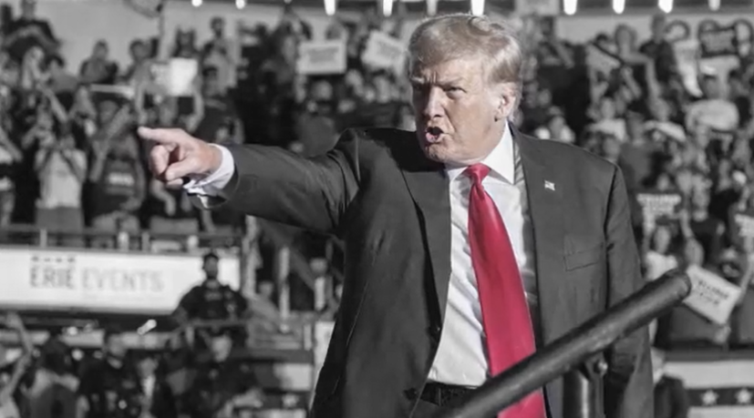
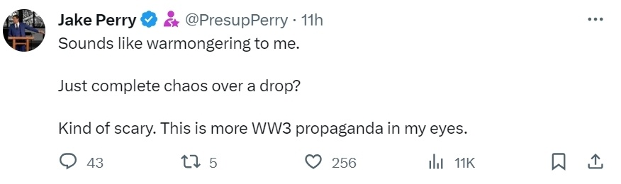
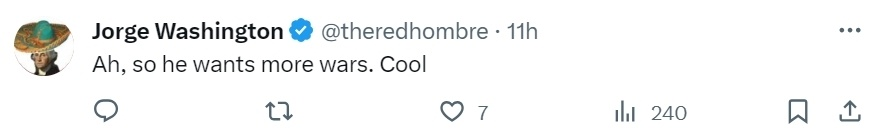
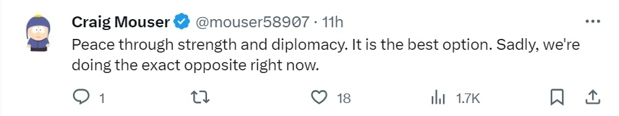

# 特朗普竞选广告称“一加仑敌人血换一滴美国人血”，网友批：战争贩子

【环球网报道】“如果让美国人流一滴血，我们会让你流一加仑血。”这是美国前总统特朗普在其最新竞选视频中的表态。据“今日俄罗斯”（RT）网站11日报道，巴以新一轮冲突持续之际，特朗普竞选团队11日在社交平台X发布最新竞选广告，其中提及中东局势以及特朗普在该地区使用过的“强硬手段”，并在最后放出开头言论、警告“美国敌人”。但对于这一竞选视频及其中所谓警告，有网友批评称是“战争贩子”言论。

这段视频长约1分钟，开头便提到10月7日哈马斯袭击以色列，称“有31名美国人在以色列丧生”“伊朗帮助策划哈马斯袭击行动”，并指责美国现任总统拜登把“（美国）纳税人数十亿的钱给了伊朗”。

_当地时间11日，特朗普竞选团队在社交平台X发布竞选广告，其中提及“有31名美国人在以色列丧生”，声称“伊朗帮助策划哈马斯袭击行动”等 视频截图
图源：社交平台X_

视频还对特朗普的中东政策进行了一番回顾，随后便出现文章开头言论。“历史非常清楚地表明，邪恶只尊重一件事：不屈的力量。”特朗普这样放话称，一旦他“回到白宫”，他将确保“美国敌人”知道，如果他们“让美国人流一滴血，我们会让你流一加仑血”。

_当地时间11日，特朗普竞选团队在社交平台X发布竞选广告，视频最后特朗普放话称“如果让美国人流一滴血，我们会让你流一加仑血” 视频截图 图源：社交平台X_

对于特朗普这一最新竞选视频以及其中警告，在社交媒体X的相关帖文下，有网民表示支持，认为很有“威慑力”。但是，也有不少网民表达不同意见，认为特朗普有煽动战争之嫌：“听起来像个战争贩子一样。就为了这一滴（血）而（把一切）搞得一团糟？有点吓人。在我看来，这是在宣传第三次世界大战。”“啊，所以他想要更多的战争。好吧。”“通过实力和外交实现和平，这是最好的选择。遗憾的是，我们现在做的正好相反。”↓

RT提到，这不是特朗普及其竞选团队第一次提“一加仑敌人血换一滴美国人血”的言论。据美国《国会山报》消息，上月28日，特朗普在共和党犹太人联盟会议上对“美国的敌人”发出严厉警告称，“如果你让美国人流了一滴血，我们会让你流一加仑血。”此外，他还抨击拜登是“糟糕的总统”，是“美国历史上最糟糕的总统”。RT表示，回顾特朗普时期的中东政策，正是在其任内，美国将其驻以色列大使馆从特拉维夫迁至耶路撒冷。此外，特朗普还公布了所谓的“世纪协议”，声称该协议提出“现实的两国方案”，承认耶路撒冷为以色列“不可分割的首都”，巴勒斯坦国未来将在东耶路撒冷部分地区建立首都。这些举措均受到以色列的欢迎，但受到伊斯兰世界的强烈谴责。有媒体称，当时不少分析人士认为，“世纪协议”将激化巴以矛盾，带来多重消极影响。

