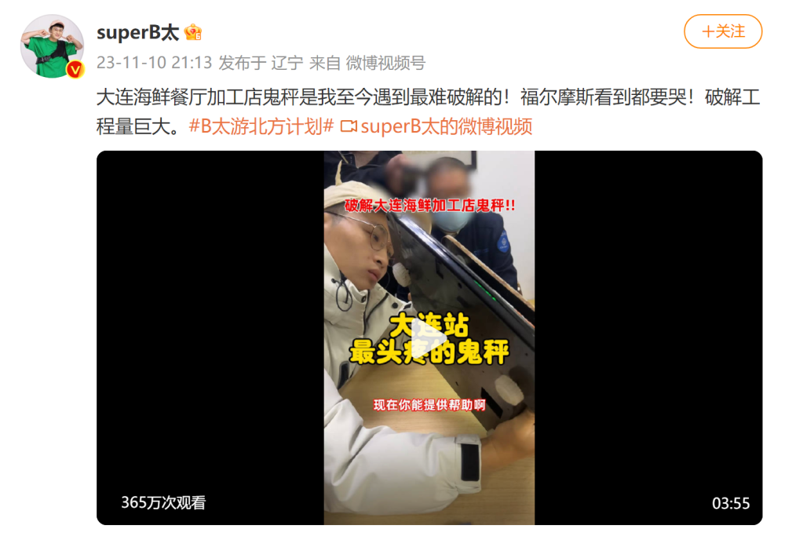
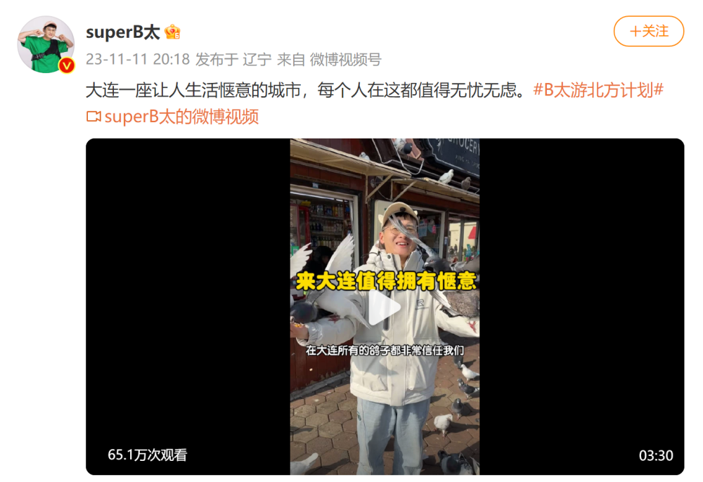

# 网络博主“superB太”在大连遭遇“鬼秤”，官方：立案调查涉事商户

11月12日，大连市市场监督管理局发布通报：

中山区寻味来餐饮店在经营中使用的电子计价秤经无锡市计量测试院检测，检定结论为不合格。

该商户涉嫌在经营中故意使用破坏准确度计量器具的行为，违反了《侵害消费者权益行为处罚办法》第五条第九项的规定，依据《侵害消费者权益行为处罚办法》第十四条及《中华人民共和国消费者权益保护法》第五十六条第一款的规定,市市场监管局已立案调查，依法严厉查处。

此前，知名网络打假博主“B太”曝光大连多个市场有商户存在“鬼秤”问题，引发热议。

11月9日，大连市市场监督管理局发布案情公告，通报四起故意使用不合格计量器具及经营中故意使用破坏准确度的计量器具案，疑似不点名回应“B太”发布的视频和直播时提到的“鬼秤”等消费问题。

案件一

沙河口区福之源生鲜超市涉嫌在经营中故意使用破坏准确度的计量器具案

2023年11月5日，沙河口区市场监管局接到举报，称其在沙河口区福之源生鲜超市购买一只7.2斤活鸡，实际重量仅为5.2斤。

经初步查明，该商户存在经营中故意使用破坏准确度计量器具的行为，涉嫌违反《侵害消费者权益行为处罚办法》第五条第九项的规定，依据《侵害消费者权益行为处罚办法》第十四条及《中华人民共和国消费者权益保护法》第五十六条第一款的规定,市市场监管局已立案调查，并将依法严厉查处。

案件二

沙河口区兆轩海鲜店涉嫌在经营中故意使用破坏准确度的计量器具案

2023年11月5日，沙河口区市场监管局接到举报，称其在沙河口区兆轩海鲜店购买活鱼时，发现该商户存在缺斤短两行为。

经初步查明，该商户存在经营中故意使用破坏准确度计量器具的行为，涉嫌违反《侵害消费者权益行为处罚办法》第五条第九项的规定，依据《侵害消费者权益行为处罚办法》第十四条及《中华人民共和国消费者权益保护法》第五十六条第一款的规定,市市场监管局已立案调查，并将依法严厉查处。该商户所在的大连新智联农副产品批发市场已责令其停业整顿。

案件三

中山区寻味来餐饮店涉嫌在经营中使用计量器具未按照规定进行检定案

2023年11月5日，中山区市场监管局接到举报，称其在中山区寻味来餐饮店购买6只海蟹时，发现该商户存在缺斤短两行为。

经初步查明，该商户使用的电子秤具存在未按照规定申请检定的行为，涉嫌违反《中华人民共和国计量法》第九条第一款及《中华人民共和国计量法实施细则》第二十二条的规定，依据《中华人民共和国计量法实施细则》第四十三条的规定,市市场监管局已立案调查。针对该商户使用的电子秤是否存在破坏准确度的问题，已将该秤送至国内权威机构进行检测，根据检测和调查情况依法依规进行处理。

案件四

郑某涉嫌在经营中故意使用破坏准确度的计量器具案

2023年11月7日，大连市市场监督管理局在检查宝军水产海鲜店时，发现该店经营者郑某在经营中使用的电子秤存在称量不准确问题。

经初步查明，该商户存在经营中故意使用破坏准确度计量器具的行为，涉嫌违反《侵害消费者权益行为处罚办法》第五条第九项的规定，依据《侵害消费者权益行为处罚办法》第十四条及《中华人民共和国消费者权益保护法》第五十六条第一款的规定,市市场监管局已立案调查，并将依法严厉查处。

11月11日，大连市监局再度通报“查处3起非法改装销售计量器具案”：

近日，市市场监管部门在电子秤市场秩序综合整治专项行动中，联合公安机关查处3起非法改装销售计量器具案，现将有关案情通报如下：

案件一

王某涉嫌销售以欺骗消费者为目的的计量器具案

经初步查明，王某通过密码调试的方式非法改装电子秤，破坏计量器具准确度，通过销售改装电子秤谋取非法利益，目前案件正在进一步调查当中。

案件二

徐某涉嫌销售以欺骗消费者为目的的计量器具案

经初步查明，徐某在其销售电子秤的营业场所，通过涮卡器对电子秤进行改装，破坏计量器具准确度，通过销售改装电子秤谋取非法利益，目前案件正在进一步调查当中。

案件三

贾某涉嫌销售以欺骗消费者为目的的计量器具案

经初步查明，贾某在其营业场所销售改装后破坏计量器具准确度的电子秤，谋取非法利益，目前案件正在进一步调查当中。

**【来源：大连市场监管】**

