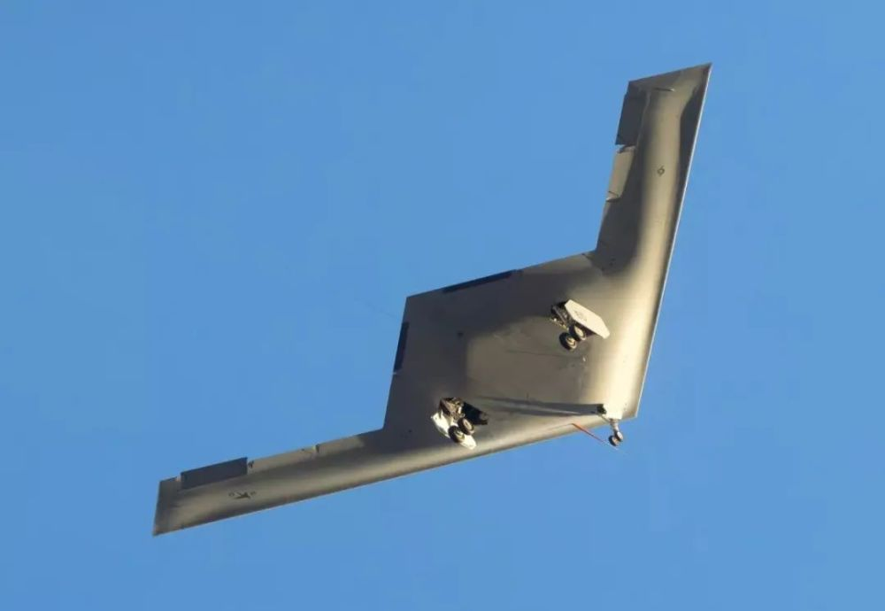
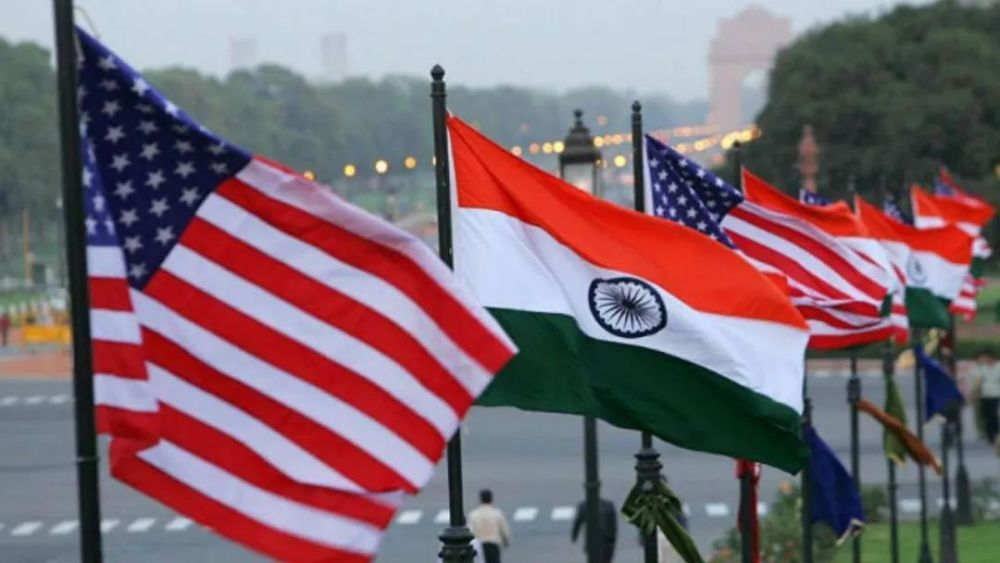

# 美军新型隐身轰炸机首飞，意味着什么？专家解读

**直新闻：美国空军下一代隐身轰炸机B-21“突袭者”进行了首飞，请问石先生，这款轰炸机的性能如何？**

**特约评论员 石宏：**
B-21是美国在B-2之后发展的第二款隐身轰炸机，在外形上与B-2很相似，因此隐身性能是很出色的。有些分析认为B-21的隐身性能比B-2好得多，因为B-21在首飞时间上比B-2晚了34年，采用了更好的隐身技术。这种说法显然夸张了，因为飞机的隐身性90%取决于外形设计，而B-21与B-2的外形区别不大，甚至尾部的外形设计还进行了简化，所以B-21在隐身性能方面与B-2并无明显差别。

B-21的航程为9000公里，比B-2小了3000公里左右；B-21的载弹量为13.6吨，比B-2减小了40%。这也就是美军为什么将B-21称为远程打击轰炸机，而不是像B-2那样称为战略轰炸机。

尽管B-21的隐身性能并不比B-2出色，航程和载弹量还比B-2明显缩水，但如果据此轻视B-21就错了。实际上，作为比B-2晚出现30多年的新型轰炸机，B-21真正比B-2厉害的地方在于其应用了最新的材料、航电和信息等技术，使其信息化、网络化、智能化程度明显强于B-2。不仅如此，B-21还采用了新型隐身涂料，牢固性很好而且易于保养，这就使B-21能够在更多的机场进行部署，作战灵活性显著增强，使用和维护费用大大下降。相比之下，B-2每飞行几架次就要重新修补隐身涂层，并且平常还要待在恒温恒湿的机库，部署能力和再出动能力受到极大限制。

还有必要强调的一点是，B-21虽然自身航程和载弹量较小，但其和美军其他作战飞机一样具备空中加油能力，再加上其部署灵活性极大，因此执行战略打击任务不存在任何问题。

 _图源：《洛杉矶时报》_

**直新闻：B-21对美军的真正意义在哪方面？**

**特约评论员 石宏：**
B-21的问世，标志着美军在武器设计思想上发生了重大变化，不再刻意追求技术先进性，而是强调性价比，让美军能够买得起、用得起。B-2每架造价高达24亿美元，例如B-2每飞行一小时要花10多万美元，而且每飞行一小时需要50小时进行维护，这就导致B-2平时大部分时间都是待在机库，很少飞行。说白了，B-2对美军而言，就像是养了一位大爷，每天需要好吃好喝伺候着，但这位大爷却干不了多少活。如果是在冷战结束初期以及反恐作战时期，美军还能忍受B-2的一身毛病，但是随着美国现在的战略转为所谓的“大国竞争”，B-2的一身毛病就是美军无法忍受的事情了。

在所谓的“大国竞争”战略下，美军需要的是性能够用，同时造价和使用、维护费用较低的装备，所以美军现在对新武器越来越强调成本控制。B-21在设计时，美国空军就要求其单价必须控制在5亿美元，几乎只有B-2的五分之一。尽管现在B-21的单价出现了上涨，达到了6.5亿美元，但仍然远低于B-2。作为一款问世比B-2晚了30多年的新型轰炸机，B-21的单价相比于B-2显得如此之低，可见美军现在对成本控制多么在意。

也正因为B-21单价低，再加上使用和维护费用均显著下降，因此美国空军打算采购100架甚至更多的B-21，全面取代现役的B-1B、B-52H和B-2A战略轰炸机。此外，B-21的部署灵活性、可部署周期、可出动架次均比B-2显著增加，因此B-21将来服役后将大大增强美国空军的远程和战略打击能力。

**直新闻：据美国彭博社报道，美国和印度宣布，将联合生产“斯特赖克”轮式装甲车，而且未来生产的“斯特赖克”装甲车大部分会部署在中印边境。请问石先生，这款装甲车对印军的战斗力会有多大提升，美印合作生产是否意味着印度在军事领域将进一步倒向美国？**

**特约评论员 石宏：**
“斯特赖克”轮式装甲车并非什么新奇装备，目前世界上与之类似的轮式装甲车一大堆。从美军之前在阿富汗、伊拉克战场上应用“斯特赖克”装甲车的情况来看，“斯特赖克”的防护力是不足的，火力也孱弱，唯一值得称道的是机动能力还不错。美军之前大量采用“斯特赖克”装甲车，就是看中了这款装甲车的机动力，比较适合快速部署，应对中低烈度冲突或局部战争也够用。但是美军现在要重新准备应对高强度战争，对“斯特赖克”装甲车就不满意了，于是美国今年一直在研制新的轮式装甲车。在这样的情况下，“斯特赖克”装甲车在美军那就显得过气，技术敏感性也就日益消失，正好被美国用来为拉拢印度服务。

印度不是认识不到“斯特赖克”装甲车存在的问题，但是印度陆军的机械化程度不高，而且“斯特赖克”装甲车对于印度来说还是技术相当高的轮式装甲车，所以面对美国愿意转让“斯特赖克”装甲车的动作，印度还是很高兴的。将来大批生产“斯特赖克”，既能大幅提升印度陆军的机械化程度，又能获得轮式装甲车技术，进而提升印度本国独立研制先进轮式装甲车的能力，对印度来说怎么算都不亏。

就近年来美印军事合作情况来看，印度的确是和美国在加大军事合作的广度和深度，但印度还不会因此倒向美国。因为印度很清楚，过于依赖美国技术会使印度逐渐丧失战略自主性，逐渐沦为美国的附庸，而这是印度想极力避免的情况。再说美国也不会把最尖端的军事技术提供给印度，使得美印军事合作就算想深也深不到哪儿去。因此，印度仍会在军事领域采取多元化发展战略，而不是倒向美国。

作者丨石宏，深圳卫视《直播港澳台》特约评论员

编辑丨俞哲旻，深圳卫视直新闻主编

