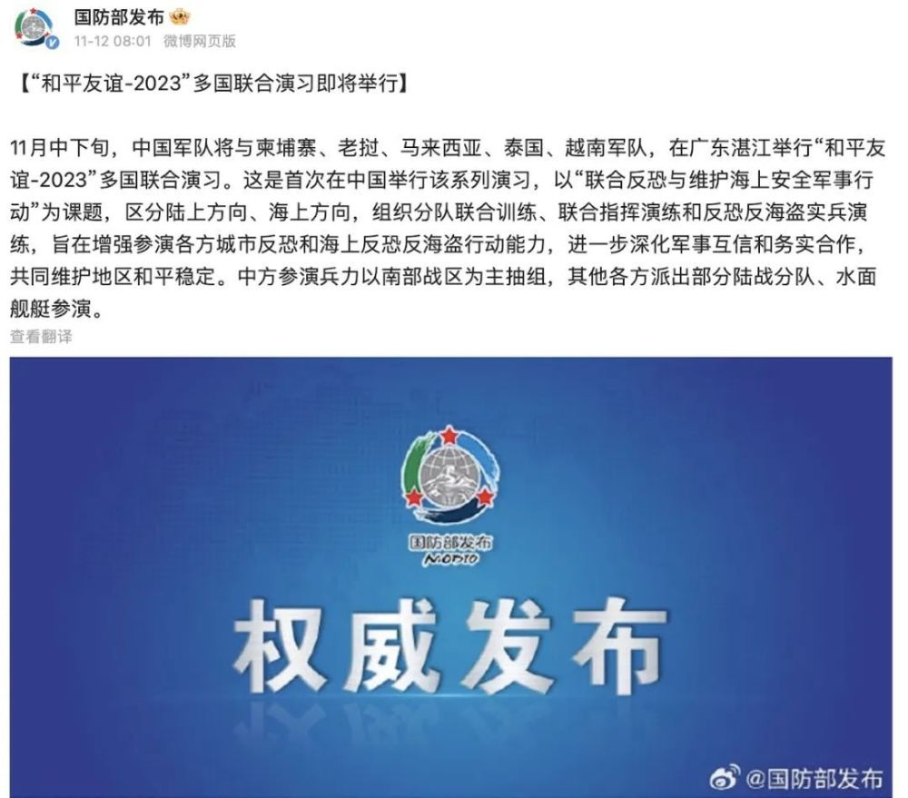

# 首次！国防部刚刚发布

11月中下旬，中国军队将与柬埔寨、老挝、马来西亚、泰国、越南军队，在广东湛江举行“和平友谊-2023”多国联合演习。这是首次在中国举行该系列演习，以“联合反恐与维护海上安全军事行动”为课题，区分陆上方向、海上方向，组织分队联合训练、联合指挥演练和反恐反海盗实兵演练，旨在增强参演各方城市反恐和海上反恐反海盗行动能力，进一步深化军事互信和务实合作，共同维护地区和平稳定。中方参演兵力以南部战区为主抽组，其他各方派出部分陆战分队、水面舰艇参演。

来源：@国防部发布

