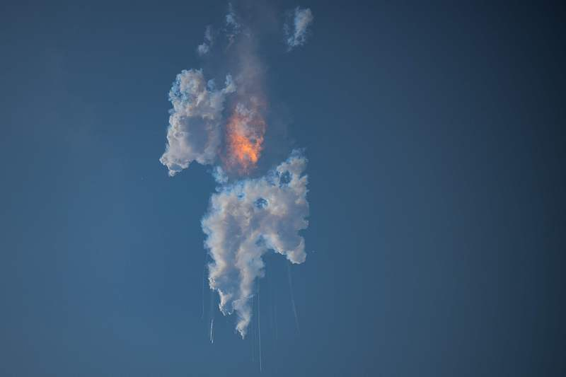
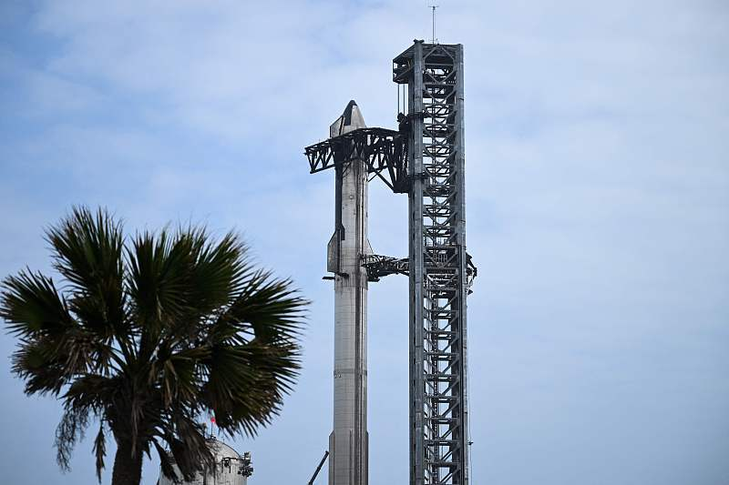

# 首飞失败后，SpaceX“星舰”或于一周内开展第二次试飞

据央视新闻消息，当地时间10日，美国太空探索技术公司说，“星舰”火箭及飞船集成系统可能在一周内试飞。如果一切顺利，这将是“星舰”自4月首次试飞失败以来第二次开展试飞。

_当地时间4月22日，一名民众走过博卡奇卡发射基地的发射台，“星舰”20日在这里首次试飞，火箭升空不久后爆炸。_

太空探索技术公司10日晚在社交媒体平台上说，“星舰”准备“最早于11月17日发射”，目前在等待监管部门的最终批准。

该公司发布的宣传材料显示，新的“星舰”火箭目前矗立在发射台上。

依据美国国家航空航天局与太空探索技术公司签订的合同，“星舰”将作为搭载美国宇航员重返月球的交通工具，用于“阿耳忒弥斯3号”载人登月计划。不过，相关研发进程几度延迟。

_“星舰”进行首次轨道试飞，火箭升空不久后爆炸。_

今年4月20日，“星舰”火箭及飞船集成系统进行首次轨道试飞，但火箭升空不久后爆炸。依据法新社说法，火箭发动机出现故障，第一级助推器也没有与上面的飞船分离。

按规定，“星舰”第二次试飞需要美国联邦航空局颁发发射许可。联邦航空局已于10月完成安全检查。不过，试飞项目还需获得美国鱼类和野生动物管理局的批准。

 _当地时间4月19日，准备进行首次轨道试飞的“星舰”。_

太空探索技术公司创始人兼首席执行官埃隆·马斯克10月初说，“星舰”的分离系统已经彻底检修。测试这个新系统将是“飞行中最危险的部分”，他不希望把期望值“定得太高”。

依据马斯克的说法，两次试飞的飞行计划相似，即与助推器分离后，“星舰”的飞船船舱将完成近一圈绕地飞行，然后坠入夏威夷附近的太平洋。

太空探索技术公司网站介绍，新一代重型运载火箭“星舰”是迄今全球体积最大、推力最强的运载火箭，总高度约120米，直径约9米。火箭由两部分组成，底部是第一级“超级重型”助推器，高约69米，配备33台“猛禽”发动机；顶部是飞船，高约50米，可重复利用。

“星舰”属于可回收火箭，比太空探索技术公司现有的“猎鹰9”和“猎鹰重型”运载火箭更大，可将超过100吨载荷送入地球轨道，其设计目标是将人和货物送至地球轨道、月球和火星等。

编辑 陈艳婷

