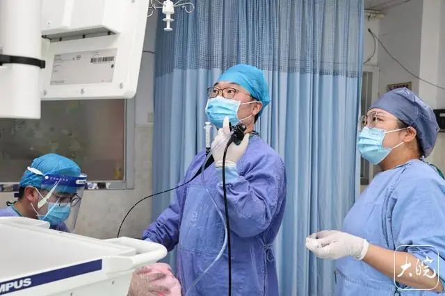
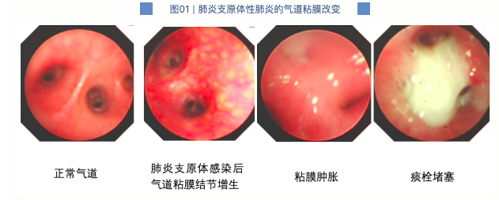
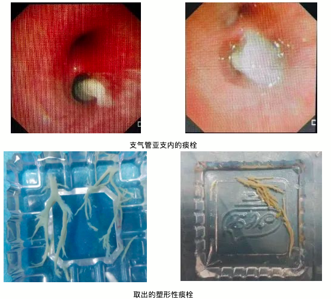

# 7岁男童肺部实变！有医院一天最高峰67例“洗肺”……

北京日报微信公众号 | 记者 张力

近期，儿童支原体肺炎广受关注。患儿什么时候具有传染性？是否需要输液、“洗肺”？担心医院人多能否自行用药？

**案例：7岁男童咳嗽一周**

**肺部发生实变**

近日，据大皖新闻报道，一名7岁的男孩强强（化名）发热咳嗽六天，体温在40度左右波动，在当地医院住院治疗，但病情未见明显好转。

“孩子咳嗽越来越重，精神也变差了。”强强的妈妈非常着急，日前将孩子转入复旦儿科安徽医院（安徽省儿童医院）。胸部CT检查结果显示：颈胸部皮下以及纵膈间隙广泛性积气；左肺上叶及右肺下叶多发炎性病变、左侧少量胸腔积液。

在评估病情后，该院儿童呼吸科主治医师王彦紧急对其进行了纤维支气管镜检查和治疗，发现他肺部左上叶、右下叶内基底段被痰栓完全堵塞，给予灌洗、钳取等操作取出痰栓，并对肺炎处精准施药。

治疗后，强强的体温开始回复平稳。四天后复查胸部CT，发现实变范围较之前扩大，医生再次用纤维支气管镜将气管内堵死的痰栓予以清理。目前，孩子的体温已经恢复正常，偶尔有咳嗽，症状较之前明显好转。

据大皖新闻报道，强强的病情并非个例。因近期儿童肺炎支原体感染高发，有些孩子甚至出现了明显的肺实变、肺不张等肺内并发症。复旦儿科安徽医院（安徽省儿童医院）儿童内镜室工作节奏也开始紧张起来。

“我们以前平均每天只做10例左右的纤维支气管镜检查，近期平均每天要做50多例，最高峰一天做了67例，这个检查也就是家长常说的洗肺。”王彦介绍，因为很多严重的肺炎支原体肺炎引起了痰栓堵塞，必须通过纤维支气管镜进行灌洗取出痰栓，以保持呼吸道通畅。

**关于支原体肺炎**

**“洗肺”的真相**

据复旦大学附属儿科医院介绍，“洗肺”的全称是支气管肺泡灌洗术，它是一项通过支气管镜进行的微创内窥镜技术。支气管镜是一种带光源和镜头的软镜，操作时将软镜经口或鼻置入，从气管进入到支气管中，可以帮助医生直接观察到气管、支气管黏膜、管腔病变的情况。支气管肺泡灌洗是指通过支气管镜向支气管肺泡内注入规定量的无菌生理盐水，充分吸引获得合格的肺泡灌洗液后进行相关检测，特别是感染病原检测；同时可以对肺炎局部进行冲洗，排出肺炎区域大量的炎性分泌物（痰液），达到对肺部疾病的诊断和治疗目的。

 _图源：复旦大学附属儿科医院官微_

 _图源：复旦大学附属儿科医院官微_

_图源：复旦大学附属儿科医院官微_

针对家长担心的“洗肺”操作，北京大学第三医院儿科副主任医师周薇11月12日接受新华社采访时介绍，“今年支原体肺炎的患儿进行肺灌洗治疗的确实比较多。肺灌洗有严格的操作指征，比如患儿出现了肺不张、局部实变，甚至有坏死和痰栓形成等非常严重的炎症反应，这时可能需要在支气管镜下进行肺灌洗，让气道通畅，同时在镜下也可以看到肺部病变的程度。”

**支原体肺炎**

**最好输液治疗？**

得了支原体肺炎是否最好输液治疗？周薇表示，有些家长认为静脉输液优于口服治疗，实际上没有这样的结论。应根据患儿的病情选择治疗方式，重症肺炎的患儿可以选择静脉输液，而大部分患儿属于轻症，可以口服药物治疗。

“感染肺炎支原体后，在开始发烧前有几天的潜伏期，这时患者就具有一定的传染性。”北京大学第三医院儿科副主任医师周薇表示，戴口罩能在一定程度上预防感染，但让儿童一直严格规范地佩戴口罩并不现实。少去人员密集的密闭公共场所、屋内勤通风换气、学校定期打扫消毒、增加户外活动等，都对预防感染有所帮助。

**建议老人和儿童接种肺炎疫苗**

**谨遵医嘱选择用药**

除了支原体，细菌、病毒也都可以导致肺炎。北京胸科医院呼吸科主任叶寰提示，肺炎患者常有发烧、咳嗽、呼吸困难等典型症状，低龄儿童和老年人尤其要注意防范。建议65岁以上老年人和儿童接种肺炎疫苗，尽管目前没有针对肺炎支原体的疫苗，但肺炎疫苗可对多种肺炎球菌起到预防作用。

专家提示，针对不同病原体引起的肺炎，用药选择也有所不同，比如对于支原体肺炎，青霉素和头孢类抗生素没有效果，最常用的是大环内酯类的抗生素。怀疑感染肺炎的患者应及时到医院就医，确诊后进行有针对性的治疗，避免“自行服用抗生素”等盲目用药情况。

北京日报（ID：Beijing_Daily）综合新华社、复旦大学附属儿科医院、大皖新闻

