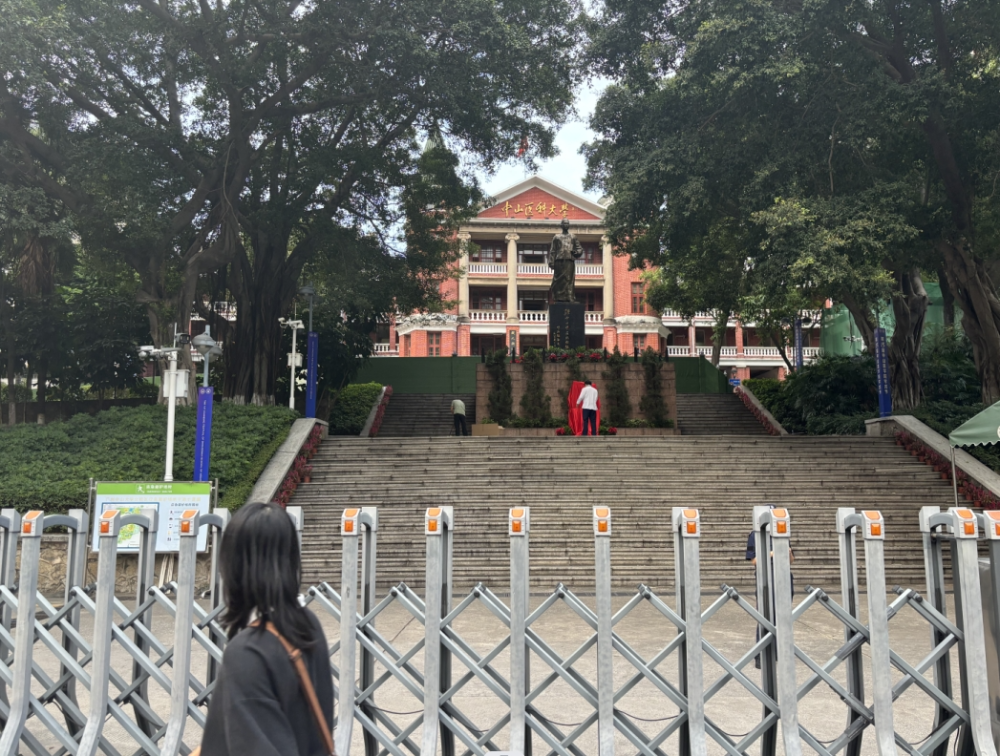
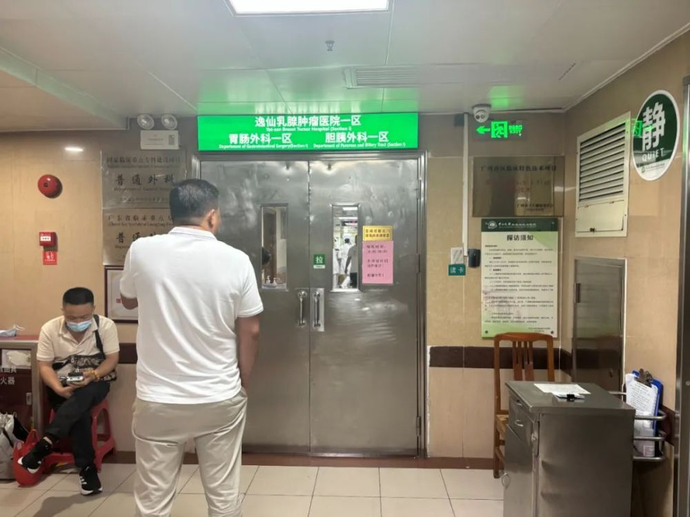
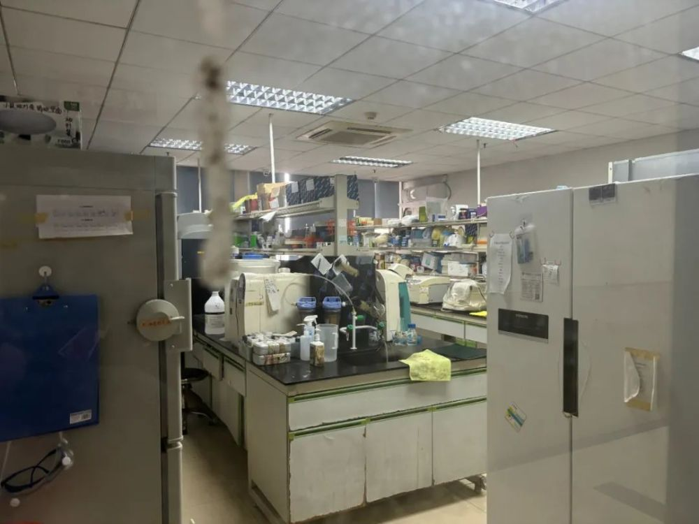
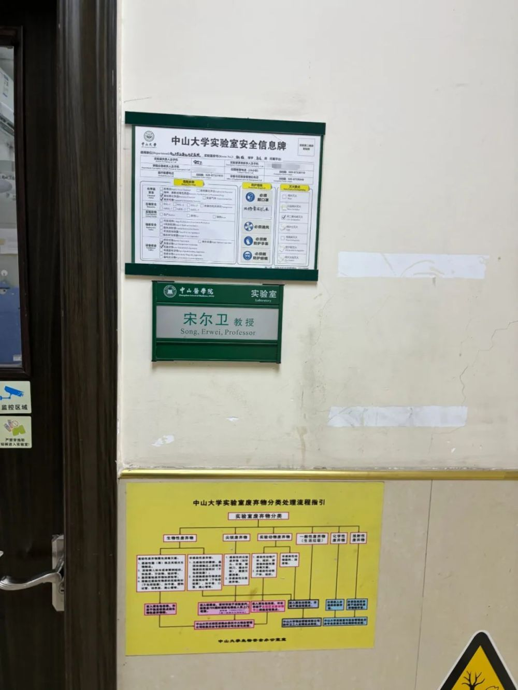
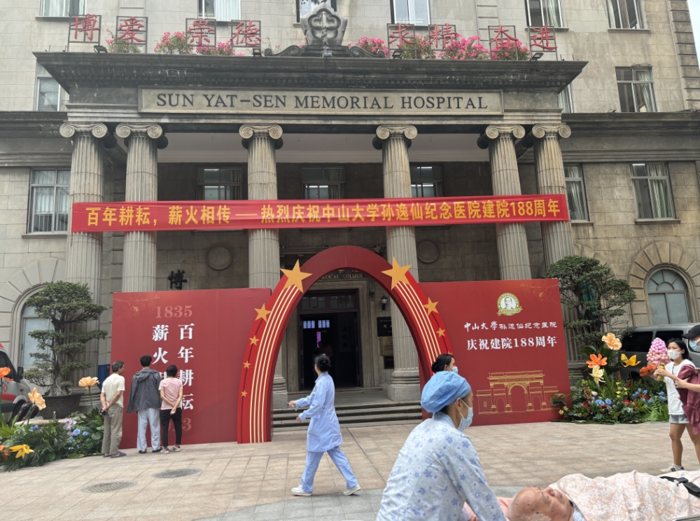

# “患癌”实验室涉事医生请公众等待调查结果，目前仍正常出诊

_乳腺肿瘤中心实验室所在地为中山医科大学（隶属中山大学）_

近日，一则“中山大学孙逸仙纪念医院乳腺外科导师苏士成的6个学生集体患癌”的消息在网络上流传，引发舆论关注。

中山大学孙逸仙纪念医院又名中山大学第二附属医院（以下简称“中山二院”）发布通报称，近年来在乳腺肿瘤中心实验室学习、工作过的人员中有3人2023年先后被确诊癌症。

11月8日，广州卫健委科教处工作人员称，正在按照流程跟进处理，会组织第三方机构调查实验室。

苏士成在10日回应《中国慈善家》的采访时表示，“请大家耐心等待调查结果，目前我不方便发声。媒体的耐心是对我最大的帮助，因为调查组官方的发布是最权威的答案。请放心，会有正确的答案。”

**荣誉等身的年轻专家**

公开资料显示，苏士成今年40岁，他在中山医学院读大三时就加入了中国科学院院士、孙逸仙纪念医院院长宋尔卫的团队。

被业内称为“抗癌斗士”的宋尔卫是中国乳腺治疗领域第一位院士，是国内最早开展乳腺癌根治性保乳手术的外科医生之一。

2009年，26岁的苏士成正式在中山二院成为一名乳腺外科医生。除了临床和科研，苏士成还参与医学本科生和研究生的教育工作，他长期担任中山大学中山医学院八年制临床本科《外科学》乳腺疾病章节的教学任务，并兼任中山医学院免疫教研室副主任一职。

“教师不能只做传授书本知识的教书匠，而要成为塑造学生品格、品行、品味的大先生。”这是苏士成在学为人师时，始终强调的一句话。

一位医院内部人士告诉《中国慈善家》，目前苏士成每周二、周三出门诊，其余时间除了指导团队同事和学生开展相关实验工作，还有不少讲座。而根据官方宣传资料介绍，苏士成每周出门诊量高达100人次，平均每年主刀乳腺癌手术超300台，是全球开展这类手术最多的专家之一。

2016年，苏士成获得国家优秀青年基金资助，该基金含金量高，竞争非常激烈，当年国家自然科学基金委受理申请3314项，获批400项，支持率仅为12.7%。33岁的苏士成成为获此殊荣的最年轻的专家之一。

_逸仙乳腺肿瘤医院是国内首个公立乳腺专科医院，在中山二院挂牌。_

5年后，苏士成又获得国家杰出青年科学基金资助（简称“国家杰青”），该项目几乎是每一个中青年学者的奋斗目标。苏士成获奖项目为“免疫微环境和炎症相关疾病”，直接获批经费400万元。

天眼查上的数据显示，中山二院的专利申请多达1200余项，其中750余项已获授权，苏士成是多个专利的发明人，多涉及乳腺癌相关研究及治疗领域，如“乳腺癌新辅助化疗耐药标志物及其应用”。

这样一位荣誉等身的年轻专家，近日深陷舆论风波。一位匿名人士在微博爆料，称其团队有学生在上半年出现腹痛症状，并在就医后查出患癌，病理分析为胰腺未分化癌。在未沟通的情况下，苏士成将确诊的患癌学生踢出微信群。爆料还指称，目前该乳腺癌研究中心已有多位学生确认患癌。

随后，中山二院通报证实，近年在乳腺肿瘤中心实验室工作、学习过的人员中有3人罹患癌症。然而，这则通报并未平息舆论的讨论和质疑。

**实验室风波**

按照官方给出的结论，中山二院乳腺肿瘤中心实验室早在2009年就正式启用，正好与苏士成成为该院乳腺外科医生是同一年。

11月10日，《中国慈善家》记者在中山医学院走访时发现，涉事实验室位于科学楼8楼东翼816室。门口张贴的信息显示，其使用单位为中山大学孙逸仙纪念医院，负责人为宋尔卫；危险类别中，化学品安全一栏内提示“易制毒化学品”“易燃易爆”；防护措施注明：必须戴口罩、必须穿实验衣、必须通风、必须戴防护手套、必须戴防护眼镜，其中“必须穿实验衣”为手写字体。

中山医学院工作人员向记者证实，乳腺肿瘤中心实验室由医院基础与转化医学研究中心管理，使用时需要申请，过程均要严格按照流程执行。

就在曝出“集体患癌”消息当天，还有消息称涉事实验室疑遭拆除，网传图片显示，实验室门口堆放大量板材和塑料袋。面对涉嫌“销毁证据”的指责，中山二院相关人员表示，这只是例行的消防检查。

但关于消防检查的说法被中山二院科研与学科建设部主任林桂平否认。他告诉媒体，今年6月28日，中山大学组织全校实验室进行检查，发现实验室的柜子摆放位置导致实验通道过窄，要求对这些柜子进行拆除。

“柜子里的物品均是属于实验室人员的普通实验耗材，比如一次性口罩、手套、离心管以及培养皿等，里面并没有任何试剂。”林桂平还表示，拆下来的柜子还在，可以接受相关部门的检查。

11月10日下午，《中国慈善家》记者实地走访时透过门窗玻璃看到，实验室灯亮着，但不见有人作业。旁边办公室的工作人员告诉《中国慈善家》，“这就是网上说的那个实验室，被媒体关注后，人家都是正常开展工作，每天都有使用，刚才里面还有人在工作，不可能拆除的”。

_涉事的乳腺肿瘤中心实验室并未拆除。_

这间实验室并不大，里面的设备、仪器摆放整齐，空间显得有些拥挤，不时有工作人员从该实验室门口经过。

“它就是一个普通的实验室，做的也是一些常规实验，并不是进行多神秘的科研，不知道为什么会传出这样的事情。”中山医学院一位内部人士告诉记者，他认为此次事件不断发酵，主要原因是医院“没有应对舆论的经验”。

刊登于医院官网上的一条人才招聘信息显示，该院乳腺肿瘤中心苏士成教授团队2023年8月还在招聘专职科研人员，研究方向为免疫微环境、肿瘤免疫、免疫相关疾病。岗位职责为患者随访管理和资料整理、协助管理实验室日常事务等。岗位分研究助理、助理研究员、副研究员和研究员，工资从8万元至41万元不等。

**“致癌”疑云**

中山二院在通报中承认，实验室有3名确诊癌患者，2名现为该院乳腺外科医生，在临床工作，另1名为外地来院进修人员，已回原单位工作。其中，黄某在2017～2022年期间在该院读博，此间在乳腺肿瘤中心实验室学习，2022年7月博士毕业后入职该院乳腺外科，从事临床工作。2023年10月，被确诊患胰腺癌并接受手术，目前情况稳定。

患者刘某2013至2018年，在该院读博，此间在乳腺肿瘤中心实验室学习，2018年8月博士毕业后入职该院乳腺外科，从事临床工作。2023年6月被确诊患滑膜肉瘤并接受手术，术后恢复良好。

另一名癌症患者为某外地医院毕业博士生，2021年到该院进修一年，在乳腺肿瘤中心实验室工作，于2022年4月结束进修离开广州，今年在工作当地被诊断为乳腺癌。

《中国慈善家》采访了多位肿瘤领域专家，他们均表示此前没有听说过发生类似这样的事情，“但这不意味着永远不会发生”。此外，他们也指出，肿瘤的致病过程非常复杂，很难确定某种因素有直接的因果关系。

北京市某知名医院乳腺病防治中心一位主任医师表示，从理论上来说，肿瘤实验室集体患癌的风险是存在的，但因为接触危险物导致患癌的可能性较低。

他向记者分析，一般类似实验室，都是从病人身体提取癌细胞输入老鼠体内，让老鼠患癌，再通过科研成果来观察治癌效果。对于这样的实验，为了力求数据准确，工作往往不分昼夜，晚上需要熬夜来观察数据变化，这就会让科研人员承受较高的工作压力和工作强度。

“至于风险，就要看实验室里的具体工作，如果是给老鼠做放疗，就存在较强的辐射，就会有致癌的风险。但如果光做老鼠模型的培养，就不存在辐射。”这位主任医师说，由于目前无法确定实验室的具体实验内容，所以无法做出判断。不过，在高强度的工作压力之下，人体免疫力下降，加上特定的工作环境，相关工作人员患病风险就相对高一些。

实验室的安全环境对于科研人员和公众来说都至关重要，科研人员在工作中接触到的试剂往往具有毒性和危害性，需要在严格的安全环境下进行操作。因此，对于高校或医院而言，一些高危实验的必要性一直是个存有争议的话题。

_涉事实验室门口的安全信息牌。_

“对于一个实验室来说，如果做一个药物的化学疗效观察，设备、环境可能达不到一定条件，结果也往往不太可靠。”前述主任医师建议，一些基础研究可以由大型药厂完成。

2017年6月，国家卫健委主管的《中国循环杂志》发文称，瑞典随访20年数据显示，化学实验室女性研究人员工作由于经常接触化学品和有机溶剂，其乳腺癌风险显著增加。研究纳入2245名受试者，随访20年间发生383例癌症，开始随访时年龄为28.6岁。

数据显示，在化学实验室工作的女性研究者的乳腺癌风险增加41%，在实验室工作10年以上者，其乳腺癌风险增加更加显著，约为3倍。而在非化学实验室工作者的乳腺癌风险没有增加。

**医护的职业暴露**

医护人员在从事诊疗、护理活动过程中接触有毒、有害物质或传染病病原体，从而损害健康或危及生命，这被称为“职业暴露”，是每个医护人员不得不面对的职业风险。

2016年，北京大学人民医院等15家医院的研究人员对全国13个省份158所不同级别医院的医护人员进行了有关职业暴露发生情况调查研究。结果发现，我国医务人员面临职业暴露的风险大、危害重、形势严峻。11116例职业暴露事件中，53.9%为护理人员，21.3%为医生。

事实上，为了保护工作在临床一线的医护人员，各医院都有相应的规范和防范措施。一般情况下，医院对放射机房等建筑的墙壁厚度、门窗设置等，都有严格要求。对特殊科室的医务人员，还有其他方面的福利，比如从事放射工作的医务人员，发放放射营养津贴，每年安排2-4周的固定休假等。

 _中山大学孙逸仙纪念医院（中山大学附属第二医院）188周年院庆。_

“在大家的一般认知中，患者往往是弱势，而在职业暴露问题面前，医生也是弱势群体。”北京某三甲医院肿瘤科一位医生告诉《中国慈善家》，除了无法回避的职业特点以外，医院安全措施不到位以及医疗政策的缺位，是造成这个问题的原因，比如医护及相关人员安全防护工具不足、防护意识不到位，因工作致病后权责不清、上报处理流程不完善等，这些方面亟须完善。

广东穗江律师事务所律师刘功武告诉记者，在此次事件中，院方是否按照法律规定为医务人员做好相应的防护措施、尽到管理和培训义务，以及医护人员是否按照院方的要求合规操作等因素，均影响到责任划分。

但他也认为，按照目前的已知信息，无法断定患癌和实验室有直接关系，这种因果关系的证明是一大难题。

中国科协发布消息称，中山二院3人患癌是否和医学实验室有关联，需要严谨、专业的医学调查和验证，这是一个严肃的科学问题。同时呼吁相关部门秉持实事求是、科学理性的态度，尽快地探求事件真相。

作者：温如军

摄影：本刊记者 温如军

图片编辑：张旭

值班编辑：杨永洁

