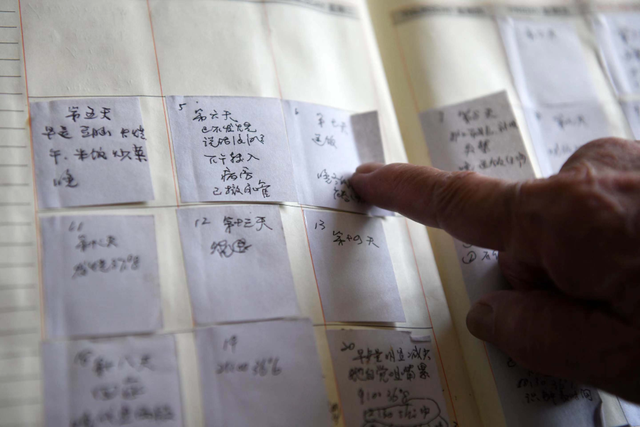
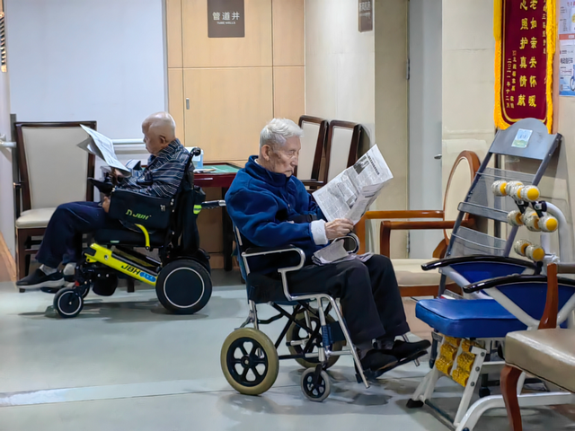

# 一人失能、全家失衡，4400万失能老人的照护困局

（健康时报记者 赵苑旨 赵萌萌）一个人的衰老，从能自理到吃喝拉撒都要人照护，不能行走、不能说话……完全失能，或许是一个过程，亦或是一个不幸的瞬间。

据中国老龄科学研究中心发布的《中国老龄产业发展报告(2021-2022)》显示，截至2022年末，我国60岁及以上老年人达2.8亿，其中失能老年人数大约有4400万。

24小时不离人的看守、巨大的精神压力、高昂的护理费用……失能老人的照护已成为亟待解决的社会痛点，“一人失能，全家失衡”更是道出了多少家庭在照护失能老人上的艰辛。而在这场养老服务的困局里，有的是不被信任的养老机构、困在父母病床前的低龄老人和被高昂护理费用劝退的家庭。

老人更愿意居家养老

10月26日下午1点半，秋日和煦的阳光透过向南的窗户照进李秀兰（化名）的卧室，一切是那么安静祥和。躺在床上的李秀兰正安静地注视着在床边认真写写画画的老伴儿。

“体温37度正常，血压143/90毫米汞柱稍微偏高，心率103次/分钟有点儿快了……”检测完老伴儿今日身体的各项指标，王怀民（化名）从抽屉里拿出一个笔记本，嘴里边念叨边详细记录。这是他为老伴儿做的健康档案，自今年4月份开始记录，如今半年时间，这本“2023健康档案”已从一页纸变成了一本书。

_10月26日，王怀民老人在家为记者展示他为老伴儿做的健康档案。牛宏超摄_

王怀民与老伴儿都是教师，自1965年结婚，如今已携手走过了58个春秋。今年4月，李秀兰因为便秘4天肠道出现破损，导致血液感染，前后住院治疗2次，之后便无法站立、大小便失禁、长期卧床，成了一位重度失能老人。

按照国际通行标准，吃饭、穿衣、上下床、上厕所、室内走动、洗澡6项指标，一到两项“做不了”的，定义为“轻度失能”，三到四项“做不了”的定义为“中度失能”，五到六项“做不了”的则定义为“重度失能”。

“没病之前她可是我们家的大拿，她倒下了，这下换我来。”王怀民说。

除了每天身体指标的检测与记录，王怀民还要为老伴儿做饭、更换尿不湿、翻身、拍背、擦身体、抹痱子粉等，一天下来常常累到话都不想多说一句。后来家里请来一个保姆，每个月4000块钱，负责每天午饭和打扫卫生，偶尔也会帮着他照护老伴儿，这才让王怀民有了喘息的机会。

_在王怀民老人家，助浴师为李秀兰老人洗澡，王怀民在一旁仔细观察老伴儿的每一个细小表情与反应。牛宏超摄_

看着已年过八旬的父亲每日略显吃力照顾母亲的样子，女儿王燕（化名）不忍，曾提议将母亲送去养老机构让专人进行看护，为父亲减轻点负担，也让母亲能得到更专业的照护。但话一提出，就被王怀民毫不犹豫地拒绝了。

“我是她最亲近的人，我现在身体还可以，照顾她现在的吃喝拉撒睡，我还能行。”王怀民说，“假如哪天我不行了，再请人。”

_10月26日，王怀民老人在卧室手拿着老伴儿小时候的照片，回忆起过去的岁月。健康时报记者牛宏超摄_

在我国，非正式照护者是失能老人长期照护的主力军，大多数失能老人都是由子女、伴侣在家照护。中国社会科学院社会政策研究中心原秘书长、唐钧研究员向健康时报记者表示，我们原来以为只有中国的老年人不愿去养老院，但研究发现，其实全世界的老年人都一样。社会保障界组团前往发达国家考察，发现他们的老年人95%以上都住在家里，而由自己、家庭和社区承担照护责任。现在发达国家的养老政策都在往这个方向发展，而养老机构的责任则是收养严重或完全失能失智老人。

“在中国，大多数需要长期照护的老年人事实上居住在自己家或儿女家，但是在没有选择时，还是入住养老照护机构为好。”唐钧说，既然我国绝大多数失能老人处于居家养老状态，我们就需要将机构照护、社区照护和居家照护整合起来，形成一个有机的体系，这样才能做好老年照护服务。

每月还有差不多一万元的开支

“照顾失能老人之后，才明白什么是人间疾苦。”北京朝阳区居民王明(化名)有感而发。

两年前，王明的舅舅突发脑梗，送去医院及时救治，最后命虽救回来了，但却留下严重后遗症——半身不遂外加脑萎缩。由于舅舅无儿无女，照护重任便落在王明一家和其姨妈两家的身上。他们曾凑钱请过多个保姆，但总是没过多久就不愿干了，“这我也能理解，毕竟照顾失能老人不是一件容易的事”。

曾经也有身边的朋友劝王明一家把舅舅送去养老服务中心，但舅舅的态度却很坚决，“死都要死在家里！”这个想法便再也没有人敢提起。

“现在是60岁患有高血压的母亲带着我和68岁的姑姑一家，轮流照顾舅舅。吃饭是每天最烦心的事，常常要花半小时才勉强喂几口。更让人头疼的是，舅舅大小便失禁，经常拉在裤子和床上。”王明说，“舅舅生病后脾气也大了，还得像哄小孩一样哄着他，有时一晚上要醒好几次去看舅舅睡得好不好，日子一长，全家都身心疲惫。”

为使更多失能老人得到专业照料，避免陷入“一人失能、全家失衡”的困境，我国从2016年开展长期护理保险试点工作，2020年又将试点范围扩大至49个城市。据国家医保局数据，截至2022年年底，长期护理保险参保人数达到1.69亿人。

除了体力上的付出，王明一家人在经济上也面临不小的压力。他告诉记者，这几年给舅舅做康复治疗已经花费了不少钱，基本上都是由他家和姨妈两家人承担，对于长护险他们也未曾听说过。

“照顾失能老人，不仅要耗费大量的时间精力，也要面临大量的开支。长护险作为失能老人的一大保障还处于试点和起步阶段，试点7年覆盖了49个城市。而且目前养老服务费用较高，我国老年人口收入水平偏低，养老服务的费用分担机制还不够。”国务院发展研究中心公共管理与人力资源研究所研究室主任冯文猛表示。

记者走入多家养老机构了解到，失能老人的照护费用远高于能自理老人。一家民营养老机构负责人告诉记者，目前入院老人平均年龄87岁，院里失能老人已占总人数一半，其中完全失能的老人近90位。机构一张床位4000~5000元/月，护理费用（自理、半自理、不自理）1000~4300元/月，餐标人均50元/天，自理老人人均花销8000余元/月。针对失能老人根据特殊的需求提供个性化的照护服务，护理一对一24小时专人照护费用500元/天。

“现在，每周要去康复医院做三次复健治疗，一次就要几百块。此外，每天至少要用两条纸尿裤，加上吃喝，一个月开销将近一万元。”王明说。

 _10月26日，在天通大爱颐养中心，助浴师为失能老人助浴。牛宏超摄_

困在父母病床前的低龄老人

10月26日，在天通大爱颐养中心，87岁的隋爱莲（化名）坐在床上时不时摆弄放在床头边的花，“这是我昨天过生日，女儿来看我送给我的生日花，我很喜欢。”隋爱莲跟健康时报记者说。

_10月26日，在北京天通大爱颐养中心，隋爱莲老人为健康时报记者展示她的作品集。健康时报记者牛宏超摄_

今年是隋爱莲住进养老机构的第5个年头，5年前的一个春节，隋爱莲某天夜里在脱衣服时不慎摔倒导致胯骨骨折，自此再没站起来过。刚摔的那一个月，60多岁的女儿曾尝试照护母亲，最后因体力不支，无法给母亲更好的照护，将母亲送到了养老机构。

“我不会护理的那套专业手法，我也60多岁了，常常给母亲翻身、更换尿不湿，自己累得胳膊就抬不起来了，有时候力气用不对也弄得母亲很不舒服。后来，母亲心疼我，自己尿了也不说，等攒多了再换，好几次我发现时，她的臀部已经捂出了红疹，我看着很心疼。”隋爱莲女儿李芳（化名）告诉记者，后来母亲进入养老机构后，经过专业的护理，身上再没出现半点不适，自己的精神压力也小了很多。

“基本每周我都会去看望母亲一次，天气好的时候，一进门看到阳光照在母亲身上，她转头看向我一副岁月静好的样子，我就知道当初的决定没有错，很欣慰。”李芳说。

除了那盆新送来的生日花，在隋爱莲的房间里，还摆放着各种各样的手工制品，有纸糊的灯笼、手卷的纸卷画、用黏土捏成的玩偶……这些都是她在手工课上的“小成就”。

一人失能，全家失衡

“一人失能，全家失衡”是不少家有失能老人面临的窘境，如何做好失能老人的照护很重要。冯文猛表示，我国失能老人养老服务需求在向社会化转变，但目前我国养老服务体系仍存在总量供给不足、服务质量参差不齐、各类人才缺乏、财务可持续性差、监管和评估机制不完善、创新发展和技术应用滞后等问题。

对于如何改善失能老人照护难的困境，冯文猛指出，第一，提高居民健康意识，做好自身健康监管，减少失能半失能情况的发生；第二，做好疾病早筛，在早期对居民健康状态做好监测，通过早干预来减少疾病的发生；第三，把专业化的养老服务队伍建起来，完善养老服务制度，提高养老服务技术等；第四，建立完善养老服务费用分摊机制，减少家庭负担的同时让更多老人能住得起养老机构；第五，利用智慧技术手段赋能养老服务，通过智慧医疗、养老、康养等模式深入推进，把老年人的健康“管”起来，让老年人享受幸福与便捷。

除此之外，唐钧指出，为解决失能人员的长期护理问题，应该进一步扩大长护险试点范围，找到符合我国实际的解决问题路径，尽快建立长期护理保险制度，在个人、单位、国家和社会之间合理分配养老护理责任。“目前我国各个城市老年照护服务的‘中档’价格，大概相当于当地平均养老金的一倍。如果长期照护保险的支付水平能够覆盖市场价格的一半，另外一半以养老金支付，再辅以社会救助和慈善捐助，完全失能老人入住专业照护机构应该就不成问题了。”唐钧说。

王明希望长护险能尽快在他们那里落地实施，王燕希望他的父亲能从照料重担上有所解脱……他们代表着失能老人家属的心声：让失能老人能得到更多关注和社会支持。

_10月26日下午，在养老机构走廊过道里看报纸的老人。赵苑旨摄_

