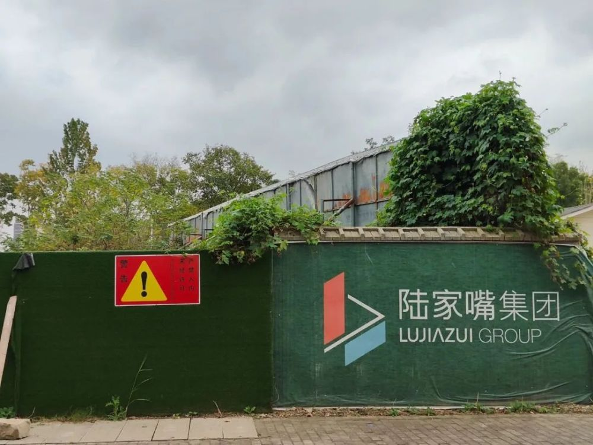
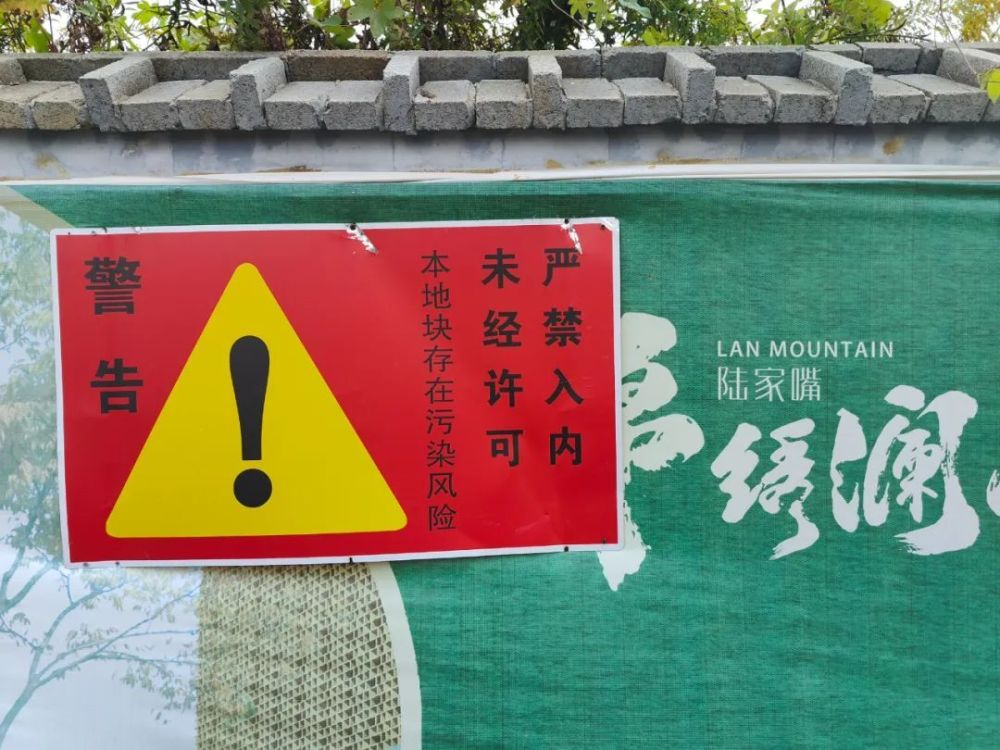
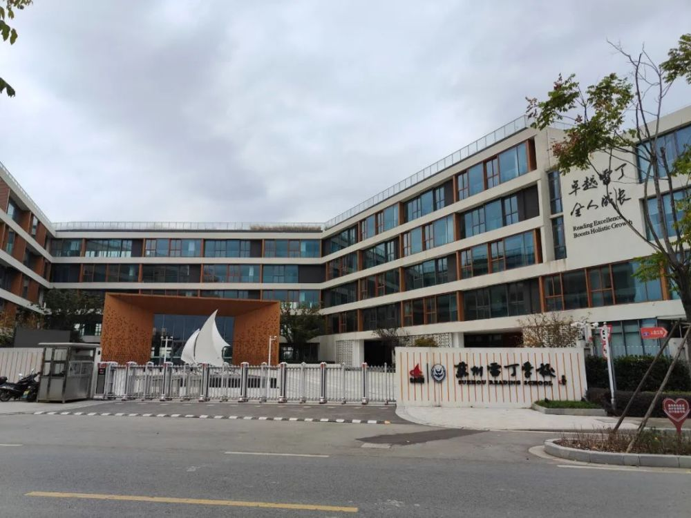
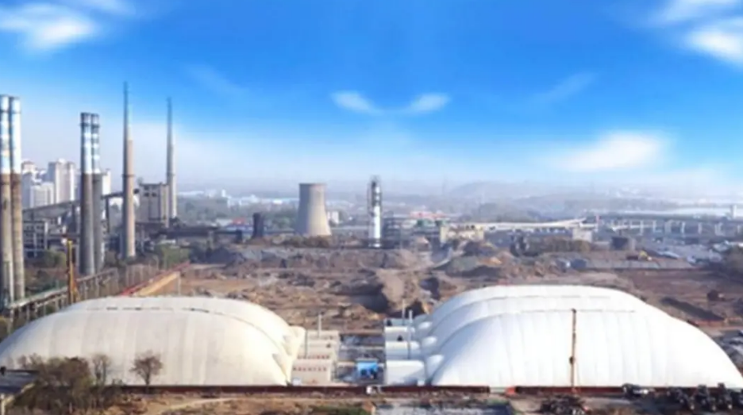

# 同一块地数次环评结果出入巨大，究竟哪一份值得信任？苏州“毒地块”百亿诉讼暴露三大疑点

花了85亿、历经222轮抢拍到的17块土地有14块含“毒”，上市公司上海陆家嘴一纸诉状将江苏苏钢及多家苏州政府机构和单位告上法庭，向苏钢索赔100.4亿元。

11月11日，橙柿互动记者前往苏州涉事地块探访，有小区居民告诉记者，原先120万元买来的房子85万元也卖不掉。

目前，江苏省高级人民法院已立案，尚未开庭审理。记者发现，这起可能是70多年来索赔金额最大的民事案件中， **有三个关键性疑点值得特别关注。**

**这块地污染情况究竟如何？**

**不同权威部门的环评结论为何差别巨大？**

苏钢集团始建于1957年。2003年北大方正全资收购后，在运河对面建立新厂区，老厂区2014年完全停产，苏钢成立全资子公司苏州绿岸，准备开发房地产。

2016年，苏钢集团把苏州绿岸95%股权挂牌出售，当时全国房地产火热，多家知名房企参与竞争，最终上海陆家嘴经222轮举牌，以溢价2倍85.25亿元拍下，打算建设苏州高新区首个百万方城市区域综合体，直至2021年“毒地”事件爆发。

通过原告和被告发布的公报不难发现，矛盾争议核心是土地污染情况。陆家嘴表示，17个地块有14个检测出污染，远超转让时披露的情况。而苏钢坚称，双方一起查过，17个地块10个安全，剩下7个经治理也可安全利用。

关于该地块的环评经历，记者做了大致梳理：

2014-2015年，苏钢集团将地块分为非焦化区和焦化区，委托第三方进行土壤和地下水调查评估。

2016年，苏钢集团挂牌时披露，绿岸公司名下地块中，非焦化区域的土壤和地下水基本未受污染，可再开发利用；焦化区污染主要集中在4号地块局部，根据修复目标值，最终确定0-18米深度内，污染范围为17542平方米，污染土方量为39604立方米。

2021年6月，苏州雷丁学校办理办学许可证时，第三方检测发现，所处2号地块污染严重，投资4亿多的学校叫停。陆家嘴称从2021年12月起，对尚未开发的6块地块初步调查，发现同样存在严重污染风险。

2022年4月10日，江苏省政府官网公开《中央第二生态环境保护督察组向我省移交的第六批信访事项办理情况》，其中一条信访称，苏州市高新区浒墅关苏州绿岸项目17幅土地，用地面积约66万平方米，第三方检测机构检测结果显示多处地块土壤中苯并芘、萘严重超标，不符合用地标准。

2022年4月1日，高新区生态环境局和浒墅关镇工作人员现场调查出具初步报告，部分地块可能存在土壤污染风险（2、3、4和13号地块部分点位存在苯并芘、萘超标）。

2022年4月20日，江苏省政府公开《中央第二生态环境保护督察组向我省移交的第十六批信访事项办理情况》，苏州绿岸地块污染再次被举报。苏州高新区管委会核查结果显示，苏钢集团在2014年完成的非焦化区土壤和地下水调查结论，与苏州绿岸2022年提交的土壤污染状况初步调查报告结果不一致。

2022年8月，苏州高新区浒墅关镇政府委托生态环境部南京环境科学研究所进行详细调查，发现7个地块超标。

苏钢集团在情况说明中也提到了这7个地块：2022年，陆家嘴与苏钢一致同意委托的第三方专业机构南京环科所对地块污染情况进行了详细调查。焦化区1、2、3、4、5、6号和非焦化区10号地块（其中仅2号地块已开发建设），经治理修复后可安全利用。已有居民入住的14、15号地块，已开发建设的8、9、12、13、16号地块和未开发建设的7、11、17号地块，属可安全利用地块。

最近一次的便是陆家嘴今年9月提出的：1-13号地块和17号地块都存在超标。

**同一块地，几家都是专业权威部门，数次环评的结果出入巨大，究竟哪一份值得信任？**

 _涉事地块很多地方挂着警告牌_

值得注意的是，
**这期间也是我国土壤污染防治工作快速成长时期，2014年苏钢地块开展土壤调查时，我国土壤污染防治的相关法律法规、标准、技术规范刚刚起步。2014年上述技术导则诞生。2017年7月1日，《污染地块土壤环境管理办法》施行。2019年1月1日，《土壤污染防治法》施行。**

**苏州雷丁学校所在的2号地块**

**到底是工业用地还是教育用地？为何两度变更？**

身处旋涡中心的苏州雷丁学校在2号地块，公众普遍认为陆家嘴希望通过引入名校提升区域产业价值。

雷丁学校建成后，根据苏州高新区环保局要求对所在地块土壤污染状况进行补充调查，结果显示污染严重。今年1月19日，苏州市生态环境局对其做出542.7万元行政处罚，目前陆家嘴正在行政复议和起诉。

_投资4亿多的苏州雷丁学校从没开过学_

值得注意的是， **陆家嘴用于建设学校的2号土地发生过土地性质变更。**

根据陆家嘴2016年公告，2号地块为工业用途，但最后却建起了苏州雷丁学校。2023年8月2日，苏州市自然资源和规划局向苏州绿岸出具《撤销决定书》，表示2号地块规划用地性质由工业（研发）用地变为教育用地不符合控制性详细规划，违反《城乡规划法》，撤销2号地块教育用地调性，恢复为工业（研发）用地。

苏钢50多年的生产积淀，
**为何仅停产2年就可将曾经的工业用地更改为教育用地？为何时至今日又再度将土地性质改了回去？如果雷丁学校开学前没做检测，污染问题会拖到何时才曝光？**

**工业污染用地修复改造有严格流程，**

**为何有如此结果？**

在刚刚落幕的第三届全国土壤修复大会上，清华大学环境学院土壤与地下水环境教研所所长侯德义介绍，不同地区、不同状态的土壤，修复方式也有较大差异，需要根据土壤特性、污染条件和程度、当地气候条件以及周边敏感人群等一系列因素来确定。一些大型修复项目，往往单一技术无法满足修复需求，还需要将多种技术组合起来集成修复。对于建设用地，需要根据建筑物过渡方式、污染物种类以及土壤结构等进行风险评估，若发现风险不可接受，一方面可以进行风险管控，切断污染物传播途径，抑制挥发性污染物的扩散；另一方面可以采取修复措施，通过化学、生物或物理手段将污染物浓度降低到可接受的水平。

 _原北京化工二厂土地改造周期长达10年,耗资数亿_

受污染的工业用地学名“棕地”，其开发利用，需要经过严格的环境监测、评估、修复等流程，最后申请变更。事实上，有不少工业污染用地经过修复后用于住宅用地的成功案例，相关技术经过多年发展已十分成熟。

例如，上海世博会园区的土地，就是曾经的重工业企业上钢三厂和江南造船厂。再比如广州，广州油制气厂、广州钢铁厂（白鹤洞）地块，都变成了高级住宅区珠江花城和广钢新城。

橙柿互动·都市快报记者 朱振辉

