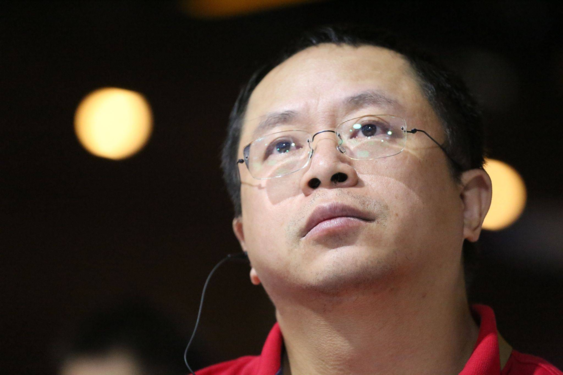
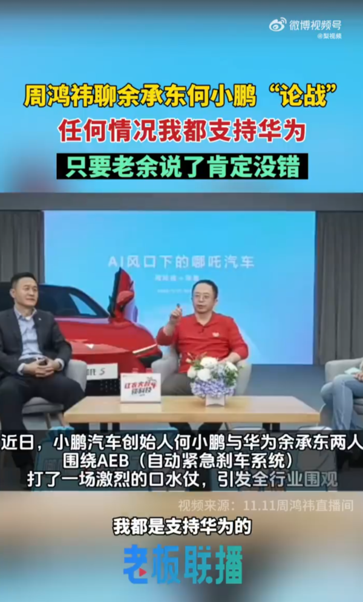
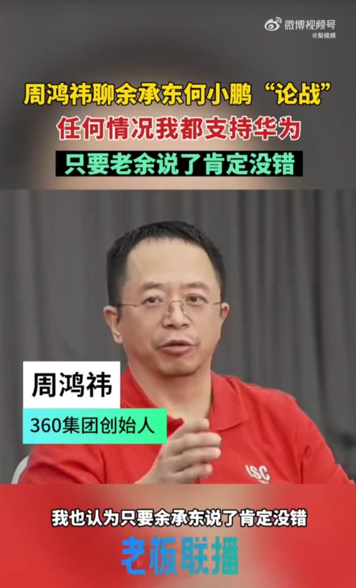

# 周鸿祎回应华为小鹏AEB之争：不懂但支持华为，只要余承东说的准没错

【CNMO新闻】不久前，小鹏汽车CEO何小鹏和华为常务董事、终端BG CEO、智能汽车解决方案BU
董事长余承东在有关车辆AEB（自动紧急刹车）方面的争论，引起了行业内的广泛讨论，也让不少汽车行业的人士谈及了自己的看法。11月11日，在一场直播活动中，360公司创始人、董事长兼CEO周鸿祎谈到了自己的看法。

_周鸿祎_

周鸿祎在直播间聊到余承东、何小鹏关于AEB的口水战。他表示，任何情况下，他都是支持华为，他还称自己对AEB不太懂，但是虽然自己不懂，不过只要余承东说了肯定没错。此外，他还询问合众汽车CEO张勇，华为在AEB方面能做到的是不是哪吒汽车也能做到，在得到肯定的答复后，周鸿祎表示，那我们（合众汽车）跟华为是一伙的嘛。

_相关直播视频截图（图源网络）_

其实在周鸿祎表态之前，余承东与何小鹏之间的争论似乎有所缓和。近日，何小鹏在微博发文称：“今天早上我和老余一起讨论了一下技术路线，我相信这种技术的争鸣最后定能让用户受益。我们也会通过OTA拓展AEB功能，感谢老余的建议和大度，有时候误会后更容易成为好朋友。之后，我们会一起努力引领智驾科技创新，共赢智能电动汽车新时代。也感谢大家的关心，感谢老余!”这也表示双方目前已经和解。尽管如此，这场口水战仍引发了对AEB技术安全性的关注，其实对于整个行业来说也是有意义的。

