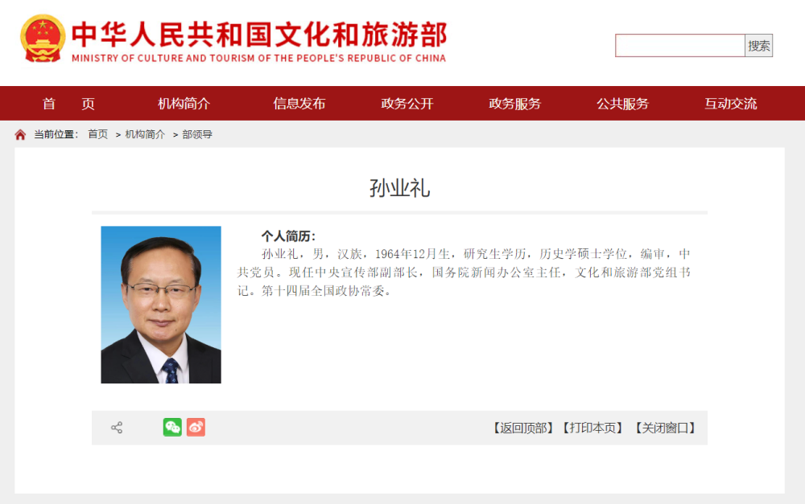

# 孙业礼已任文旅部党组书记，胡和平不再担任

文化和旅游部官网日前更新后显示，此前担任中央宣传部副部长、国务院新闻办公室主任的孙业礼已任文化和旅游部党组书记，胡和平不再担任。

孙业礼，男，汉族，1964年12月生，研究生学历，历史学硕士学位，编审，中共党员。

他先后担任过中央文献研究室副秘书长兼《党的文献》主编、中央文献研究室室务委员兼第五编研部主任、中央文献研究室室务委员兼第六编研部主任、中央文献研究室副主任、中央党史和文献研究院副院长等职，后出任中央宣传部副部长，中央宣传部副部长、国新办主任等职。

此前，胡和平为中央宣传部分管日常工作的副部长，文化和旅游部党组书记、部长。

