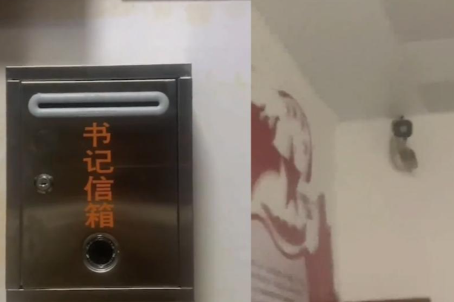

# 摄像头对着“书记信箱”，媒体：彻底整改应深究选址失误并真诚道歉

日前，广西南宁有网友在短视频平台上发布视频称，本应用来搭建“连心桥”的“书记、院长信箱”，却被摄像头照着。11月12日，广西大学回应称，摄像头为2013年统一安装，信箱于2023年安装，“未能充分关注到投信者的隐私”，并表示已对此进行了“彻底整改”。

监控与信箱的新闻不是第一次出现在公众视野，总有各类信箱被置于监控范围，或者直接装在监控底下，起码给人不适的公共体验，对潜在的意见提出者，更客观上有一种提意见行为被全程围观的即视感。

当然，每次意见箱被监控总是事出有因，总有考虑不周，比如广西大学这次，监控安装时间比意见箱早了十年，包括2016年的某条类似新闻里，陕西汉阴县国土局也说这里面有“时差”存在，可以说监控不是在刻意追着意见箱走，但反过来，那些后安的意见箱又是否有意置于监控之下？

据广西大学的通报，设置在摄像头下的信箱已经“彻底整改”，大概率是把意见箱安到了某个监控盲区。但客观上说，单位就那么大，在各地公共区域的监控还在不断迭代以实现全覆盖的大背景中，意见箱究竟能被妥善安置到什么地方？

一个耐人寻味的细节是，广西大学与领导信箱并列于监控之下的，还有一个名为“学生e见信箱”，有网友扫码还寻到了广西大学“学生e见”的小程序。收集学生“e见”居然需要一个实体的意见箱，这里面的逻辑似乎有点凌乱。理论上讲，通过更为便捷的互联网手段获取意见建议已经越来越常见，包括这次广西大学“摄像头下的意见箱”引发热议、获得“彻底整改”的最初契机，也是网友（很可能是学校师生）通过网络平台发声的直接结果。尽管通过网络信箱或者短视频平台提出意见也属于一种常态意见反馈渠道，当然意见收集者通过网络IP信息锁定特定人员也不是难事……

即便是不正对着监控，如果“有心人”真的想要按图索骥，通过周边监控进行倒推，进而找到疑似试图走向意见箱的群众，也很容易做到。更何况，意在收集群众急难愁盼问题的广西大学意见箱，对正处在急难愁盼之中的群众而言，解决急难愁盼问题与被监控拍到之间应该也有一个轻重缓急的权衡。还是说，提出急难愁盼本身也处在某个犯忌的空间，这就不是一个意见箱该摆在哪里的问题了。

有必要深究，是不是真有人有能力对意见提出者施加任何事后清算，制度层面对此又是否有空间支持？畅通意见、建议渠道，保护投诉举报人私人信息、保障其合法权益一直是国家从法律到制度的明确态度，关键在于执行层面对此的个案处置，是否能给公众一个可信赖的预期？对于事后爆出的泄露举报人信息及打击报复举报者、意见提出者的个案，是否有一个切实严肃的问责和追究？

制度上的意见收集渠道，一直都有个从匿名到实名，进而再到面对面的设计，初衷也在充分尊重意见提出者的个人信息权利。不能因为有实名甚至当面提出意见的渠道，就让匿名意见的提出缺乏必要的边界与距离，不能因为“不管怎么样，我都能找到你”，就干脆直截了当地用摄像头直接对准意见箱，抱持某种“不装了”“摊牌了”的态度。

摄像头可以是十年前安装，新装的意见箱追着摄像头走却绝对不能只用一句“无心之失”来搪塞。“彻底整改”包括给意见箱换个地方，也应当包括对此前“选址失误”决策的深究，以及因此对学校师生、社会公众带来的“震慑”真诚地道歉。对于已经被发现的工作失误，得有真的问责，要不然下一次“误会”就难免再次发生。

