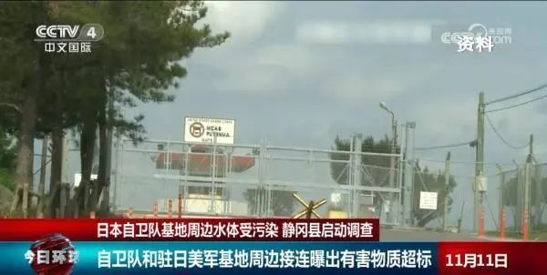

# 日本大阪有居民血检异常，自卫队和驻日美军基地周边曾曝出有害物超标

据新华社，日本媒体12日援引一项最新调查报道，大阪府摄津市部分居民血液中有机氟化合物含量偏高，健康受到威胁。调查人员分析，这可能与当地河流和地下水中全氟和多氟烷基物质含量超标有关。

近期，日本关西地区多座城市的河流和地下水检测出全氟和多氟烷基物质超标，大阪府摄津市是其中之一。当地一个由医生和研究人员组成的市民团体今年9月以来组织居民参加血液检测，结果显示，
**87名受检居民中，31人血液中含有高浓度的全氟和多氟烷基物质** 。

这一市民团体决定扩大检测范围，将对当地1000名居民做血检，并根据调查结果要求日本中央政府采取对策。

全氟和多氟烷基物质难以降解，会在环境和人体中累积，因此被称为“永久性化学物”。专家指出，长期大量饮用受这类物质污染的水
**可能影响生殖健康和儿童生长发育，甚至引发乳腺癌、前列腺癌等疾病** 。

今年以来，日本多地曝出居民血液中全氟和多氟烷基物质超标，他们大多居住在驻日美军基地和日本自卫队基地附近区域。

冲绳县一个市民团体2月发布的调查结果显示， **美军冲绳基地周边居民中大约40%血检结果异常** 。

今年7月，驻日美军承认横田基地 **发生过含有全氟和多氟烷基物质的灭火剂泄漏**
。疑受此影响，这一基地附近的东京多摩地区超半数居民被检测出血液中全氟和多氟烷基物质超标。

同样在7月，爱知县丰山町组织的一次血检显示，四成受检居民血液中此类物质超标，疑与附近一处供水站的水受污染有关，而当地邻近航空自卫队小牧基地和名古屋机场。

据央视新闻，日本媒体10日报道，日本航空自卫队位于静冈县的一座基地周边多处水体检测出 **全氟和多氟烷基**
物质超标后，静冈县决定对县内33处河流展开水质调查，以检测其中是否含有相关有害物质。

报道称，静冈县滨松市今年8月发布的一项调查结果显示，日本航空自卫队滨松基地附近两条河流及相连水体检测出 **全氟和多氟烷基**
物质超标，其中一处水体中这类物质的含量为日本暂定国家标准的28倍。除滨松基地外，静冈县另有多地水体中检测出全氟和多氟烷基物质。鉴于此，静冈县于10月下旬对县内33处河流启动水质调查，结果定于12月发布。

2022年9月，日本横须贺市表示，接到日本防卫省南关东防卫局通知，驻日美军同年8月调查显示，
**横须贺基地向海中排放的废水中全氟和多氟烷基物质浓度超标，达到日本国家标准的约170倍** 。

横须贺市政府对美军排放有害物表示不满，要求就污染原因展开调查。相关调查由美军单方面实施。美军今年7月向日方通报，由于横须贺基地面积大、废水来源多，因此“难以判定污染原因”。美军同时表示，已于去年11月在横须贺基地废水处理站安装过滤设备，多次调查显示排放的废水均已“符合日方标准”。鉴于过滤设备正常运转，美军今后将不再向日方通报废水采样调查结果。

针对美方表态，横须贺市政府只是简单回应称“有特殊情况请告知”，没有继续要求深入调查。这一消极态度引发当地民众不满。横须贺市一个市民团体7日向市政府递交抗议书，表示绝对不允许政府无视民众安全和海洋环境，对美军排放有害物问题敷衍了事。这一团体指出，横须贺市政府应继续要求日本中央政府和美军方面追查并解决污染源。

此前有英国记者报道称，位于多摩地区西部的驻日美军横田基地使用含有高浓度有机氟化物的泡沫灭火剂，多年来持续污染土壤。

不过，由于日方称没有权限进入驻日美军基地调查，受污染地区周边居民只能忍气吞声。

**编辑|** 孙志成 盖源源

**校对|** 卢祥勇

每日经济新闻综合新华社、央视新闻等

每日经济新闻

