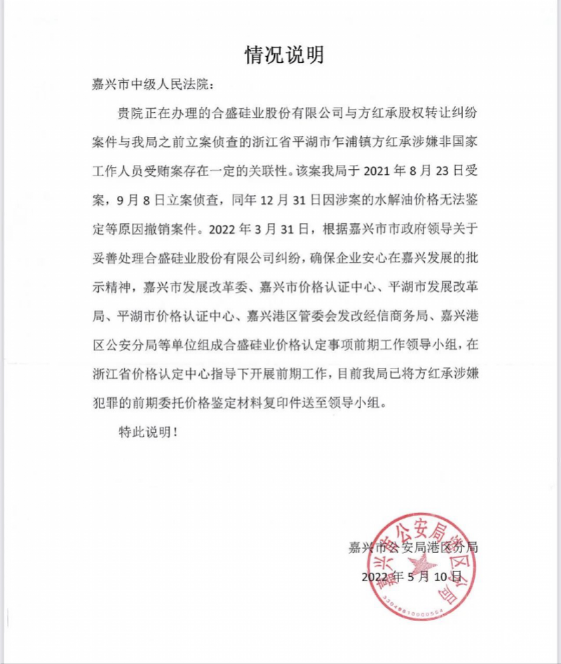

# 浙江千亿富豪遭实名举报，上市公司创始人与职业经理人反目

2023年11月12日，一封《实名举报浙江千亿富豪罗立国：以搬迁上市企业要挟市领导干预司法、陷害忠良》的举报信，将合盛硅业董事长罗立国和公司原总经理方红承持续多年的恩怨情仇推到了聚光灯下。

翌日，随着上交所监管函发出，合盛硅业对《举报信》内容进行了公告回应，随后，方红承家属再度发声，对合盛硅业一方澄清公告进行了反驳与进一步质疑。

南都记者梳理发现，双方的争论焦点主要聚集在方红承所称应获股权激励是否合理合法、罗立国是否以企业搬离辖区为由促使地方领导干涉方红承案件、合盛硅业嘉兴、泸州子公司是否存在非法生产和经营危险化学品低沸“水解油”行为。

**创始人与职业经理人反目**

浙江慈溪人罗立国有着一段传奇的创业故事，上世纪90年代，罗立国通过草帽生意赚到了第一桶金，后进入房地产行业。2005年，其再度跨界，进军硅基新材料领域，用十余年时间，打造出如今的硅基领域龙头企业合盛硅业。

方红承则在有机硅行业浸淫多年，2001年至2009年任职于新安股份（600596.SH），2011年加入合盛硅业，担任公司总经理，2015年成为公司董事，2018年12月离职。其任职期间，公司营业收入从2012年的19.89亿元，增长至2018年的110.76亿元；扣非净利润从0.16亿元增长至26.92亿元。2017年末，合盛硅业成功登陆上交所。

方红承离职之时，合盛硅业在公告中表示，“方红承先生在担任公司董事、总经理职务期间，在推进公司创新发展等方面
做出了积极贡献,公司董事会对方红承先生在任职期间为公司发展做出的贡献表 示衷心的感谢！”一副好聚好散的景象。

然而，2021年4月30日，随着方红承一纸诉状将宁波英融企业管理咨询有限公司（下称“宁波英融”，为合盛硅业员工持股平台）、合盛硅业告上法庭。

风云骤起，双方纠纷浮出水面，方红承本人甚至也在2022年被公安机关带走并移送检察院起诉。

根据方红承表述，其在合盛硅业工作期间，通过股权激励和罗立国个人转让并代持的方式，获得了部分上市公司股份。但想要兑现之时，罗立国一直想让他放弃股权，甚至在多次沟通无果后，以假冒签名方式，将宁波英融法人从方红承变更为他人，进而使得方红承不得不以法律手段维权。

对此说法，合盛硅业在《澄清公告》中表示，罗立国确实约定给予方红承一定数量股份增值的现金奖励，但需要满足“服务于公司满五年、不损害公司利益、不与公司同业竞争”等条件，而方红承实际上没有支付对价，相关股权也未过户（处于“代持”），且方红承不足两年即从公司离职，同时公司经自查发现其涉嫌背信损害上市公司利益的违法行为并向公安机关报案，因此公司罗立国认为方红承不满足奖励条件。

《澄清公告》同时表示，2022年2月23日，杭州仲裁委员会裁决酌情按照实际服务时间裁决方红承享有40%的权益：要求公司董事长罗立国以集中竞价交易方式减持公司股票扣税后支付给方红承。但罗立国已向法院提出不予执行仲裁裁决申请，法院尚在审查之中。

南都记者注意到，合盛硅业此澄清应该针对的是方红承所述“应从罗立国个人处所获股权”，并未谈及宁波英融。

宁波英融原名“新疆启恒股权投资有限公司”，《招股说明书》显示，彼时，宁波英融股东包括方红承及罗立国的亲家闫海峰，公司副总经理、核心技术人员彭金鑫，财务负责人张雅聪，董事会秘书龚吉平，职工监事、核心技术人员聂长虹，核心技术人员曹华俊、赵晓辉等人，为核心员工持股平台，合计持有上市公司600万股股份，方红承为执行董事，出资占比5%。

**迁址被指施压判决，合盛硅业辩称“办公场地需求”**

在双方说辞中，宁波英融股权纠纷还涉及另一层次的博弈。

根据方红承家属举报文章，2022年3月28日，平湖法院对于方红承起诉宁波英融和合盛硅业的案件作出一审判决，裁定“方红承胜诉”，但罗立国以将公司搬离嘉兴为由，要求市领导出面干预。

2022年5月28日，合盛硅业确实发布了《变更公司住所、经营范围》的公告，称拟将住所由浙江省平湖市（嘉兴市代管）变更至浙江省慈溪市；仅两周后，即6月13日，又公告取消了拟召开的相关股东会。

方红承一方表示，正是在6月13日，方红承被传唤并拘留，6月14日被“监视居住”。《举报信》同时贴出了盖有“嘉兴市公安局港区分局”印章的向嘉兴市中级人民法院出具的《情况说明》，提及了“根据嘉兴市市政府领导关于妥善处理合盛硅业股份有限公司纠纷，确保企业安心在嘉兴发展的批示精神”相关事项。

举报信所呈公安局情况说明。

针对如此说法，合盛硅业解释，变更办公地址是因为“公司注册地址位于浙江省嘉兴市，嘉兴生产基地以化工生产设施为主，办公条件有限。随着公司生产经营规模日益扩大，原办公场地已无法满足公司管理需求。”后终止该事项是因为“为维持相关资质登记”。

**危险化学品生产、销售是否合规？**

举报信提及的另一个重点，为“罗立国决策非法处置危险废物，涉嫌污染环境犯罪及非法生产经营危险化学品罪”。

信中称，合盛硅业生产过程中形成的副产物“低沸物”主要成分是危险化学品，属于危险废物，应当焚烧处置或者由有资质的机构处置，合盛公司未经政府依法审批擅自上马设备非法处置，将低沸物加工为“水解油”（合盛硅业自己命名的危废物）并对外非法销售。据合盛硅业“水解油”的项目立项报告、验收报告、部分销售合同和发票，合盛硅业2012-2020年“水解油”的销售就达到4000多吨（之后也在销售)。

其中，四川省应急管理厅2023年10月26日答复“水解油”系危险化学品，且未在安全生产许可范围，已责令合盛硅油（泸州）有限公司暂停使用低沸水解装置中有关“含氢硅油S”的生产装置，并对该公司涉嫌安全生产违法行为进行调查。

四川省应急管理厅官网显示，2023年10月3日，市应急局检查组在合盛硅业公司，“现场查看低沸物水解生成含氢硅油S生产装置的停用管理情况，在现场和DCS系统中确认了低沸物进料泵、低沸物水洗泵、低沸油输送泵等关键设备停用状态”。

对于“水解油”相关情况，合盛硅业表示公司的嘉兴子公司已经办理《危险化学品登记品种》，包括低沸油；泸州子公司已办理的《危险化学品登记品种》包括含氢硅油S。

就此回应，举报人一方在《方红承家属针对合盛硅业澄清公告的声明》中提出质疑，“事实上，合盛硅业嘉兴公司在2022年之前一直未办理《危险化学品登记品种》，请问合盛硅业及罗立国董事长：你们是什么时候办理的“登记”？敢不敢把登记证书向公众公示？”

南都记者就证件办理时间等问题联系了合盛硅业董秘办，对方表示以公告为准，针对公众关心的疑问，后续视情况会有说明。

采写：南都记者 缪凌云

相关报道：

[合盛硅业原总经理涉嫌受贿案今日未如期开庭 ](https://new.qq.com/rain/a/20231113A0818C00)

