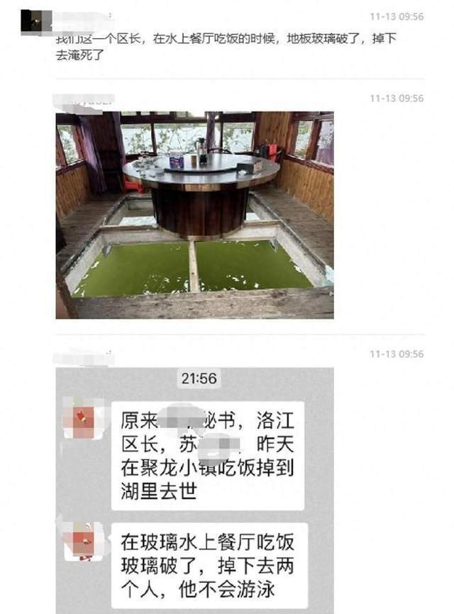

# 网传泉州市一区长水上餐厅就餐时落水身亡？当地政府办公室回应

11月13日，一张“泉州市洛江区长苏某某在水上餐厅就餐时落水身亡”的聊天记录截图在网上流传。

_截图显示，事发地点系聚龙小镇。_

13日午间，泉州市惠安县政府办公室一名工作人员向大河报·豫视频《看见》记者表示，事发当天有2人落水，其中1人不幸身亡，身亡者系原泉州市洛江区区长苏某某。

据闽南网此前报道，2015年1月，在洛江区四届人大四次会议举行的第三次全体会议上，苏某某当选为泉州市洛江区人民政府区长。

2019年12月31日，洛江召开全区领导干部大会，洛江区政府主要领导进行了调整变动。苏某某不再担任中共洛江区人民政府党组书记。

据悉，事发餐厅系聚龙小镇一家名为聚龙轩的餐厅。

13日，涉事餐厅一名工作人员回应记者，餐厅前天就开始暂停营业了，“设施设备都在改造”。对于上述落水事故，其表示，“案件在进一步调查，不便透露情况”。

来源：大河报·豫视频、新黄河

