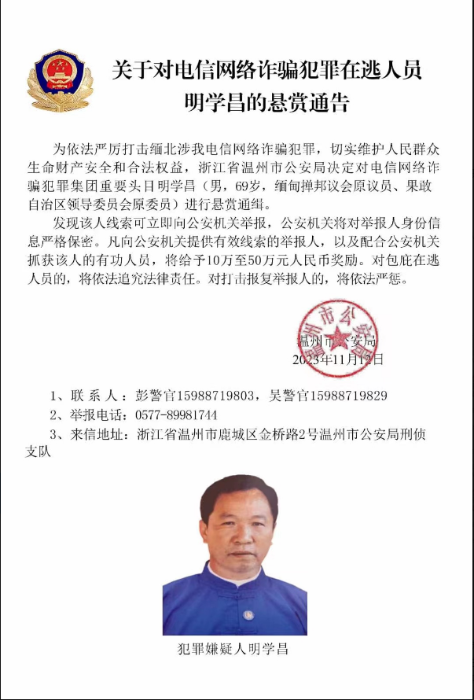
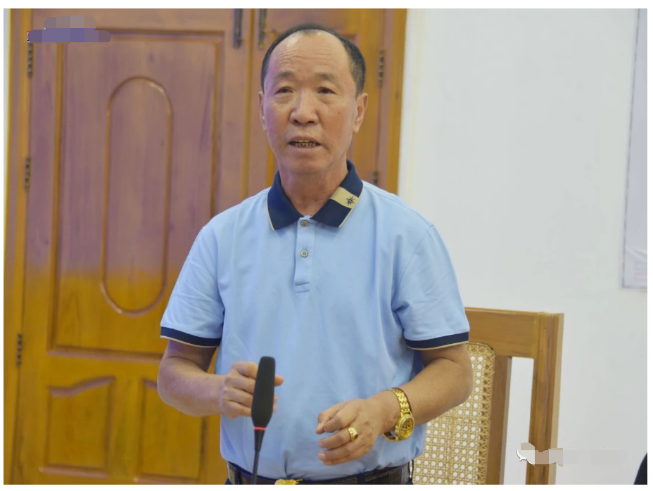

# 美媒：缅北电诈园开始针对非中国公民 以防引北京注意

中国通缉缅北电诈重要头目的消息迅速引起外媒的关注。

11月12日，浙江省温州市公安局公开悬赏通缉缅北果敢自治区电信网络诈骗犯罪集团重要头目明学昌、明国平、明菊兰、明珍珍。

该消息迅速引起外媒的关注。因为缅北的明学昌并非一般人物，直到最近还在以“老领导”的身份出席各种活动。其余三人都是明学昌的子女。

果敢自治区的官方社交媒体10月26日报道称：“为进一步落实工作要求，强化电信诈骗等各类衍生违法行为的打击力度，自治区召开专项工作会议。自治区主席李正福、委员觉觉伍中校、白应能、吴缪索旦、纽伦伍警长及各级部门、治安单位负责人、乡/社区负责人参加会议。此外，地区老领导明学昌、赵德强、刘正祥参加会议。”

报道还说，“明学昌、赵德强、刘正祥等老领导也对电信诈骗对地区造成的严重影响进行了介绍，并就相关打击工作发表了建议。”

此时距离缅北三支“民地武”发起“1027行动”还有一天。

果敢地方官媒把明学昌称为“老领导”，是因为他曾长期在果敢担任各种要职。

据介绍，69岁的明学昌曾跟随彭家声脱离缅甸共产党，成立缅甸民族民主同盟军，担任过任果敢副县长；2009年8月，缅甸政府军击败彭家声的武装控制果敢时，明学昌脱离缅甸民族民主同盟军，被缅甸政府军任命为果敢县长；2011年任掸邦议会议员、果敢自治区副主席、果敢自治区日常工作委员会和领导委员会委员。

“涉缅北武装护诈，明学昌等四人被中国公安机关通缉”，新加坡《联合早报》报道称，中国公安机关宣布通缉明学昌等四名缅北电诈重要头目，指他们涉嫌组织开设诈骗窝点，公开武装护诈。

报道称，据中国媒体的报道，经浙江省温州市公安机关侦查发现，明学昌、明国平、明菊兰、明珍珍是缅北果敢自治区涉及中国的电信网络诈骗犯罪集团重要头目，以明学昌为首的犯罪集团长期组织开设诈骗窝点，公开武装护诈，实施针对中国公民的电信网络诈骗犯罪活动，诈骗数额巨大。

他们被指在中国公安机关严打高压态势下，仍不收敛，不收手，继续大肆组织实施违法犯罪活动，同时涉嫌故意杀人、故意伤害、非法拘禁等多种严重暴力犯罪，情节极其恶劣，后果极其严重。

浙江省温州市公安局决定对四人进行公开悬赏通缉，公安机关也呼吁他们主动投案自首，争取宽大处理。对提供有效线索和协助抓捕的有功人员，公安机关将给予10万至50万元人民币奖励。

尤其值得关注的是，《联合早报》的报道援引了一则“网上流传的消息”称，缅甸北部毗邻中国的果敢地区10月20日发生多人被枪杀、活埋的事件，地点为位于果敢首府老街、由明学昌家族控制的卧虎山庄园区。

美国国会创立的和平研究所，最近在一篇文章中也报道了果敢地区电诈集团的猖狂活动。

该研究所在题为“缅甸军政府正在失去对与中国边界的控制”的文章中称，最近几天，缅甸军方失去了对该国与中国边境大部分地区的控制，因为与他们作战的武装正以前所未有的方式协调他们的攻击。值得注意的是，在此过程中，民族地方武装利用了中国最近打击电诈的行动。

文章称，自今年5月以来，中国发出了一个明确的信息：在缅甸窝藏诈骗集团是不可接受的，这些诈骗集团从世界各地贩运数十万人，每月从全球受害者那里骗取数十亿美元。但中国发出的信息被忽视，于是北京于9月开始采取行动，重点打击掸邦北部的佤邦和勐腊地区的电诈活动。

这两个地区都是享有最高自治权的“边境特区”，他们由强大的地方武装控制，他们使用中国货币、电力、互联网和电信。9月中旬，1207名涉诈犯罪嫌疑人被移交中方。此后不久，中国对两名佤邦高级官员发出逮捕令，指控他们是佤邦境内犯罪集团的“头目”。

作为回应，佤邦突袭了40多个诈骗窝点，向中国移交了4000多人，其中包括来自其他国家的数百人。数万台电脑和手机也被提供给了中方，其中包含了数百万份有关诈骗集团的情报。

和平研究所的文章说，佤邦和勐腊采取的前所未有的行动，并没有促使果敢采取任何行动，因为那里的诈骗活动已经失控。截至10月中旬，果敢仅交出了被关押在其“罗德岛大小领土”上的100多个诈骗营地的约2万-3万名涉诈犯罪嫌疑人中的377人。而且10月20日还发生了一起悲剧事件，果敢的一处诈骗大院外的警卫杀害了多名中国和泰国人，一些分析人士将其与2011年造成13名中国船员死亡的湄公河惨案相提并论。

作为有美国官方背景的一家机构，和平研究所的文章没有提到以下几个事实：

第一，此次参与对抗缅甸军政府行动的许多民地武背后有美国的影子。长期一盘散沙的这些武装之间能进行“前所未有的协调”，如果没有它们背后力量的支持也很难办到。

第二，文章提到的佤邦和勐腊在“1027行动”中表态中立，并没有支持缅甸民族民主同盟军的行动。

所以有分析认为，美国有故意把中国与缅北战局挂钩的意图。

实际上，和平研究所的文章最后的落脚点也是怎么样维护美国在缅甸的利益。

文章给出了几点建议，包括加大对缅甸“善治倡议和联盟建设”的支持力度；为反军政府的缅甸文职领导人争取更多支持，特别是印度、泰国和东盟主要成员国的支持；向泰国提供重要支持，以加强其在打击跨国犯罪方面的领导作用。

值得关注的是，其中一条建议说，有迹象表明，诈骗集团越来越多地针对非中国公民，以避免引起北京的注意，这可能会大大扩大针对美国公民的诈骗。美国应该考虑直接向中国提出这个问题。

美国的这条建议不是从另一个方面说明了中国打击电诈行动的力度吗？

