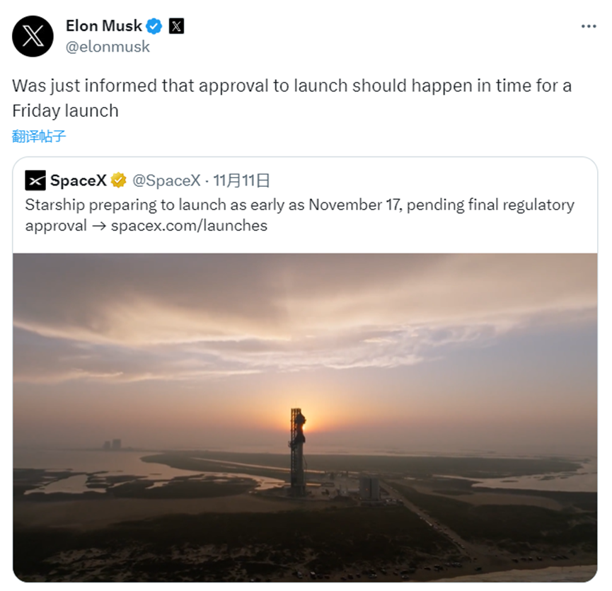

# SpaceX星舰二次发射在即 为何说它是“全村的希望”？

**《科创板日报》11月14日讯（编辑 郑远方）**
被称为“人类历史上体积最大、推力最强运载火箭”的SpaceX星舰（Starship）超重型火箭即将迎来二次发射。

据SpaceX日前宣布， **星舰最早将在当地时间11月17日（周五）发射**
。美国联邦航空管理局（FAA）之前已完成发射许可的安全性审查工作，还需等待最终许可。

而马斯克最新宣布， **星舰有望在周五发射之前及时获得发射许可** 。

星舰火箭之前在今年4月底首次试飞惨遭折戟，这次将是其第二次尝试发射。马斯克6月曾表示， **星舰项目已完成1000多处改进，二次试飞成功率有望达60%**
。

实际上， **星舰最初由马斯克火星殖民计划演变而来，在发射卫星的同时，还承载着后续探索宇宙重任**
。为实现前往火星，甚至木星、土卫二、木卫二、土星的愿景，星舰经历多次更新迭代，目前星舰已衍生出测试（原型机）、登月、环月旅行、货运、加油、卫星平台、洲际旅行等多个版本，其中已进入试飞测试阶段的为测试版星舰。

为何星舰发射备受外界关注，为何其能被称作“人类历史上体积最大、推力最强运载火箭”？整体而言， **星舰的意义主要可以归结为两方面：可复用性与运力** 。

01 可复用性

可以说， **星舰承载了马斯克对“火箭完全重复使用”的厚望——其目标是两级运载火箭皆可回收并重复使用**
。若这一目标实现，星舰将取代SpaceX的其他所有运载火箭和航天器（猎鹰9号、猎鹰重型火箭与龙飞船），接下卫星发射与载人运输的重担，甚至在未来飞向月球与火星。

而之前的猎鹰9号，则仅能回收一子级。根据数据，该系列火箭在13年中（截至2023年10月10日）已发射263次，其中261次成功，一子级成功回收219次，复用一子级发射194次。

而运载火箭可复用技术创新正是SpaceX火箭低成本的主要原因。山西证券便指出，这项技术推动了 **发射成本实现数量级上的降低**
，SpaceX通过突破发动机重启与推力控制技术、火箭下降控制系统技术及重复使用火箭着陆系统技术，实现了火箭的垂直回收。

从成本结构来说，硬件设备价值在单个火箭中占比较高。以ULA公司的Altas
V-401型火箭为例，数据显示，将发射过程中人力成本、基础设施成本、测控成本等项目剔除之后，其一级火箭中，发动机成本占据总成本的54.20%，箭体结构占23.60%，推进剂仅占0.70%；而在二级火箭中，二级发动机、箭体机构和电气设备所占的比重均为28%左右，推进剂占比仅0.20%。

中信证券11月7日报告显示， **SpaceX在回收一级和整流罩后的复用火箭，单次发射成本仅为全新火箭的30%**
。一二级火箭均呈现硬件成本占比高、推进剂占比低的特点。若在实现可回收的条件下，火箭可重复使用的次数足够多，那么硬件成本分摊到单次发射的成本将明显下降。

02 运力

虽说数据显示，发射服务产值在整个航天产业中仅占1.5%-2%，但 **运载是进入太空空间的入口，也是连接卫星制造与卫星应用的中枢环节**
。随着国内外推出规模不一的星座计划，卫星发射需求也不断增长。

在这种情况下，火箭运力便成为了制约星座大规模部署的主要瓶颈。

诚然，复用火箭能在一定程度上提高整体运力规模，但火箭自身的运载能力同样关键。

**星舰的近地轨道运载能力约为150吨；在不考虑回收的情况下，其有效载荷高达250吨-300吨** 。

这些荷载数字是什么概念？SpaceX的猎鹰9号最大运载能力为22.8吨，猎鹰重型火箭最大运载能力64吨，而 **星舰的运载能力较它们实现了数倍提升**
。飞行验证成功后， **星舰有望成为运力最大的运载火箭** 。

03 全球卫星互联网建设有望加速

不难看出，有了可复用性与运力两大优势在手，星舰发射成功后，有望进一步加速全球卫星互联网建设。

华泰证券便指出， **星舰强大的运载能力和低廉的发射成本或将服务于各大星座的部署，进而加速全球卫星互联网建设，推动手机、汽车等终端直连卫星**
。此外，作为NASA月球着陆器唯一中标方案，星舰有望服务阿尔特弥斯计划，美国航天能力提升将促使其他航天强国在航天领域投入更多关注和资源，或将加速全球航天竞赛。

民生证券11月13日报告则认为，若星舰本次试飞成功，将意味着SpaceX解决了4月份试飞中导致发动机舱燃油泄漏和起火的问题，并证明了SpaceX已经提高了猛禽发动机的可靠性。
**虽然星舰二次试飞能否成功仍存在较多不确定性，但无论从设计理念及后续行业发展方向上，都将对全球商业航天事业发展产生积极影响** 。

分析师进一步指出，卫星互联网有望开启并引领下一轮通信板块基础设施建设，当前我国卫星互联网的发展虽尚处早期起步阶段，但发展进程提速显著。短期来看，前端卫星生产制造环节将有望依托卫星发射进程提速率先受益，中长期维度随着技术设施建设的逐步完善，下游卫星互联网应用侧相关环节将迎来黄金发展阶段。建议关注信科移动、震有科技、上海瀚讯、铖昌科技、天银机电、航天智装、海格通信、普天科技等。

