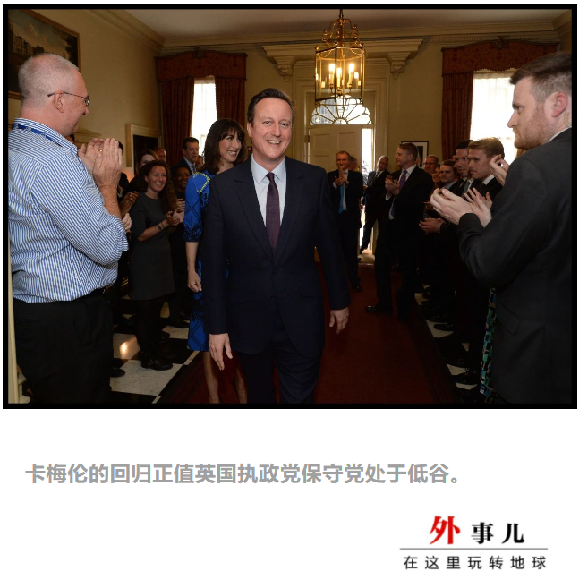
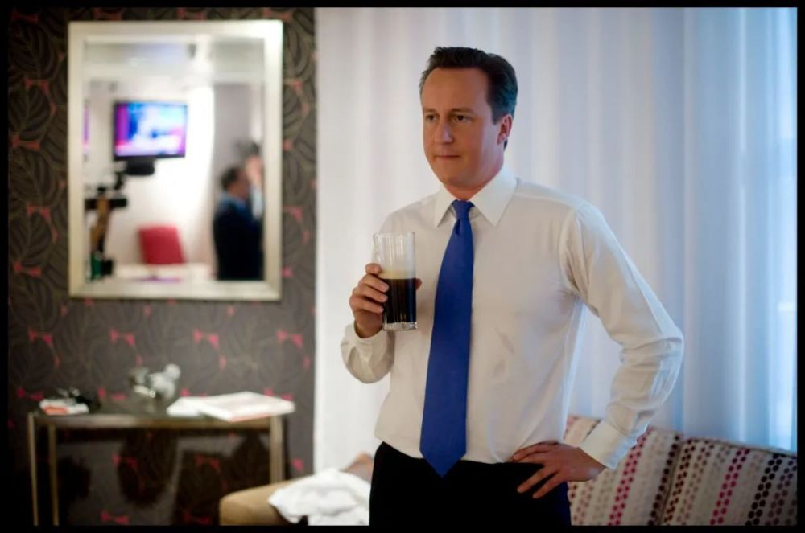

# “押宝”前首相卡梅伦复出，苏纳克的“最后一搏”

当地时间11月13日，英国政府内阁上演改组，与英国首相苏纳克有分歧的内政大臣布雷弗曼遭解职；阔别政坛7年之久的英国前首相卡梅伦突然复出，被任命为外交大臣。

卡梅伦的回归正值英国执政党保守党处于低谷，其民调支持率落后反对党工党超过20个百分点。按此趋势，在明年英国可能举行的大选中，保守党将惨败。分析认为，苏纳克押注老将复出，目的是取得党内久违的稳定。但此举效果可能适得其反，反而更加令保守党显得“技穷”。

**前首相“不同寻常”的回归**

英国首相办公室当地时间11月13日宣布，卡梅伦被任命为英国外交大臣，接替克莱弗利。此前担任外交大臣的克莱弗利刚刚被任命为内政大臣，以接替稍早前被解职的布雷弗曼。

“我知道前首相以这种方式回归不同寻常，但我认为这能够为公共利益服务。”卡梅伦当天对英国媒体表示。

前首相进入现任内阁任职，在英国近代政治历史上鲜有先例。近几十年，可与之相提并论的仅有1970年的英国政府任命前首相亚历克·道格拉斯-霍姆为外交大臣。

卡梅伦出生于1966年。2010年，卡梅伦带领保守党在议会选举中胜出，与自由民主党组成联合政府。英国媒体称，卡梅伦为保守党连续13年的执政奠定了基础，在他领导保守党之前，该党被认为是一个脱离现实、古板过时的政治团体。

但是，卡梅伦在2016年发起的脱欧公投彻底改变英国政治走向，也结束了自己的首相生涯。卡梅伦在回忆录和媒体采访中表示，他本人强烈反对英国脱离欧盟，在2016年举行脱欧公投是为了安抚保守党内部的“脱欧派”。未曾料到，这场公投令英国脱欧成真。

 _资料图：英国前首相卡梅伦。图/IC photo_

“有些人永远不会原谅我举行那场公投。”卡梅伦对媒体说。脱欧公投后，卡梅伦辞职。英国媒体称，由卡梅伦发起的脱欧公投在英国造成长期的混乱，并令保守党陷入了多年的动荡。

最新民调显示，英国57%的民众后悔脱欧，认为脱欧是错误的决定；只有33%的民众认可脱欧；其余民众表示不知道脱欧是好是坏。

卡梅伦在辞去首相职务后不久又辞去了国会议员的职务，近几年很少参与英国政治事务。因此，卡梅伦突然重返内阁，在许多媒体和观察人士看来令人震惊。英国各大报纸以“卡梅伦的惊人回归”“回到了一切的起点”“时光穿越”等标题来报道卡梅伦被任命为外交大臣一事。

在接受任命后，卡梅伦在社交媒体上表示，英国正面临着俄乌冲突、中东危机等“一系列严峻的国际挑战”，支持盟国和加强伙伴关系将是他作为外交大臣的首要任务。

英国前首相特雷莎·梅对卡梅伦的“复出”表示欢迎。她表示：“在当今世界充满不确定性的时刻，他在国际舞台上的丰富经验非常宝贵。”

**保守党支持率仅25%，大幅落后对手**

实际上，卡梅伦和苏纳克在一些政策上的观点上并不一致。

卡梅伦表示，他欣然接受了苏纳克邀请他出任外交大臣的提议，但他也承认批评了苏纳克的一些政策，比如苏纳克大幅削减了卡梅伦支持的英国高速铁路项目。

卡梅伦说：“虽然我可能不同意一些决定，但我很清楚，苏纳克是一位有能力的首相，他在困难时期展现出了领导力。”

在经历了“派对门”丑闻、频繁更换首相、激烈内部斗争等事件后，保守党在英国选民中的好感度跌入低谷。最新民调显示，保守党支持率仅25%，落后工党超过20个百分点，照此趋势发展，保守党在下一次大选中可能遭遇惨败。

“这可能是苏纳克最后一搏。”英国媒体评论称，苏纳克押注让卡梅伦回归，可能给保守党带来久违的稳定。目前，苏纳克的三个最高级内阁职位中，有两个由温和派老将担任——卡梅伦和财政大臣亨特。

但英国政治观察人士认为，苏纳克押注卡梅伦的复出也存在风险，这会让民众更加相信保守党已经“技穷”，才会重新请出这位前首相。

_当地时间2023年11月13日，英国伦敦，英国首相苏纳克出席伦敦市政厅一年一度的市长晚宴。图/IC photo_

观察人士指出，苏纳克请卡梅伦复出，此举意在争取所谓“蓝墙”（指英格兰南部的富裕地区，通常反对英国脱欧）的支持，但此举也让保守党面临失去“红墙”（指英格兰中部和北部地区，通常支持英国脱欧）选票的风险。

另外，卡梅伦担任首相期间推行财政紧缩政策，被批令保健体系等公共服务陷入困境，因此他在民众中的好感度并不高。今年9月的民调显示，45%的英国成年人对卡梅伦没有好感，看好卡梅伦的比例仅为25%。

**布雷弗曼的解职可能引发新一轮权力之争**

在卡梅伦被任命为外交大臣的同一天，布雷弗曼遭解职。

布雷弗曼属于保守党强硬派，她在移民、政治庇护、流浪汉等多个问题上持强硬立场。她曾推动一项政策，试图用飞机把在英国寻求庇护的移民运往非洲的卢旺达，遭到国内反对党和国际组织的抨击。

布雷弗曼屡次发表争议性言论。她称英国愈发严重的流浪汉问题是“生活方式的选择”导致的，并主张制定政策让流浪汉无法得到帐篷。观察人士称，布雷弗曼在移民、无家可归者等问题上发表强硬言论，意在吸引党内强硬派，但同时也与党内温和派产生间隙。

近日，布雷弗曼再度发表争议性言论，称伦敦支持巴勒斯坦的抗议者为“暴徒”，并指责伦敦警方在维持治安时偏袒抗议者。布雷弗曼的言论遭到来自保守党内部和反对党的共同批评。

英国前反恐警察负责人尼尔•巴苏表示：“发表这种分裂性言论，有可能激化事态，是一件非常危险的事情……以前的内政大臣不会做出这样的事情。”

熟悉此事的英国记者称，此后，苏纳克找到布雷弗曼表示，他希望对方离开政府。

苏纳克的发言人11月13日表示，苏纳克和布雷弗曼的工作关系就言论方面出现了问题，并且两人存在“风格上的差异”。

值得一提的是，这已是布雷弗曼在一年多内第二次失去内政大臣职务。去年，在英国前首相特拉斯短暂的任期内，布雷弗曼担任了6周的内政大臣，后因违规使用私人电子邮件地址等原因辞职。苏纳克去年10月25日正式就任英国首相后，布雷弗曼重回内阁，继续担任内政大臣。

英国媒体指出，布雷弗曼是保守党强硬派的代表人物，她的影响力不太可能消失，苏纳克给自己树立了强劲的对手。布雷弗曼的解职在执政党高层可能引发一场权力之争，将英国推向另一段政治内斗和不稳定的时期。

观察人士称，有猜测认为，布雷弗曼正在策划未来竞选保守党党魁。保守党内部对苏纳克存在不满情绪，认为他没能扭转该党的颓势。在这种情况下，布雷弗曼可能把自己塑造为苏纳克的替代方案，这可能会使接下来的竞选活动复杂化。

记者 | 陈奕凯

编辑 | 张磊

