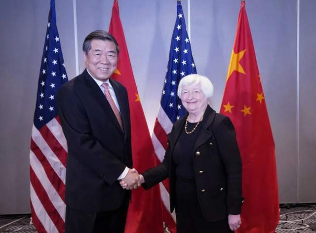

# 中美元首会晤前夕，这轮十个小时的高层会谈“吹暖风”

近日，中共中央政治局委员、国务院副总理、中美经贸中方牵头人何立峰访问美国，期间与美国财政部部长耶伦举行多轮会谈，并举行工作晚餐，会谈时间累计达10个小时。这次会谈旨在持续落实两国元首重要共识、为两国元首的旧金山会晤做好经济成果准备。

_11月8日至12日，国务院副总理、中美经贸中方牵头人何立峰应邀访美，其间与美财长耶伦举行数次会谈。图/新华_

作为全球最大的两个经济体，中美两国的经济体量约占世界的40%；双方的贸易总额在2022年创历史新高，达到6906亿美元，约占全球贸易的五分之一。长期以来，中美经贸关系是两国关系的“压舱石”，双方交往的重要驱动力源自在经济方面的共同利益。然而，在美国出现“逆全球化”和“美国优先”思潮的背景下，一些美国人士宣扬“美国对华接触失败论”“美国对华合作吃亏论”等不实论调，并鼓吹中美经贸脱钩，减少美国在经贸领域的对华依存度。美国政府则通过惩罚性关税、出口管制、投资审查等政策手段，对中美经贸关系加以干扰。事实证明，这些举措损人不利己，对美国消费者和企业的利益带来严重损害，也给全球产业链供应链的稳定带来不容小视的冲击。

近一个时期以来，美国财政部长耶伦、商务部长雷蒙多等拜登政府高级官员在多个场合强调，美国不寻求与中国脱钩，而是希望实现去风险和多元化目标，力图与中国建立健康的经济关系。在何立峰访美前夕，耶伦在美国重要智库亚洲协会发表演讲，美中两国经济如果全面脱钩，将会对世界造成重大负面影响，让其他国家在美中之间选边站队也不是拜登政府的目标。此外，耶伦还在《华盛顿邮报》撰文指出，建设性的中美经济关系不仅能成为双边关系的稳定器，也有利于两国及世界各地的工人和民众；在动荡的世界中，多元化的供应链是必要的，而中美经济脱钩将带来经济灾难，不符合美国家利益；美国有办法在与中国竞争的同时与中国合作。耶伦还别有意味地强调，她对美国的国家实力充满信心，美国不应过度专注于对华竞争，导致自身被这种竞争所定义。

何立峰与耶伦的会谈是中美两国经贸政策团队持续深化沟通的关键步骤，这种沟通本身就是外交接触的重要成果。根据中美两国政府官员的吹风，双方借助此次会谈达成三点重要共识。

第一，中美同意加强沟通，管控分歧，避免误解意外导致摩擦升级。由副部级官员牵头、向双方牵头人汇报的中美经济、金融工作组将按照计划举行更多会议。双方牵头人同意定期直接沟通。

第二，双方强调不寻求经济“脱钩”，致力于发展健康的经济关系，为两国企业和工人提供公平竞争环境，增进两国人民福祉。

第三，双方同意努力应对共同挑战，包括经济增长、金融稳定和监管。中美同意就气候变化相关经济问题、低收入和新兴经济体债务问题开展合作。同意强化国际金融架构，推动国际货币基金组织开展有意义的份额增资并努力通过新份额公式增加代表性不足成员/区域的话语权，加速推动多边开发银行通过改革，使其更好、更大、更有效。

会谈中，中方重点向美方介绍了今年以来中国宏观经济形势及政策。这有助于美方更加客观理性地看待中国发展前景，避免一些美欧战略界人士宣扬的“中国崛起到顶论”干扰中美经贸合作的预期。中方指出，当前中国经济回升势头不断巩固，经济发展新动能持续涌现，经济长期向好的基础进一步夯实。中国发展有强大内生动力，中国人民过上好日子的决心是坚定的，中国政府推进高质量发展的决心是坚定的。同时，中方明确表达了在美对华双向投资限制、制裁打压中国企业、对华出口管制、对华加征关税等方面的关切。这些措施干扰了两国间正常经贸往来，影响了企业经营预期，也无益于美国企业的长远利益。

耶伦在会谈中强调两国负责任管理双边经济关系的重要性，包括保持有韧性的沟通渠道。美国寻求与中国发展健康的经济关系，这将使两国长期受益。双方同意进行定期沟通，耶伦将应何立峰副总理邀请于明年再次访问中国。

诚然，这次会谈并没有消除中美在很多领域的分歧，如双方在何谓公平竞争环境以及出口管制举措的适用性等问题上有着深刻的差异。但是，中美经贸团队之间的沟通相较以往，更加务实坦诚，也展现出更大程度的建设性。这次会谈的重要意义在于，为两国元首即将举行的会晤营造良好条件，为双方进一步深化互利合作拓展空间。近期，两国间的商业航班持续增加、美国政府派出高级别代表团参加中国进口博览会等一系列进展表明，中美之间的经贸关系有望显露更多暖意。在美国难以转变对华战略竞争大趋势的背景下，修复中美经贸关系需要更多智慧和努力。正如美国战略与国际问题研究中心弗里曼中国研究项目主席麦艾维（Lily
McElwee）所言，美中经济关系的进展更可能是渐进式的，而非突破性的。

（作者系复旦大学国际问题研究院教授）

作者：赵明昊

编辑：徐方清

