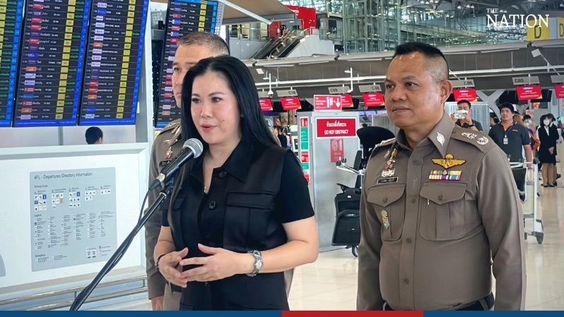

# 外媒炒作泰国欲邀中国警察在热门景区“联合巡逻”，泰总理府回应

（观察者网讯）泰国《国民报》11月12日发文称，为提升中国游客赴泰旅游信心，泰国政府正考虑邀请中国警察赴泰开展警务“联合巡逻”活动，预计将于15日与中方商讨相关合作事项。消息传出后，美国彭博社趁机炒作称，泰国这一计划在该国国内引发所谓“影响泰国主权”的担忧。对此，泰国总理府第一时间进行了回应。

据《曼谷邮报》13日报道，泰国总理府发言人猜·瓦差隆表示，有关“联合巡逻”的报道并不准确，泰国警方计划邀请中国警方在警务方面展开合作，希望在犯罪分子信息等方面进行交流，从而更有效地打击犯罪。猜·瓦差隆批评相关炒作，强调勿用此事“谋取政治利益”。

_泰国国家旅游局局长塔佩妮·佳沛本在素万那普机场召开记者会（图源：泰国《国民报》）_

泰国《国民报》12日报道称，泰国总理赛塔·他威信在前往美国出席亚太经合组织第三十次领导人非正式会议之前，与泰国国家旅游局局长塔佩妮·佳沛本等人会面，会议重点讨论了安全问题和确保游客赴泰旅游期间获得的服务质量。

会议结束后，塔佩妮在曼谷素万那普机场向媒体表示，为了实现这些目标，泰国国家旅游局、泰国旅游和体育部需要与该国中央调查局和旅游警察局展开合作。塔佩妮还宣布，会上讨论了计划邀请中国警察展开合作的提议。

泰国《国民报》称，合作计划包括邀请中国警察赴泰国热门旅游区与泰国警察展开“巡逻”，并称此模式旨在效仿中国警方与意大利、克罗地亚等国执法部门成功开展的警务联合巡逻活动。

中国警方此前多次派员赴意大利，中方联巡队员赴意期间同意大利警员混合编组开展警务联合巡逻工作，中方警员通过提供警务建议的方式协助、配合意方工作，设立专门面向华人的报警热线，由中国警员协助意方接处警。

报道称，泰国政府预计将于11月15日与中国驻泰国大使馆商讨相关事宜，泰国政府尚未公布将采用这种联巡模式的城市，预计该举措将有助于在今年最后两个月吸引中国游客，冲刺达到全年中国游客赴泰440万人次的目标。

“邀请中国警察赴泰十分必要，中国警察的到来将有助于我们向中国游客展示泰国正在加强安保措施。”塔佩妮称，如果中国警方认可泰国的安全水平，将提升中国游客的信心。

这一消息立马引起了美国彭博社的关注，该媒体炒作称，泰国计划邀请中国警察在泰国街头开展巡逻在泰国国内引发质疑，并渲染所谓“影响泰国主权”的担忧。

针对这种争议，泰国总理府发言人猜·瓦差隆表示，有关“联合巡逻”的报道并不准确，泰国政府也不会放弃主权，他强调，有关中国警察应邀赴泰等于泰国“放弃独立和主权”的批评毫无根据，“请不要利用此事谋取政治利益，如果各方都能集中精力为国家和人民谋利益，那就更好了。”

据《曼谷邮报》报道，猜·瓦差隆介绍称，泰国警方提出，为提升中国游客的信心，最好的办法是与中国警方合作，在提供罪犯信息等方面展开合作，从而更有效地打击犯罪，防止犯罪行为影响游客的信心。

泰国国家警察总长托萨克·素威蒙也否认了泰国警方计划开展联合巡逻行动，他认为在这个问题上存在误解。他补充称，有关官员提议设立一个协调中心，以方便中泰官员在那里共同处理与两国有关的犯罪问题。

泰国国家旅游局局长塔佩妮则表示，有关联合巡逻行动的计划是邀请中国警方展开合作以加强泰国旅游安全的众多建议中的一项，这个想法还没有敲定，也未与中方讨论，将在本周与中方商讨。

塔佩妮称，泰国将以合法性和适当的背景为基础对相关合作提出申请，如果公众对联合巡逻方案感到关切，泰国会邀请中国警方联合执行其他计划，比如在犯罪分子信息上进行交流。塔佩妮表示，这次合作旨在解决中国游客对泰国信心下降的问题。

《曼谷邮报》称，尽管泰国政府宣布从今年9月25日开始，面向中国游客实施阶段性免签政策，为期5个月，但免签政策实施以来，中国游客仍然很少。

泰国旅行社协会主席西斯迪瓦奇称，在城市巡逻方面，泰国警察应该自己负责这项工作，可以邀请中国警方为中国游客安全提供必要支持。

泰国《国民报》13日发文称，一位不愿透露姓名的泰国高级警官称，由于泰国安全法的限制，此前会议上泰国国家旅游局提出的关于联合巡逻的提议可能无法实施。

今年10月3日，泰国曼谷暹罗百丽宫购物中心发生枪击事件，一名中国公民不幸遇难，另有一名中国公民受伤。事件发生后，泰国总理赛塔亲赴医院看望中国受伤人员。赛塔和泰国副总理兼外长班比分别致电中国驻泰国大使韩志强，代表泰国政府对不幸遇难的中国公民表示哀悼，对受伤人员表示慰问，强调泰方将迅速依法查办此次事件，强化治安管理，确保为来泰中国公民提供可靠安全环境。

针对枪支问题，泰国副总理兼内政部长阿努廷10月5日表示，泰国内政部已召开关于严控使用和携带枪械、弹药及枪械配件的会议，明确提出将出台一系列更加严格管控枪械的措施。

泰国外交部局势指挥中心在10月6日召开的新闻发布会上表示，将进一步加强购物场所的安检措施，泰国旅游警察局也将进一步加大安保力度，并已与包括购物中心在内的主要旅游景点协调，评估和整合紧急行动计划，审查现有平面图、疏散计划以及紧急和危机行动指南。同时，还将建立公共预警系统，向连接到移动网络的所有移动设备发送安全警告，随时向公众发布紧急情况通报。

10月19日，泰国国家旅游局局长塔佩妮在接受北京商报记者专访时表示，泰国政府非常重视安全问题，已经联动国家安全部门以及泰国警察总署，“我们希望能够给中国游客一些特别的安全保障”。塔佩妮当时曾称，泰旅局近日收到建议，其中，有部分中国企业希望泰国能够邀请中方警察前往泰国的各个景点常驻。“我们也会将这些建议传达给泰国的高层，以便中泰两方能够在安全保障上有更深层的交流合作。”

**本文系观察者网独家稿件，未经授权，不得转载。**

